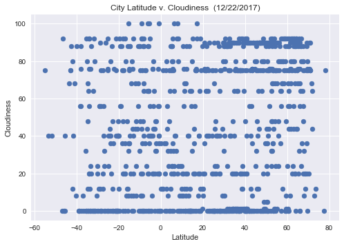

# WeatherPy

### Analysis
-  The max temperature is highest closest to the equator decreasing exponentially as you move toweards the poles. However it evens out 50-60 degrees latitude and then keeps decreasing.
- The greatest humidity also exists around the equator and while humidiety drops just north and south of the equator, it gradually increases after.
- It is cloudier north of the equator between 30-70 degrees and wind speed is highest at the poles and the equator


```python
# Dependencies
import random

import json
import urllib
import gzip
import requests as req

import pandas as pd
from citipy import citipy
import matplotlib.pyplot as plt
import numpy as np
import seaborn as sns

# Create url, api key, and units
url = 'http://api.openweathermap.org/data/2.5/weather?'
apiKey = '25bc90a1196e6f153eece0bc0b0fc9eb'
unit = 'imperial'

# Write function to print a visual line break
def breaker():
    print('---------------------------------')
```

## Generate Cities List


```python
owmCityJson = 'http://bulk.openweathermap.org/sample/city.list.json.gz'
owmCityList = [] #Open Weather Map's list of cities
sampleCities = [] #Sample cities
sampleSize = 1000


# Unzip Open Weather Map list of cities
with gzip.open(urllib.request.urlopen(owmCityJson)) as f: #unzip file from URL
    owmCities = json.load(f) #load json

    # For each city, append the name and country to a list as a tuple
    for city in owmCities:
        owmCityList.append((city['name'].lower(),city['country'].lower()))


# Create sample of cities
for c in range(sampleSize):

    uniqueCities = True

    # While every city is not unique in the list
    while uniqueCities:

        # Find nearest city to randomly generated lat/long
        city = citipy.nearest_city(random.uniform(-90,90),random.uniform(-180,180)) #randomly select lat/long
        # Create list of tuples with city name and country
        sampleCities.append((city.city_name, city.country_code))
        uniqueCities = False #stop loop

        # If the length of sample cities isn't equal to the uniques only length
        # OR the city is not in the Open Weather Map's list of cities
        if len(sampleCities) != len(set(sampleCities)) or sampleCities[c] not in owmCityList:
            sampleCities.pop() #remove entry
            uniqueCities = True #go through loop again to generate new city

# Print the length of cities sampled
len(sampleCities)
```


    1000


## Perform API Calls


```python
count = 1 #count placeholder for printout
l = len(sampleCities) #length of sample cities
missing = 0 #placeholder for how many records won't be read properly
cityDet = [] #list for city details

print('Beginning Data Retrieval')
breaker()

# Create function to
for city in sampleCities:

    # Compile query URL
    queryURL = '{}appid={}&q={},{}&units={}'.format(url,apiKey,city[0].replace(' ','+'),city[1],unit)
    # Read to a json
    weather = req.get(queryURL).json()

    # If there is a record of the city
    try:
        # Create a tuple of city details
        cityDet.append((weather['id'],
                        weather['name'],
                        weather['sys']['country'],
                        weather['coord']['lon'],
                        weather['coord']['lat'],
                        weather['main']['temp_max'],
                        weather['main']['humidity'],
                        weather['clouds']['all'],
                        weather['wind']['speed']))
        print('Processing Record {} of {} | {}, {}'.format(count,l,city[0],city[1]))
        print(queryURL)
        count += 1

    # If there is no record of that city
    except KeyError:
        print('Processing Record {} of {} | {}, {}'.format(count,l,city[0],city[1]))
        print('---This record cannot be found---')
        missing += 1

# End
breaker()
print('Data Retrieval Complete')
print('{} record(s) could not be found during retreival'.format(missing))
breaker()   
```

    Beginning Data Retrieval
    ---------------------------------
    Processing Record 1 of 1000 | mount isa, au
    http://api.openweathermap.org/data/2.5/weather?appid=25bc90a1196e6f153eece0bc0b0fc9eb&q=mount+isa,au&units=imperial
    Processing Record 2 of 1000 | aklavik, ca
    http://api.openweathermap.org/data/2.5/weather?appid=25bc90a1196e6f153eece0bc0b0fc9eb&q=aklavik,ca&units=imperial
    Processing Record 3 of 1000 | cape town, za
    http://api.openweathermap.org/data/2.5/weather?appid=25bc90a1196e6f153eece0bc0b0fc9eb&q=cape+town,za&units=imperial
    Processing Record 4 of 1000 | punta arenas, cl
    http://api.openweathermap.org/data/2.5/weather?appid=25bc90a1196e6f153eece0bc0b0fc9eb&q=punta+arenas,cl&units=imperial
    Processing Record 5 of 1000 | ushuaia, ar
    http://api.openweathermap.org/data/2.5/weather?appid=25bc90a1196e6f153eece0bc0b0fc9eb&q=ushuaia,ar&units=imperial
    Processing Record 6 of 1000 | butaritari, ki
    http://api.openweathermap.org/data/2.5/weather?appid=25bc90a1196e6f153eece0bc0b0fc9eb&q=butaritari,ki&units=imperial
    Processing Record 7 of 1000 | westport, nz
    http://api.openweathermap.org/data/2.5/weather?appid=25bc90a1196e6f153eece0bc0b0fc9eb&q=westport,nz&units=imperial
    Processing Record 8 of 1000 | hilo, us
    http://api.openweathermap.org/data/2.5/weather?appid=25bc90a1196e6f153eece0bc0b0fc9eb&q=hilo,us&units=imperial
    Processing Record 9 of 1000 | kashi, cn
    http://api.openweathermap.org/data/2.5/weather?appid=25bc90a1196e6f153eece0bc0b0fc9eb&q=kashi,cn&units=imperial
    Processing Record 10 of 1000 | hobart, au
    http://api.openweathermap.org/data/2.5/weather?appid=25bc90a1196e6f153eece0bc0b0fc9eb&q=hobart,au&units=imperial
    Processing Record 11 of 1000 | iqaluit, ca
    http://api.openweathermap.org/data/2.5/weather?appid=25bc90a1196e6f153eece0bc0b0fc9eb&q=iqaluit,ca&units=imperial
    Processing Record 12 of 1000 | jamestown, sh
    http://api.openweathermap.org/data/2.5/weather?appid=25bc90a1196e6f153eece0bc0b0fc9eb&q=jamestown,sh&units=imperial
    Processing Record 13 of 1000 | singaraja, id
    http://api.openweathermap.org/data/2.5/weather?appid=25bc90a1196e6f153eece0bc0b0fc9eb&q=singaraja,id&units=imperial
    Processing Record 14 of 1000 | vaini, to
    http://api.openweathermap.org/data/2.5/weather?appid=25bc90a1196e6f153eece0bc0b0fc9eb&q=vaini,to&units=imperial
    Processing Record 15 of 1000 | port alfred, za
    http://api.openweathermap.org/data/2.5/weather?appid=25bc90a1196e6f153eece0bc0b0fc9eb&q=port+alfred,za&units=imperial
    Processing Record 16 of 1000 | warmbad, na
    http://api.openweathermap.org/data/2.5/weather?appid=25bc90a1196e6f153eece0bc0b0fc9eb&q=warmbad,na&units=imperial
    Processing Record 17 of 1000 | razdolinsk, ru
    http://api.openweathermap.org/data/2.5/weather?appid=25bc90a1196e6f153eece0bc0b0fc9eb&q=razdolinsk,ru&units=imperial
    Processing Record 18 of 1000 | posse, br
    http://api.openweathermap.org/data/2.5/weather?appid=25bc90a1196e6f153eece0bc0b0fc9eb&q=posse,br&units=imperial
    Processing Record 19 of 1000 | belle glade, us
    http://api.openweathermap.org/data/2.5/weather?appid=25bc90a1196e6f153eece0bc0b0fc9eb&q=belle+glade,us&units=imperial
    Processing Record 20 of 1000 | timra, se
    http://api.openweathermap.org/data/2.5/weather?appid=25bc90a1196e6f153eece0bc0b0fc9eb&q=timra,se&units=imperial
    Processing Record 21 of 1000 | chuy, uy
    http://api.openweathermap.org/data/2.5/weather?appid=25bc90a1196e6f153eece0bc0b0fc9eb&q=chuy,uy&units=imperial
    Processing Record 22 of 1000 | birjand, ir
    http://api.openweathermap.org/data/2.5/weather?appid=25bc90a1196e6f153eece0bc0b0fc9eb&q=birjand,ir&units=imperial
    Processing Record 23 of 1000 | nehe, cn
    http://api.openweathermap.org/data/2.5/weather?appid=25bc90a1196e6f153eece0bc0b0fc9eb&q=nehe,cn&units=imperial
    Processing Record 24 of 1000 | ponta delgada, pt
    http://api.openweathermap.org/data/2.5/weather?appid=25bc90a1196e6f153eece0bc0b0fc9eb&q=ponta+delgada,pt&units=imperial
    Processing Record 25 of 1000 | hambantota, lk
    http://api.openweathermap.org/data/2.5/weather?appid=25bc90a1196e6f153eece0bc0b0fc9eb&q=hambantota,lk&units=imperial
    Processing Record 26 of 1000 | prince rupert, ca
    http://api.openweathermap.org/data/2.5/weather?appid=25bc90a1196e6f153eece0bc0b0fc9eb&q=prince+rupert,ca&units=imperial
    Processing Record 27 of 1000 | tiksi, ru
    http://api.openweathermap.org/data/2.5/weather?appid=25bc90a1196e6f153eece0bc0b0fc9eb&q=tiksi,ru&units=imperial
    Processing Record 28 of 1000 | kodiak, us
    http://api.openweathermap.org/data/2.5/weather?appid=25bc90a1196e6f153eece0bc0b0fc9eb&q=kodiak,us&units=imperial
    Processing Record 29 of 1000 | tottori, jp
    http://api.openweathermap.org/data/2.5/weather?appid=25bc90a1196e6f153eece0bc0b0fc9eb&q=tottori,jp&units=imperial
    Processing Record 30 of 1000 | qaanaaq, gl
    http://api.openweathermap.org/data/2.5/weather?appid=25bc90a1196e6f153eece0bc0b0fc9eb&q=qaanaaq,gl&units=imperial
    Processing Record 31 of 1000 | saldanha, za
    http://api.openweathermap.org/data/2.5/weather?appid=25bc90a1196e6f153eece0bc0b0fc9eb&q=saldanha,za&units=imperial
    Processing Record 32 of 1000 | kuningan, id
    http://api.openweathermap.org/data/2.5/weather?appid=25bc90a1196e6f153eece0bc0b0fc9eb&q=kuningan,id&units=imperial
    Processing Record 33 of 1000 | kahului, us
    http://api.openweathermap.org/data/2.5/weather?appid=25bc90a1196e6f153eece0bc0b0fc9eb&q=kahului,us&units=imperial
    Processing Record 34 of 1000 | sao filipe, cv
    http://api.openweathermap.org/data/2.5/weather?appid=25bc90a1196e6f153eece0bc0b0fc9eb&q=sao+filipe,cv&units=imperial
    Processing Record 35 of 1000 | belmonte, br
    http://api.openweathermap.org/data/2.5/weather?appid=25bc90a1196e6f153eece0bc0b0fc9eb&q=belmonte,br&units=imperial
    Processing Record 36 of 1000 | winnipeg, ca
    http://api.openweathermap.org/data/2.5/weather?appid=25bc90a1196e6f153eece0bc0b0fc9eb&q=winnipeg,ca&units=imperial
    Processing Record 37 of 1000 | port hedland, au
    http://api.openweathermap.org/data/2.5/weather?appid=25bc90a1196e6f153eece0bc0b0fc9eb&q=port+hedland,au&units=imperial
    Processing Record 38 of 1000 | busselton, au
    http://api.openweathermap.org/data/2.5/weather?appid=25bc90a1196e6f153eece0bc0b0fc9eb&q=busselton,au&units=imperial
    Processing Record 39 of 1000 | touros, br
    http://api.openweathermap.org/data/2.5/weather?appid=25bc90a1196e6f153eece0bc0b0fc9eb&q=touros,br&units=imperial
    Processing Record 40 of 1000 | bluff, nz
    http://api.openweathermap.org/data/2.5/weather?appid=25bc90a1196e6f153eece0bc0b0fc9eb&q=bluff,nz&units=imperial
    Processing Record 41 of 1000 | geraldton, au
    http://api.openweathermap.org/data/2.5/weather?appid=25bc90a1196e6f153eece0bc0b0fc9eb&q=geraldton,au&units=imperial
    Processing Record 42 of 1000 | bredasdorp, za
    http://api.openweathermap.org/data/2.5/weather?appid=25bc90a1196e6f153eece0bc0b0fc9eb&q=bredasdorp,za&units=imperial
    Processing Record 43 of 1000 | castro, cl
    http://api.openweathermap.org/data/2.5/weather?appid=25bc90a1196e6f153eece0bc0b0fc9eb&q=castro,cl&units=imperial
    Processing Record 44 of 1000 | mount gambier, au
    http://api.openweathermap.org/data/2.5/weather?appid=25bc90a1196e6f153eece0bc0b0fc9eb&q=mount+gambier,au&units=imperial
    Processing Record 45 of 1000 | mandalgovi, mn
    http://api.openweathermap.org/data/2.5/weather?appid=25bc90a1196e6f153eece0bc0b0fc9eb&q=mandalgovi,mn&units=imperial
    Processing Record 46 of 1000 | yellowknife, ca
    http://api.openweathermap.org/data/2.5/weather?appid=25bc90a1196e6f153eece0bc0b0fc9eb&q=yellowknife,ca&units=imperial
    Processing Record 47 of 1000 | honningsvag, no
    http://api.openweathermap.org/data/2.5/weather?appid=25bc90a1196e6f153eece0bc0b0fc9eb&q=honningsvag,no&units=imperial
    Processing Record 48 of 1000 | guaraniacu, br
    http://api.openweathermap.org/data/2.5/weather?appid=25bc90a1196e6f153eece0bc0b0fc9eb&q=guaraniacu,br&units=imperial
    Processing Record 49 of 1000 | souillac, mu
    http://api.openweathermap.org/data/2.5/weather?appid=25bc90a1196e6f153eece0bc0b0fc9eb&q=souillac,mu&units=imperial
    Processing Record 50 of 1000 | dikson, ru
    http://api.openweathermap.org/data/2.5/weather?appid=25bc90a1196e6f153eece0bc0b0fc9eb&q=dikson,ru&units=imperial
    Processing Record 51 of 1000 | bandarbeyla, so
    http://api.openweathermap.org/data/2.5/weather?appid=25bc90a1196e6f153eece0bc0b0fc9eb&q=bandarbeyla,so&units=imperial
    Processing Record 52 of 1000 | mahebourg, mu
    http://api.openweathermap.org/data/2.5/weather?appid=25bc90a1196e6f153eece0bc0b0fc9eb&q=mahebourg,mu&units=imperial
    Processing Record 53 of 1000 | new norfolk, au
    http://api.openweathermap.org/data/2.5/weather?appid=25bc90a1196e6f153eece0bc0b0fc9eb&q=new+norfolk,au&units=imperial
    Processing Record 54 of 1000 | quang ngai, vn
    http://api.openweathermap.org/data/2.5/weather?appid=25bc90a1196e6f153eece0bc0b0fc9eb&q=quang+ngai,vn&units=imperial
    Processing Record 55 of 1000 | grojdibodu, ro
    http://api.openweathermap.org/data/2.5/weather?appid=25bc90a1196e6f153eece0bc0b0fc9eb&q=grojdibodu,ro&units=imperial
    Processing Record 56 of 1000 | lebu, cl
    http://api.openweathermap.org/data/2.5/weather?appid=25bc90a1196e6f153eece0bc0b0fc9eb&q=lebu,cl&units=imperial
    Processing Record 57 of 1000 | georgetown, sh
    http://api.openweathermap.org/data/2.5/weather?appid=25bc90a1196e6f153eece0bc0b0fc9eb&q=georgetown,sh&units=imperial
    Processing Record 58 of 1000 | iranshahr, ir
    http://api.openweathermap.org/data/2.5/weather?appid=25bc90a1196e6f153eece0bc0b0fc9eb&q=iranshahr,ir&units=imperial
    Processing Record 59 of 1000 | cabedelo, br
    http://api.openweathermap.org/data/2.5/weather?appid=25bc90a1196e6f153eece0bc0b0fc9eb&q=cabedelo,br&units=imperial
    Processing Record 60 of 1000 | chokurdakh, ru
    http://api.openweathermap.org/data/2.5/weather?appid=25bc90a1196e6f153eece0bc0b0fc9eb&q=chokurdakh,ru&units=imperial
    Processing Record 61 of 1000 | yonago, jp
    http://api.openweathermap.org/data/2.5/weather?appid=25bc90a1196e6f153eece0bc0b0fc9eb&q=yonago,jp&units=imperial
    Processing Record 62 of 1000 | khuzhir, ru
    http://api.openweathermap.org/data/2.5/weather?appid=25bc90a1196e6f153eece0bc0b0fc9eb&q=khuzhir,ru&units=imperial
    Processing Record 63 of 1000 | hithadhoo, mv
    http://api.openweathermap.org/data/2.5/weather?appid=25bc90a1196e6f153eece0bc0b0fc9eb&q=hithadhoo,mv&units=imperial
    Processing Record 64 of 1000 | puri, in
    http://api.openweathermap.org/data/2.5/weather?appid=25bc90a1196e6f153eece0bc0b0fc9eb&q=puri,in&units=imperial
    Processing Record 65 of 1000 | arraial do cabo, br
    http://api.openweathermap.org/data/2.5/weather?appid=25bc90a1196e6f153eece0bc0b0fc9eb&q=arraial+do+cabo,br&units=imperial
    Processing Record 66 of 1000 | torbay, ca
    http://api.openweathermap.org/data/2.5/weather?appid=25bc90a1196e6f153eece0bc0b0fc9eb&q=torbay,ca&units=imperial
    Processing Record 67 of 1000 | college, us
    http://api.openweathermap.org/data/2.5/weather?appid=25bc90a1196e6f153eece0bc0b0fc9eb&q=college,us&units=imperial
    Processing Record 68 of 1000 | san buenaventura, mx
    http://api.openweathermap.org/data/2.5/weather?appid=25bc90a1196e6f153eece0bc0b0fc9eb&q=san+buenaventura,mx&units=imperial
    Processing Record 69 of 1000 | hermanus, za
    http://api.openweathermap.org/data/2.5/weather?appid=25bc90a1196e6f153eece0bc0b0fc9eb&q=hermanus,za&units=imperial
    Processing Record 70 of 1000 | atuona, pf
    http://api.openweathermap.org/data/2.5/weather?appid=25bc90a1196e6f153eece0bc0b0fc9eb&q=atuona,pf&units=imperial
    Processing Record 71 of 1000 | maymyo, mm
    http://api.openweathermap.org/data/2.5/weather?appid=25bc90a1196e6f153eece0bc0b0fc9eb&q=maymyo,mm&units=imperial
    Processing Record 72 of 1000 | manicore, br
    http://api.openweathermap.org/data/2.5/weather?appid=25bc90a1196e6f153eece0bc0b0fc9eb&q=manicore,br&units=imperial
    Processing Record 73 of 1000 | palauig, ph
    http://api.openweathermap.org/data/2.5/weather?appid=25bc90a1196e6f153eece0bc0b0fc9eb&q=palauig,ph&units=imperial
    Processing Record 74 of 1000 | saskylakh, ru
    http://api.openweathermap.org/data/2.5/weather?appid=25bc90a1196e6f153eece0bc0b0fc9eb&q=saskylakh,ru&units=imperial
    Processing Record 75 of 1000 | neepawa, ca
    http://api.openweathermap.org/data/2.5/weather?appid=25bc90a1196e6f153eece0bc0b0fc9eb&q=neepawa,ca&units=imperial
    Processing Record 76 of 1000 | saint-denis, re
    http://api.openweathermap.org/data/2.5/weather?appid=25bc90a1196e6f153eece0bc0b0fc9eb&q=saint-denis,re&units=imperial
    Processing Record 77 of 1000 | phan thiet, vn
    http://api.openweathermap.org/data/2.5/weather?appid=25bc90a1196e6f153eece0bc0b0fc9eb&q=phan+thiet,vn&units=imperial
    Processing Record 78 of 1000 | victoria, sc
    http://api.openweathermap.org/data/2.5/weather?appid=25bc90a1196e6f153eece0bc0b0fc9eb&q=victoria,sc&units=imperial
    Processing Record 79 of 1000 | ribeira grande, pt
    http://api.openweathermap.org/data/2.5/weather?appid=25bc90a1196e6f153eece0bc0b0fc9eb&q=ribeira+grande,pt&units=imperial
    Processing Record 80 of 1000 | berlevag, no
    http://api.openweathermap.org/data/2.5/weather?appid=25bc90a1196e6f153eece0bc0b0fc9eb&q=berlevag,no&units=imperial
    Processing Record 81 of 1000 | usak, tr
    http://api.openweathermap.org/data/2.5/weather?appid=25bc90a1196e6f153eece0bc0b0fc9eb&q=usak,tr&units=imperial
    Processing Record 82 of 1000 | zhangye, cn
    http://api.openweathermap.org/data/2.5/weather?appid=25bc90a1196e6f153eece0bc0b0fc9eb&q=zhangye,cn&units=imperial
    Processing Record 83 of 1000 | lavrentiya, ru
    http://api.openweathermap.org/data/2.5/weather?appid=25bc90a1196e6f153eece0bc0b0fc9eb&q=lavrentiya,ru&units=imperial
    Processing Record 84 of 1000 | vestmannaeyjar, is
    http://api.openweathermap.org/data/2.5/weather?appid=25bc90a1196e6f153eece0bc0b0fc9eb&q=vestmannaeyjar,is&units=imperial
    Processing Record 85 of 1000 | naze, jp
    http://api.openweathermap.org/data/2.5/weather?appid=25bc90a1196e6f153eece0bc0b0fc9eb&q=naze,jp&units=imperial
    Processing Record 86 of 1000 | lobau, de
    http://api.openweathermap.org/data/2.5/weather?appid=25bc90a1196e6f153eece0bc0b0fc9eb&q=lobau,de&units=imperial
    Processing Record 87 of 1000 | kavieng, pg
    http://api.openweathermap.org/data/2.5/weather?appid=25bc90a1196e6f153eece0bc0b0fc9eb&q=kavieng,pg&units=imperial
    Processing Record 88 of 1000 | luderitz, na
    http://api.openweathermap.org/data/2.5/weather?appid=25bc90a1196e6f153eece0bc0b0fc9eb&q=luderitz,na&units=imperial
    Processing Record 89 of 1000 | caraballeda, ve
    http://api.openweathermap.org/data/2.5/weather?appid=25bc90a1196e6f153eece0bc0b0fc9eb&q=caraballeda,ve&units=imperial
    Processing Record 90 of 1000 | segou, ml
    http://api.openweathermap.org/data/2.5/weather?appid=25bc90a1196e6f153eece0bc0b0fc9eb&q=segou,ml&units=imperial
    Processing Record 91 of 1000 | tshikapa, cd
    http://api.openweathermap.org/data/2.5/weather?appid=25bc90a1196e6f153eece0bc0b0fc9eb&q=tshikapa,cd&units=imperial
    Processing Record 92 of 1000 | vila franca do campo, pt
    http://api.openweathermap.org/data/2.5/weather?appid=25bc90a1196e6f153eece0bc0b0fc9eb&q=vila+franca+do+campo,pt&units=imperial
    Processing Record 93 of 1000 | isangel, vu
    http://api.openweathermap.org/data/2.5/weather?appid=25bc90a1196e6f153eece0bc0b0fc9eb&q=isangel,vu&units=imperial
    Processing Record 94 of 1000 | muroto, jp
    http://api.openweathermap.org/data/2.5/weather?appid=25bc90a1196e6f153eece0bc0b0fc9eb&q=muroto,jp&units=imperial
    Processing Record 95 of 1000 | albany, au
    http://api.openweathermap.org/data/2.5/weather?appid=25bc90a1196e6f153eece0bc0b0fc9eb&q=albany,au&units=imperial
    Processing Record 96 of 1000 | san jose, gt
    http://api.openweathermap.org/data/2.5/weather?appid=25bc90a1196e6f153eece0bc0b0fc9eb&q=san+jose,gt&units=imperial
    Processing Record 97 of 1000 | buraydah, sa
    http://api.openweathermap.org/data/2.5/weather?appid=25bc90a1196e6f153eece0bc0b0fc9eb&q=buraydah,sa&units=imperial
    Processing Record 98 of 1000 | bathsheba, bb
    http://api.openweathermap.org/data/2.5/weather?appid=25bc90a1196e6f153eece0bc0b0fc9eb&q=bathsheba,bb&units=imperial
    Processing Record 99 of 1000 | homer, us
    http://api.openweathermap.org/data/2.5/weather?appid=25bc90a1196e6f153eece0bc0b0fc9eb&q=homer,us&units=imperial
    Processing Record 100 of 1000 | fare, pf
    http://api.openweathermap.org/data/2.5/weather?appid=25bc90a1196e6f153eece0bc0b0fc9eb&q=fare,pf&units=imperial
    Processing Record 101 of 1000 | faanui, pf
    http://api.openweathermap.org/data/2.5/weather?appid=25bc90a1196e6f153eece0bc0b0fc9eb&q=faanui,pf&units=imperial
    Processing Record 102 of 1000 | chihuahua, mx
    http://api.openweathermap.org/data/2.5/weather?appid=25bc90a1196e6f153eece0bc0b0fc9eb&q=chihuahua,mx&units=imperial
    Processing Record 103 of 1000 | port elizabeth, za
    http://api.openweathermap.org/data/2.5/weather?appid=25bc90a1196e6f153eece0bc0b0fc9eb&q=port+elizabeth,za&units=imperial
    Processing Record 104 of 1000 | glenwood springs, us
    http://api.openweathermap.org/data/2.5/weather?appid=25bc90a1196e6f153eece0bc0b0fc9eb&q=glenwood+springs,us&units=imperial
    Processing Record 105 of 1000 | rudnogorsk, ru
    http://api.openweathermap.org/data/2.5/weather?appid=25bc90a1196e6f153eece0bc0b0fc9eb&q=rudnogorsk,ru&units=imperial
    Processing Record 106 of 1000 | saint-augustin, ca
    http://api.openweathermap.org/data/2.5/weather?appid=25bc90a1196e6f153eece0bc0b0fc9eb&q=saint-augustin,ca&units=imperial
    Processing Record 107 of 1000 | larsnes, no
    http://api.openweathermap.org/data/2.5/weather?appid=25bc90a1196e6f153eece0bc0b0fc9eb&q=larsnes,no&units=imperial
    Processing Record 108 of 1000 | vao, nc
    http://api.openweathermap.org/data/2.5/weather?appid=25bc90a1196e6f153eece0bc0b0fc9eb&q=vao,nc&units=imperial
    Processing Record 109 of 1000 | avarua, ck
    http://api.openweathermap.org/data/2.5/weather?appid=25bc90a1196e6f153eece0bc0b0fc9eb&q=avarua,ck&units=imperial
    Processing Record 110 of 1000 | manavalakurichi, in
    http://api.openweathermap.org/data/2.5/weather?appid=25bc90a1196e6f153eece0bc0b0fc9eb&q=manavalakurichi,in&units=imperial
    Processing Record 111 of 1000 | sapouy, bf
    http://api.openweathermap.org/data/2.5/weather?appid=25bc90a1196e6f153eece0bc0b0fc9eb&q=sapouy,bf&units=imperial
    Processing Record 112 of 1000 | alice springs, au
    http://api.openweathermap.org/data/2.5/weather?appid=25bc90a1196e6f153eece0bc0b0fc9eb&q=alice+springs,au&units=imperial
    Processing Record 113 of 1000 | lompoc, us
    http://api.openweathermap.org/data/2.5/weather?appid=25bc90a1196e6f153eece0bc0b0fc9eb&q=lompoc,us&units=imperial
    Processing Record 114 of 1000 | barrow, us
    http://api.openweathermap.org/data/2.5/weather?appid=25bc90a1196e6f153eece0bc0b0fc9eb&q=barrow,us&units=imperial
    Processing Record 115 of 1000 | fort nelson, ca
    http://api.openweathermap.org/data/2.5/weather?appid=25bc90a1196e6f153eece0bc0b0fc9eb&q=fort+nelson,ca&units=imperial
    Processing Record 116 of 1000 | plettenberg bay, za
    http://api.openweathermap.org/data/2.5/weather?appid=25bc90a1196e6f153eece0bc0b0fc9eb&q=plettenberg+bay,za&units=imperial
    Processing Record 117 of 1000 | ullal, in
    http://api.openweathermap.org/data/2.5/weather?appid=25bc90a1196e6f153eece0bc0b0fc9eb&q=ullal,in&units=imperial
    Processing Record 118 of 1000 | vostok, ru
    http://api.openweathermap.org/data/2.5/weather?appid=25bc90a1196e6f153eece0bc0b0fc9eb&q=vostok,ru&units=imperial
    Processing Record 119 of 1000 | togitsu, jp
    http://api.openweathermap.org/data/2.5/weather?appid=25bc90a1196e6f153eece0bc0b0fc9eb&q=togitsu,jp&units=imperial
    Processing Record 120 of 1000 | obihiro, jp
    http://api.openweathermap.org/data/2.5/weather?appid=25bc90a1196e6f153eece0bc0b0fc9eb&q=obihiro,jp&units=imperial
    Processing Record 121 of 1000 | dobroye, ru
    http://api.openweathermap.org/data/2.5/weather?appid=25bc90a1196e6f153eece0bc0b0fc9eb&q=dobroye,ru&units=imperial
    Processing Record 122 of 1000 | wahiawa, us
    http://api.openweathermap.org/data/2.5/weather?appid=25bc90a1196e6f153eece0bc0b0fc9eb&q=wahiawa,us&units=imperial
    Processing Record 123 of 1000 | east london, za
    http://api.openweathermap.org/data/2.5/weather?appid=25bc90a1196e6f153eece0bc0b0fc9eb&q=east+london,za&units=imperial
    Processing Record 124 of 1000 | alice town, bs
    http://api.openweathermap.org/data/2.5/weather?appid=25bc90a1196e6f153eece0bc0b0fc9eb&q=alice+town,bs&units=imperial
    Processing Record 125 of 1000 | honiara, sb
    http://api.openweathermap.org/data/2.5/weather?appid=25bc90a1196e6f153eece0bc0b0fc9eb&q=honiara,sb&units=imperial
    Processing Record 126 of 1000 | khilok, ru
    http://api.openweathermap.org/data/2.5/weather?appid=25bc90a1196e6f153eece0bc0b0fc9eb&q=khilok,ru&units=imperial
    Processing Record 127 of 1000 | loreto, mx
    http://api.openweathermap.org/data/2.5/weather?appid=25bc90a1196e6f153eece0bc0b0fc9eb&q=loreto,mx&units=imperial
    Processing Record 128 of 1000 | ixtapa, mx
    http://api.openweathermap.org/data/2.5/weather?appid=25bc90a1196e6f153eece0bc0b0fc9eb&q=ixtapa,mx&units=imperial
    Processing Record 129 of 1000 | puerto ayora, ec
    http://api.openweathermap.org/data/2.5/weather?appid=25bc90a1196e6f153eece0bc0b0fc9eb&q=puerto+ayora,ec&units=imperial
    Processing Record 130 of 1000 | inhambane, mz
    http://api.openweathermap.org/data/2.5/weather?appid=25bc90a1196e6f153eece0bc0b0fc9eb&q=inhambane,mz&units=imperial
    Processing Record 131 of 1000 | morondava, mg
    http://api.openweathermap.org/data/2.5/weather?appid=25bc90a1196e6f153eece0bc0b0fc9eb&q=morondava,mg&units=imperial
    Processing Record 132 of 1000 | usinsk, ru
    http://api.openweathermap.org/data/2.5/weather?appid=25bc90a1196e6f153eece0bc0b0fc9eb&q=usinsk,ru&units=imperial
    Processing Record 133 of 1000 | sao gabriel da cachoeira, br
    http://api.openweathermap.org/data/2.5/weather?appid=25bc90a1196e6f153eece0bc0b0fc9eb&q=sao+gabriel+da+cachoeira,br&units=imperial
    Processing Record 134 of 1000 | chor, pk
    http://api.openweathermap.org/data/2.5/weather?appid=25bc90a1196e6f153eece0bc0b0fc9eb&q=chor,pk&units=imperial
    Processing Record 135 of 1000 | khatanga, ru
    http://api.openweathermap.org/data/2.5/weather?appid=25bc90a1196e6f153eece0bc0b0fc9eb&q=khatanga,ru&units=imperial
    Processing Record 136 of 1000 | swakopmund, na
    http://api.openweathermap.org/data/2.5/weather?appid=25bc90a1196e6f153eece0bc0b0fc9eb&q=swakopmund,na&units=imperial
    Processing Record 137 of 1000 | manali, in
    http://api.openweathermap.org/data/2.5/weather?appid=25bc90a1196e6f153eece0bc0b0fc9eb&q=manali,in&units=imperial
    Processing Record 138 of 1000 | shubarshi, kz
    http://api.openweathermap.org/data/2.5/weather?appid=25bc90a1196e6f153eece0bc0b0fc9eb&q=shubarshi,kz&units=imperial
    Processing Record 139 of 1000 | arlit, ne
    http://api.openweathermap.org/data/2.5/weather?appid=25bc90a1196e6f153eece0bc0b0fc9eb&q=arlit,ne&units=imperial
    Processing Record 140 of 1000 | mauganj, in
    http://api.openweathermap.org/data/2.5/weather?appid=25bc90a1196e6f153eece0bc0b0fc9eb&q=mauganj,in&units=imperial
    Processing Record 141 of 1000 | forio, it
    http://api.openweathermap.org/data/2.5/weather?appid=25bc90a1196e6f153eece0bc0b0fc9eb&q=forio,it&units=imperial
    Processing Record 142 of 1000 | rikitea, pf
    http://api.openweathermap.org/data/2.5/weather?appid=25bc90a1196e6f153eece0bc0b0fc9eb&q=rikitea,pf&units=imperial
    Processing Record 143 of 1000 | kokologo, bf
    http://api.openweathermap.org/data/2.5/weather?appid=25bc90a1196e6f153eece0bc0b0fc9eb&q=kokologo,bf&units=imperial
    Processing Record 144 of 1000 | mehamn, no
    http://api.openweathermap.org/data/2.5/weather?appid=25bc90a1196e6f153eece0bc0b0fc9eb&q=mehamn,no&units=imperial
    Processing Record 145 of 1000 | maroantsetra, mg
    http://api.openweathermap.org/data/2.5/weather?appid=25bc90a1196e6f153eece0bc0b0fc9eb&q=maroantsetra,mg&units=imperial
    Processing Record 146 of 1000 | saint george, bm
    http://api.openweathermap.org/data/2.5/weather?appid=25bc90a1196e6f153eece0bc0b0fc9eb&q=saint+george,bm&units=imperial
    Processing Record 147 of 1000 | kannapolis, us
    http://api.openweathermap.org/data/2.5/weather?appid=25bc90a1196e6f153eece0bc0b0fc9eb&q=kannapolis,us&units=imperial
    Processing Record 148 of 1000 | manoel urbano, br
    http://api.openweathermap.org/data/2.5/weather?appid=25bc90a1196e6f153eece0bc0b0fc9eb&q=manoel+urbano,br&units=imperial
    Processing Record 149 of 1000 | mar del plata, ar
    http://api.openweathermap.org/data/2.5/weather?appid=25bc90a1196e6f153eece0bc0b0fc9eb&q=mar+del+plata,ar&units=imperial
    Processing Record 150 of 1000 | caravelas, br
    http://api.openweathermap.org/data/2.5/weather?appid=25bc90a1196e6f153eece0bc0b0fc9eb&q=caravelas,br&units=imperial
    Processing Record 151 of 1000 | iisalmi, fi
    http://api.openweathermap.org/data/2.5/weather?appid=25bc90a1196e6f153eece0bc0b0fc9eb&q=iisalmi,fi&units=imperial
    Processing Record 152 of 1000 | ostrovnoy, ru
    http://api.openweathermap.org/data/2.5/weather?appid=25bc90a1196e6f153eece0bc0b0fc9eb&q=ostrovnoy,ru&units=imperial
    Processing Record 153 of 1000 | aguimes, es
    http://api.openweathermap.org/data/2.5/weather?appid=25bc90a1196e6f153eece0bc0b0fc9eb&q=aguimes,es&units=imperial
    Processing Record 154 of 1000 | cidreira, br
    http://api.openweathermap.org/data/2.5/weather?appid=25bc90a1196e6f153eece0bc0b0fc9eb&q=cidreira,br&units=imperial
    Processing Record 155 of 1000 | norman wells, ca
    http://api.openweathermap.org/data/2.5/weather?appid=25bc90a1196e6f153eece0bc0b0fc9eb&q=norman+wells,ca&units=imperial
    Processing Record 156 of 1000 | mareeba, au
    http://api.openweathermap.org/data/2.5/weather?appid=25bc90a1196e6f153eece0bc0b0fc9eb&q=mareeba,au&units=imperial
    Processing Record 157 of 1000 | isahaya, jp
    http://api.openweathermap.org/data/2.5/weather?appid=25bc90a1196e6f153eece0bc0b0fc9eb&q=isahaya,jp&units=imperial
    Processing Record 158 of 1000 | kapaa, us
    http://api.openweathermap.org/data/2.5/weather?appid=25bc90a1196e6f153eece0bc0b0fc9eb&q=kapaa,us&units=imperial
    Processing Record 159 of 1000 | vestmanna, fo
    http://api.openweathermap.org/data/2.5/weather?appid=25bc90a1196e6f153eece0bc0b0fc9eb&q=vestmanna,fo&units=imperial
    Processing Record 160 of 1000 | skjervoy, no
    http://api.openweathermap.org/data/2.5/weather?appid=25bc90a1196e6f153eece0bc0b0fc9eb&q=skjervoy,no&units=imperial
    Processing Record 161 of 1000 | saint-philippe, re
    http://api.openweathermap.org/data/2.5/weather?appid=25bc90a1196e6f153eece0bc0b0fc9eb&q=saint-philippe,re&units=imperial
    Processing Record 162 of 1000 | trebukhiv, ua
    http://api.openweathermap.org/data/2.5/weather?appid=25bc90a1196e6f153eece0bc0b0fc9eb&q=trebukhiv,ua&units=imperial
    Processing Record 163 of 1000 | fortuna, us
    http://api.openweathermap.org/data/2.5/weather?appid=25bc90a1196e6f153eece0bc0b0fc9eb&q=fortuna,us&units=imperial
    Processing Record 164 of 1000 | grants, us
    http://api.openweathermap.org/data/2.5/weather?appid=25bc90a1196e6f153eece0bc0b0fc9eb&q=grants,us&units=imperial
    Processing Record 165 of 1000 | port macquarie, au
    http://api.openweathermap.org/data/2.5/weather?appid=25bc90a1196e6f153eece0bc0b0fc9eb&q=port+macquarie,au&units=imperial
    Processing Record 166 of 1000 | pelaya, co
    http://api.openweathermap.org/data/2.5/weather?appid=25bc90a1196e6f153eece0bc0b0fc9eb&q=pelaya,co&units=imperial
    Processing Record 167 of 1000 | metkovic, hr
    http://api.openweathermap.org/data/2.5/weather?appid=25bc90a1196e6f153eece0bc0b0fc9eb&q=metkovic,hr&units=imperial
    Processing Record 168 of 1000 | dasoguz, tm
    http://api.openweathermap.org/data/2.5/weather?appid=25bc90a1196e6f153eece0bc0b0fc9eb&q=dasoguz,tm&units=imperial
    Processing Record 169 of 1000 | port antonio, jm
    http://api.openweathermap.org/data/2.5/weather?appid=25bc90a1196e6f153eece0bc0b0fc9eb&q=port+antonio,jm&units=imperial
    Processing Record 170 of 1000 | choma, zm
    http://api.openweathermap.org/data/2.5/weather?appid=25bc90a1196e6f153eece0bc0b0fc9eb&q=choma,zm&units=imperial
    Processing Record 171 of 1000 | seoul, kr
    http://api.openweathermap.org/data/2.5/weather?appid=25bc90a1196e6f153eece0bc0b0fc9eb&q=seoul,kr&units=imperial
    Processing Record 172 of 1000 | salalah, om
    http://api.openweathermap.org/data/2.5/weather?appid=25bc90a1196e6f153eece0bc0b0fc9eb&q=salalah,om&units=imperial
    Processing Record 173 of 1000 | kruisfontein, za
    http://api.openweathermap.org/data/2.5/weather?appid=25bc90a1196e6f153eece0bc0b0fc9eb&q=kruisfontein,za&units=imperial
    Processing Record 174 of 1000 | zagoryanskiy, ru
    http://api.openweathermap.org/data/2.5/weather?appid=25bc90a1196e6f153eece0bc0b0fc9eb&q=zagoryanskiy,ru&units=imperial
    Processing Record 175 of 1000 | cabo san lucas, mx
    http://api.openweathermap.org/data/2.5/weather?appid=25bc90a1196e6f153eece0bc0b0fc9eb&q=cabo+san+lucas,mx&units=imperial
    Processing Record 176 of 1000 | tasiilaq, gl
    http://api.openweathermap.org/data/2.5/weather?appid=25bc90a1196e6f153eece0bc0b0fc9eb&q=tasiilaq,gl&units=imperial
    Processing Record 177 of 1000 | raglan, nz
    http://api.openweathermap.org/data/2.5/weather?appid=25bc90a1196e6f153eece0bc0b0fc9eb&q=raglan,nz&units=imperial
    Processing Record 178 of 1000 | igrim, ru
    http://api.openweathermap.org/data/2.5/weather?appid=25bc90a1196e6f153eece0bc0b0fc9eb&q=igrim,ru&units=imperial
    Processing Record 179 of 1000 | flinders, au
    http://api.openweathermap.org/data/2.5/weather?appid=25bc90a1196e6f153eece0bc0b0fc9eb&q=flinders,au&units=imperial
    Processing Record 180 of 1000 | carnarvon, au
    http://api.openweathermap.org/data/2.5/weather?appid=25bc90a1196e6f153eece0bc0b0fc9eb&q=carnarvon,au&units=imperial
    Processing Record 181 of 1000 | beringovskiy, ru
    http://api.openweathermap.org/data/2.5/weather?appid=25bc90a1196e6f153eece0bc0b0fc9eb&q=beringovskiy,ru&units=imperial
    Processing Record 182 of 1000 | forecariah, gn
    http://api.openweathermap.org/data/2.5/weather?appid=25bc90a1196e6f153eece0bc0b0fc9eb&q=forecariah,gn&units=imperial
    Processing Record 183 of 1000 | pacifica, us
    http://api.openweathermap.org/data/2.5/weather?appid=25bc90a1196e6f153eece0bc0b0fc9eb&q=pacifica,us&units=imperial
    Processing Record 184 of 1000 | bethel, us
    http://api.openweathermap.org/data/2.5/weather?appid=25bc90a1196e6f153eece0bc0b0fc9eb&q=bethel,us&units=imperial
    Processing Record 185 of 1000 | mundargi, in
    http://api.openweathermap.org/data/2.5/weather?appid=25bc90a1196e6f153eece0bc0b0fc9eb&q=mundargi,in&units=imperial
    Processing Record 186 of 1000 | marsa matruh, eg
    http://api.openweathermap.org/data/2.5/weather?appid=25bc90a1196e6f153eece0bc0b0fc9eb&q=marsa+matruh,eg&units=imperial
    Processing Record 187 of 1000 | hibbing, us
    http://api.openweathermap.org/data/2.5/weather?appid=25bc90a1196e6f153eece0bc0b0fc9eb&q=hibbing,us&units=imperial
    Processing Record 188 of 1000 | nizwa, om
    http://api.openweathermap.org/data/2.5/weather?appid=25bc90a1196e6f153eece0bc0b0fc9eb&q=nizwa,om&units=imperial
    Processing Record 189 of 1000 | lima, pe
    http://api.openweathermap.org/data/2.5/weather?appid=25bc90a1196e6f153eece0bc0b0fc9eb&q=lima,pe&units=imperial
    Processing Record 190 of 1000 | port moresby, pg
    http://api.openweathermap.org/data/2.5/weather?appid=25bc90a1196e6f153eece0bc0b0fc9eb&q=port+moresby,pg&units=imperial
    Processing Record 191 of 1000 | mayo, ca
    http://api.openweathermap.org/data/2.5/weather?appid=25bc90a1196e6f153eece0bc0b0fc9eb&q=mayo,ca&units=imperial
    Processing Record 192 of 1000 | valparaiso, cl
    http://api.openweathermap.org/data/2.5/weather?appid=25bc90a1196e6f153eece0bc0b0fc9eb&q=valparaiso,cl&units=imperial
    Processing Record 193 of 1000 | klaksvik, fo
    http://api.openweathermap.org/data/2.5/weather?appid=25bc90a1196e6f153eece0bc0b0fc9eb&q=klaksvik,fo&units=imperial
    Processing Record 194 of 1000 | bambous virieux, mu
    http://api.openweathermap.org/data/2.5/weather?appid=25bc90a1196e6f153eece0bc0b0fc9eb&q=bambous+virieux,mu&units=imperial
    Processing Record 195 of 1000 | ilulissat, gl
    http://api.openweathermap.org/data/2.5/weather?appid=25bc90a1196e6f153eece0bc0b0fc9eb&q=ilulissat,gl&units=imperial
    Processing Record 196 of 1000 | angostura, mx
    http://api.openweathermap.org/data/2.5/weather?appid=25bc90a1196e6f153eece0bc0b0fc9eb&q=angostura,mx&units=imperial
    Processing Record 197 of 1000 | longyearbyen, sj
    http://api.openweathermap.org/data/2.5/weather?appid=25bc90a1196e6f153eece0bc0b0fc9eb&q=longyearbyen,sj&units=imperial
    Processing Record 198 of 1000 | neuquen, ar
    http://api.openweathermap.org/data/2.5/weather?appid=25bc90a1196e6f153eece0bc0b0fc9eb&q=neuquen,ar&units=imperial
    Processing Record 199 of 1000 | wakkanai, jp
    http://api.openweathermap.org/data/2.5/weather?appid=25bc90a1196e6f153eece0bc0b0fc9eb&q=wakkanai,jp&units=imperial
    Processing Record 200 of 1000 | assiniboia, ca
    http://api.openweathermap.org/data/2.5/weather?appid=25bc90a1196e6f153eece0bc0b0fc9eb&q=assiniboia,ca&units=imperial
    Processing Record 201 of 1000 | udachnyy, ru
    http://api.openweathermap.org/data/2.5/weather?appid=25bc90a1196e6f153eece0bc0b0fc9eb&q=udachnyy,ru&units=imperial
    Processing Record 202 of 1000 | lyaskelya, ru
    http://api.openweathermap.org/data/2.5/weather?appid=25bc90a1196e6f153eece0bc0b0fc9eb&q=lyaskelya,ru&units=imperial
    Processing Record 203 of 1000 | alekseyevka, ru
    http://api.openweathermap.org/data/2.5/weather?appid=25bc90a1196e6f153eece0bc0b0fc9eb&q=alekseyevka,ru&units=imperial
    Processing Record 204 of 1000 | kutum, sd
    http://api.openweathermap.org/data/2.5/weather?appid=25bc90a1196e6f153eece0bc0b0fc9eb&q=kutum,sd&units=imperial
    Processing Record 205 of 1000 | hamilton, bm
    http://api.openweathermap.org/data/2.5/weather?appid=25bc90a1196e6f153eece0bc0b0fc9eb&q=hamilton,bm&units=imperial
    Processing Record 206 of 1000 | bundaberg, au
    http://api.openweathermap.org/data/2.5/weather?appid=25bc90a1196e6f153eece0bc0b0fc9eb&q=bundaberg,au&units=imperial
    Processing Record 207 of 1000 | isla vista, us
    http://api.openweathermap.org/data/2.5/weather?appid=25bc90a1196e6f153eece0bc0b0fc9eb&q=isla+vista,us&units=imperial
    Processing Record 208 of 1000 | tecoanapa, mx
    http://api.openweathermap.org/data/2.5/weather?appid=25bc90a1196e6f153eece0bc0b0fc9eb&q=tecoanapa,mx&units=imperial
    Processing Record 209 of 1000 | soure, br
    http://api.openweathermap.org/data/2.5/weather?appid=25bc90a1196e6f153eece0bc0b0fc9eb&q=soure,br&units=imperial
    Processing Record 210 of 1000 | mushie, cd
    http://api.openweathermap.org/data/2.5/weather?appid=25bc90a1196e6f153eece0bc0b0fc9eb&q=mushie,cd&units=imperial
    Processing Record 211 of 1000 | laguna, br
    ---This record cannot be found---
    Processing Record 211 of 1000 | coahuayana, mx
    http://api.openweathermap.org/data/2.5/weather?appid=25bc90a1196e6f153eece0bc0b0fc9eb&q=coahuayana,mx&units=imperial
    Processing Record 212 of 1000 | muros, es
    http://api.openweathermap.org/data/2.5/weather?appid=25bc90a1196e6f153eece0bc0b0fc9eb&q=muros,es&units=imperial
    Processing Record 213 of 1000 | toora-khem, ru
    http://api.openweathermap.org/data/2.5/weather?appid=25bc90a1196e6f153eece0bc0b0fc9eb&q=toora-khem,ru&units=imperial
    Processing Record 214 of 1000 | palekh, ru
    http://api.openweathermap.org/data/2.5/weather?appid=25bc90a1196e6f153eece0bc0b0fc9eb&q=palekh,ru&units=imperial
    Processing Record 215 of 1000 | adre, td
    http://api.openweathermap.org/data/2.5/weather?appid=25bc90a1196e6f153eece0bc0b0fc9eb&q=adre,td&units=imperial
    Processing Record 216 of 1000 | havelock, us
    http://api.openweathermap.org/data/2.5/weather?appid=25bc90a1196e6f153eece0bc0b0fc9eb&q=havelock,us&units=imperial
    Processing Record 217 of 1000 | portland, au
    http://api.openweathermap.org/data/2.5/weather?appid=25bc90a1196e6f153eece0bc0b0fc9eb&q=portland,au&units=imperial
    Processing Record 218 of 1000 | fukue, jp
    http://api.openweathermap.org/data/2.5/weather?appid=25bc90a1196e6f153eece0bc0b0fc9eb&q=fukue,jp&units=imperial
    Processing Record 219 of 1000 | te anau, nz
    http://api.openweathermap.org/data/2.5/weather?appid=25bc90a1196e6f153eece0bc0b0fc9eb&q=te+anau,nz&units=imperial
    Processing Record 220 of 1000 | umm kaddadah, sd
    http://api.openweathermap.org/data/2.5/weather?appid=25bc90a1196e6f153eece0bc0b0fc9eb&q=umm+kaddadah,sd&units=imperial
    Processing Record 221 of 1000 | praia da vitoria, pt
    http://api.openweathermap.org/data/2.5/weather?appid=25bc90a1196e6f153eece0bc0b0fc9eb&q=praia+da+vitoria,pt&units=imperial
    Processing Record 222 of 1000 | bacolod, ph
    http://api.openweathermap.org/data/2.5/weather?appid=25bc90a1196e6f153eece0bc0b0fc9eb&q=bacolod,ph&units=imperial
    Processing Record 223 of 1000 | guerrero negro, mx
    http://api.openweathermap.org/data/2.5/weather?appid=25bc90a1196e6f153eece0bc0b0fc9eb&q=guerrero+negro,mx&units=imperial
    Processing Record 224 of 1000 | viedma, ar
    http://api.openweathermap.org/data/2.5/weather?appid=25bc90a1196e6f153eece0bc0b0fc9eb&q=viedma,ar&units=imperial
    Processing Record 225 of 1000 | lillooet, ca
    http://api.openweathermap.org/data/2.5/weather?appid=25bc90a1196e6f153eece0bc0b0fc9eb&q=lillooet,ca&units=imperial
    Processing Record 226 of 1000 | virginia beach, us
    http://api.openweathermap.org/data/2.5/weather?appid=25bc90a1196e6f153eece0bc0b0fc9eb&q=virginia+beach,us&units=imperial
    Processing Record 227 of 1000 | srednekolymsk, ru
    http://api.openweathermap.org/data/2.5/weather?appid=25bc90a1196e6f153eece0bc0b0fc9eb&q=srednekolymsk,ru&units=imperial
    Processing Record 228 of 1000 | flin flon, ca
    http://api.openweathermap.org/data/2.5/weather?appid=25bc90a1196e6f153eece0bc0b0fc9eb&q=flin+flon,ca&units=imperial
    Processing Record 229 of 1000 | bachaquero, ve
    http://api.openweathermap.org/data/2.5/weather?appid=25bc90a1196e6f153eece0bc0b0fc9eb&q=bachaquero,ve&units=imperial
    Processing Record 230 of 1000 | zabol, ir
    http://api.openweathermap.org/data/2.5/weather?appid=25bc90a1196e6f153eece0bc0b0fc9eb&q=zabol,ir&units=imperial
    Processing Record 231 of 1000 | santa clarita, us
    http://api.openweathermap.org/data/2.5/weather?appid=25bc90a1196e6f153eece0bc0b0fc9eb&q=santa+clarita,us&units=imperial
    Processing Record 232 of 1000 | ducheng, cn
    http://api.openweathermap.org/data/2.5/weather?appid=25bc90a1196e6f153eece0bc0b0fc9eb&q=ducheng,cn&units=imperial
    Processing Record 233 of 1000 | tuktoyaktuk, ca
    http://api.openweathermap.org/data/2.5/weather?appid=25bc90a1196e6f153eece0bc0b0fc9eb&q=tuktoyaktuk,ca&units=imperial
    Processing Record 234 of 1000 | wattegama, lk
    http://api.openweathermap.org/data/2.5/weather?appid=25bc90a1196e6f153eece0bc0b0fc9eb&q=wattegama,lk&units=imperial
    Processing Record 235 of 1000 | kargasok, ru
    http://api.openweathermap.org/data/2.5/weather?appid=25bc90a1196e6f153eece0bc0b0fc9eb&q=kargasok,ru&units=imperial
    Processing Record 236 of 1000 | port hardy, ca
    http://api.openweathermap.org/data/2.5/weather?appid=25bc90a1196e6f153eece0bc0b0fc9eb&q=port+hardy,ca&units=imperial
    Processing Record 237 of 1000 | ambon, id
    http://api.openweathermap.org/data/2.5/weather?appid=25bc90a1196e6f153eece0bc0b0fc9eb&q=ambon,id&units=imperial
    Processing Record 238 of 1000 | suez, eg
    http://api.openweathermap.org/data/2.5/weather?appid=25bc90a1196e6f153eece0bc0b0fc9eb&q=suez,eg&units=imperial
    Processing Record 239 of 1000 | kununurra, au
    http://api.openweathermap.org/data/2.5/weather?appid=25bc90a1196e6f153eece0bc0b0fc9eb&q=kununurra,au&units=imperial
    Processing Record 240 of 1000 | zaysan, kz
    http://api.openweathermap.org/data/2.5/weather?appid=25bc90a1196e6f153eece0bc0b0fc9eb&q=zaysan,kz&units=imperial
    Processing Record 241 of 1000 | calama, cl
    http://api.openweathermap.org/data/2.5/weather?appid=25bc90a1196e6f153eece0bc0b0fc9eb&q=calama,cl&units=imperial
    Processing Record 242 of 1000 | lubyany, ru
    http://api.openweathermap.org/data/2.5/weather?appid=25bc90a1196e6f153eece0bc0b0fc9eb&q=lubyany,ru&units=imperial
    Processing Record 243 of 1000 | casper, us
    http://api.openweathermap.org/data/2.5/weather?appid=25bc90a1196e6f153eece0bc0b0fc9eb&q=casper,us&units=imperial
    Processing Record 244 of 1000 | parabel, ru
    http://api.openweathermap.org/data/2.5/weather?appid=25bc90a1196e6f153eece0bc0b0fc9eb&q=parabel,ru&units=imperial
    Processing Record 245 of 1000 | anadyr, ru
    http://api.openweathermap.org/data/2.5/weather?appid=25bc90a1196e6f153eece0bc0b0fc9eb&q=anadyr,ru&units=imperial
    Processing Record 246 of 1000 | coihaique, cl
    http://api.openweathermap.org/data/2.5/weather?appid=25bc90a1196e6f153eece0bc0b0fc9eb&q=coihaique,cl&units=imperial
    Processing Record 247 of 1000 | upernavik, gl
    http://api.openweathermap.org/data/2.5/weather?appid=25bc90a1196e6f153eece0bc0b0fc9eb&q=upernavik,gl&units=imperial
    Processing Record 248 of 1000 | mae chan, th
    http://api.openweathermap.org/data/2.5/weather?appid=25bc90a1196e6f153eece0bc0b0fc9eb&q=mae+chan,th&units=imperial
    Processing Record 249 of 1000 | san luis, ar
    http://api.openweathermap.org/data/2.5/weather?appid=25bc90a1196e6f153eece0bc0b0fc9eb&q=san+luis,ar&units=imperial
    Processing Record 250 of 1000 | plouzane, fr
    http://api.openweathermap.org/data/2.5/weather?appid=25bc90a1196e6f153eece0bc0b0fc9eb&q=plouzane,fr&units=imperial
    Processing Record 251 of 1000 | soller, es
    http://api.openweathermap.org/data/2.5/weather?appid=25bc90a1196e6f153eece0bc0b0fc9eb&q=soller,es&units=imperial
    Processing Record 252 of 1000 | moshenskoye, ru
    http://api.openweathermap.org/data/2.5/weather?appid=25bc90a1196e6f153eece0bc0b0fc9eb&q=moshenskoye,ru&units=imperial
    Processing Record 253 of 1000 | rio gallegos, ar
    http://api.openweathermap.org/data/2.5/weather?appid=25bc90a1196e6f153eece0bc0b0fc9eb&q=rio+gallegos,ar&units=imperial
    Processing Record 254 of 1000 | pisco, pe
    http://api.openweathermap.org/data/2.5/weather?appid=25bc90a1196e6f153eece0bc0b0fc9eb&q=pisco,pe&units=imperial
    Processing Record 255 of 1000 | nemuro, jp
    http://api.openweathermap.org/data/2.5/weather?appid=25bc90a1196e6f153eece0bc0b0fc9eb&q=nemuro,jp&units=imperial
    Processing Record 256 of 1000 | biloli, in
    http://api.openweathermap.org/data/2.5/weather?appid=25bc90a1196e6f153eece0bc0b0fc9eb&q=biloli,in&units=imperial
    Processing Record 257 of 1000 | wamba, cd
    http://api.openweathermap.org/data/2.5/weather?appid=25bc90a1196e6f153eece0bc0b0fc9eb&q=wamba,cd&units=imperial
    Processing Record 258 of 1000 | bayburt, tr
    http://api.openweathermap.org/data/2.5/weather?appid=25bc90a1196e6f153eece0bc0b0fc9eb&q=bayburt,tr&units=imperial
    Processing Record 259 of 1000 | lorengau, pg
    http://api.openweathermap.org/data/2.5/weather?appid=25bc90a1196e6f153eece0bc0b0fc9eb&q=lorengau,pg&units=imperial
    Processing Record 260 of 1000 | karratha, au
    http://api.openweathermap.org/data/2.5/weather?appid=25bc90a1196e6f153eece0bc0b0fc9eb&q=karratha,au&units=imperial
    Processing Record 261 of 1000 | olavarria, ar
    http://api.openweathermap.org/data/2.5/weather?appid=25bc90a1196e6f153eece0bc0b0fc9eb&q=olavarria,ar&units=imperial
    Processing Record 262 of 1000 | zhangjiakou, cn
    http://api.openweathermap.org/data/2.5/weather?appid=25bc90a1196e6f153eece0bc0b0fc9eb&q=zhangjiakou,cn&units=imperial
    Processing Record 263 of 1000 | san patricio, mx
    http://api.openweathermap.org/data/2.5/weather?appid=25bc90a1196e6f153eece0bc0b0fc9eb&q=san+patricio,mx&units=imperial
    Processing Record 264 of 1000 | nantucket, us
    http://api.openweathermap.org/data/2.5/weather?appid=25bc90a1196e6f153eece0bc0b0fc9eb&q=nantucket,us&units=imperial
    Processing Record 265 of 1000 | tuatapere, nz
    http://api.openweathermap.org/data/2.5/weather?appid=25bc90a1196e6f153eece0bc0b0fc9eb&q=tuatapere,nz&units=imperial
    Processing Record 266 of 1000 | shunyi, cn
    http://api.openweathermap.org/data/2.5/weather?appid=25bc90a1196e6f153eece0bc0b0fc9eb&q=shunyi,cn&units=imperial
    Processing Record 267 of 1000 | brewster, us
    http://api.openweathermap.org/data/2.5/weather?appid=25bc90a1196e6f153eece0bc0b0fc9eb&q=brewster,us&units=imperial
    Processing Record 268 of 1000 | batagay-alyta, ru
    http://api.openweathermap.org/data/2.5/weather?appid=25bc90a1196e6f153eece0bc0b0fc9eb&q=batagay-alyta,ru&units=imperial
    Processing Record 269 of 1000 | velingara, sn
    http://api.openweathermap.org/data/2.5/weather?appid=25bc90a1196e6f153eece0bc0b0fc9eb&q=velingara,sn&units=imperial
    Processing Record 270 of 1000 | port blair, in
    http://api.openweathermap.org/data/2.5/weather?appid=25bc90a1196e6f153eece0bc0b0fc9eb&q=port+blair,in&units=imperial
    Processing Record 271 of 1000 | hasaki, jp
    http://api.openweathermap.org/data/2.5/weather?appid=25bc90a1196e6f153eece0bc0b0fc9eb&q=hasaki,jp&units=imperial
    Processing Record 272 of 1000 | severo-yeniseyskiy, ru
    http://api.openweathermap.org/data/2.5/weather?appid=25bc90a1196e6f153eece0bc0b0fc9eb&q=severo-yeniseyskiy,ru&units=imperial
    Processing Record 273 of 1000 | malente, de
    http://api.openweathermap.org/data/2.5/weather?appid=25bc90a1196e6f153eece0bc0b0fc9eb&q=malente,de&units=imperial
    Processing Record 274 of 1000 | auki, sb
    http://api.openweathermap.org/data/2.5/weather?appid=25bc90a1196e6f153eece0bc0b0fc9eb&q=auki,sb&units=imperial
    Processing Record 275 of 1000 | altay, cn
    http://api.openweathermap.org/data/2.5/weather?appid=25bc90a1196e6f153eece0bc0b0fc9eb&q=altay,cn&units=imperial
    Processing Record 276 of 1000 | ponta do sol, cv
    http://api.openweathermap.org/data/2.5/weather?appid=25bc90a1196e6f153eece0bc0b0fc9eb&q=ponta+do+sol,cv&units=imperial
    Processing Record 277 of 1000 | san andres, co
    http://api.openweathermap.org/data/2.5/weather?appid=25bc90a1196e6f153eece0bc0b0fc9eb&q=san+andres,co&units=imperial
    Processing Record 278 of 1000 | rocha, uy
    http://api.openweathermap.org/data/2.5/weather?appid=25bc90a1196e6f153eece0bc0b0fc9eb&q=rocha,uy&units=imperial
    Processing Record 279 of 1000 | joao pinheiro, br
    http://api.openweathermap.org/data/2.5/weather?appid=25bc90a1196e6f153eece0bc0b0fc9eb&q=joao+pinheiro,br&units=imperial
    Processing Record 280 of 1000 | alihe, cn
    http://api.openweathermap.org/data/2.5/weather?appid=25bc90a1196e6f153eece0bc0b0fc9eb&q=alihe,cn&units=imperial
    Processing Record 281 of 1000 | lahad datu, my
    http://api.openweathermap.org/data/2.5/weather?appid=25bc90a1196e6f153eece0bc0b0fc9eb&q=lahad+datu,my&units=imperial
    Processing Record 282 of 1000 | glendive, us
    http://api.openweathermap.org/data/2.5/weather?appid=25bc90a1196e6f153eece0bc0b0fc9eb&q=glendive,us&units=imperial
    Processing Record 283 of 1000 | itaperucu, br
    http://api.openweathermap.org/data/2.5/weather?appid=25bc90a1196e6f153eece0bc0b0fc9eb&q=itaperucu,br&units=imperial
    Processing Record 284 of 1000 | maragogi, br
    http://api.openweathermap.org/data/2.5/weather?appid=25bc90a1196e6f153eece0bc0b0fc9eb&q=maragogi,br&units=imperial
    Processing Record 285 of 1000 | cocobeach, ga
    http://api.openweathermap.org/data/2.5/weather?appid=25bc90a1196e6f153eece0bc0b0fc9eb&q=cocobeach,ga&units=imperial
    Processing Record 286 of 1000 | palu, id
    http://api.openweathermap.org/data/2.5/weather?appid=25bc90a1196e6f153eece0bc0b0fc9eb&q=palu,id&units=imperial
    Processing Record 287 of 1000 | ewo, cg
    http://api.openweathermap.org/data/2.5/weather?appid=25bc90a1196e6f153eece0bc0b0fc9eb&q=ewo,cg&units=imperial
    Processing Record 288 of 1000 | margate, za
    http://api.openweathermap.org/data/2.5/weather?appid=25bc90a1196e6f153eece0bc0b0fc9eb&q=margate,za&units=imperial
    Processing Record 289 of 1000 | sitka, us
    http://api.openweathermap.org/data/2.5/weather?appid=25bc90a1196e6f153eece0bc0b0fc9eb&q=sitka,us&units=imperial
    Processing Record 290 of 1000 | dunedin, nz
    http://api.openweathermap.org/data/2.5/weather?appid=25bc90a1196e6f153eece0bc0b0fc9eb&q=dunedin,nz&units=imperial
    Processing Record 291 of 1000 | caconda, ao
    http://api.openweathermap.org/data/2.5/weather?appid=25bc90a1196e6f153eece0bc0b0fc9eb&q=caconda,ao&units=imperial
    Processing Record 292 of 1000 | kozan, tr
    http://api.openweathermap.org/data/2.5/weather?appid=25bc90a1196e6f153eece0bc0b0fc9eb&q=kozan,tr&units=imperial
    Processing Record 293 of 1000 | bagdarin, ru
    http://api.openweathermap.org/data/2.5/weather?appid=25bc90a1196e6f153eece0bc0b0fc9eb&q=bagdarin,ru&units=imperial
    Processing Record 294 of 1000 | thompson, ca
    http://api.openweathermap.org/data/2.5/weather?appid=25bc90a1196e6f153eece0bc0b0fc9eb&q=thompson,ca&units=imperial
    Processing Record 295 of 1000 | muskogee, us
    http://api.openweathermap.org/data/2.5/weather?appid=25bc90a1196e6f153eece0bc0b0fc9eb&q=muskogee,us&units=imperial
    Processing Record 296 of 1000 | necochea, ar
    http://api.openweathermap.org/data/2.5/weather?appid=25bc90a1196e6f153eece0bc0b0fc9eb&q=necochea,ar&units=imperial
    Processing Record 297 of 1000 | tura, ru
    http://api.openweathermap.org/data/2.5/weather?appid=25bc90a1196e6f153eece0bc0b0fc9eb&q=tura,ru&units=imperial
    Processing Record 298 of 1000 | mikhaylovskoye, ru
    http://api.openweathermap.org/data/2.5/weather?appid=25bc90a1196e6f153eece0bc0b0fc9eb&q=mikhaylovskoye,ru&units=imperial
    Processing Record 299 of 1000 | provideniya, ru
    http://api.openweathermap.org/data/2.5/weather?appid=25bc90a1196e6f153eece0bc0b0fc9eb&q=provideniya,ru&units=imperial
    Processing Record 300 of 1000 | brae, gb
    http://api.openweathermap.org/data/2.5/weather?appid=25bc90a1196e6f153eece0bc0b0fc9eb&q=brae,gb&units=imperial
    Processing Record 301 of 1000 | whakatane, nz
    http://api.openweathermap.org/data/2.5/weather?appid=25bc90a1196e6f153eece0bc0b0fc9eb&q=whakatane,nz&units=imperial
    Processing Record 302 of 1000 | copiapo, cl
    http://api.openweathermap.org/data/2.5/weather?appid=25bc90a1196e6f153eece0bc0b0fc9eb&q=copiapo,cl&units=imperial
    Processing Record 303 of 1000 | inverell, au
    http://api.openweathermap.org/data/2.5/weather?appid=25bc90a1196e6f153eece0bc0b0fc9eb&q=inverell,au&units=imperial
    Processing Record 304 of 1000 | dingle, ie
    http://api.openweathermap.org/data/2.5/weather?appid=25bc90a1196e6f153eece0bc0b0fc9eb&q=dingle,ie&units=imperial
    Processing Record 305 of 1000 | bubaque, gw
    http://api.openweathermap.org/data/2.5/weather?appid=25bc90a1196e6f153eece0bc0b0fc9eb&q=bubaque,gw&units=imperial
    Processing Record 306 of 1000 | itaituba, br
    http://api.openweathermap.org/data/2.5/weather?appid=25bc90a1196e6f153eece0bc0b0fc9eb&q=itaituba,br&units=imperial
    Processing Record 307 of 1000 | rosarito, mx
    http://api.openweathermap.org/data/2.5/weather?appid=25bc90a1196e6f153eece0bc0b0fc9eb&q=rosarito,mx&units=imperial
    Processing Record 308 of 1000 | cairns, au
    http://api.openweathermap.org/data/2.5/weather?appid=25bc90a1196e6f153eece0bc0b0fc9eb&q=cairns,au&units=imperial
    Processing Record 309 of 1000 | gemena, cd
    http://api.openweathermap.org/data/2.5/weather?appid=25bc90a1196e6f153eece0bc0b0fc9eb&q=gemena,cd&units=imperial
    Processing Record 310 of 1000 | tiassale, ci
    http://api.openweathermap.org/data/2.5/weather?appid=25bc90a1196e6f153eece0bc0b0fc9eb&q=tiassale,ci&units=imperial
    Processing Record 311 of 1000 | porto novo, cv
    http://api.openweathermap.org/data/2.5/weather?appid=25bc90a1196e6f153eece0bc0b0fc9eb&q=porto+novo,cv&units=imperial
    Processing Record 312 of 1000 | tomatlan, mx
    http://api.openweathermap.org/data/2.5/weather?appid=25bc90a1196e6f153eece0bc0b0fc9eb&q=tomatlan,mx&units=imperial
    Processing Record 313 of 1000 | severo-kurilsk, ru
    http://api.openweathermap.org/data/2.5/weather?appid=25bc90a1196e6f153eece0bc0b0fc9eb&q=severo-kurilsk,ru&units=imperial
    Processing Record 314 of 1000 | teluknaga, id
    http://api.openweathermap.org/data/2.5/weather?appid=25bc90a1196e6f153eece0bc0b0fc9eb&q=teluknaga,id&units=imperial
    Processing Record 315 of 1000 | revelstoke, ca
    http://api.openweathermap.org/data/2.5/weather?appid=25bc90a1196e6f153eece0bc0b0fc9eb&q=revelstoke,ca&units=imperial
    Processing Record 316 of 1000 | tahoua, ne
    http://api.openweathermap.org/data/2.5/weather?appid=25bc90a1196e6f153eece0bc0b0fc9eb&q=tahoua,ne&units=imperial
    Processing Record 317 of 1000 | sinnamary, gf
    http://api.openweathermap.org/data/2.5/weather?appid=25bc90a1196e6f153eece0bc0b0fc9eb&q=sinnamary,gf&units=imperial
    Processing Record 318 of 1000 | zabid, ye
    http://api.openweathermap.org/data/2.5/weather?appid=25bc90a1196e6f153eece0bc0b0fc9eb&q=zabid,ye&units=imperial
    Processing Record 319 of 1000 | husavik, is
    http://api.openweathermap.org/data/2.5/weather?appid=25bc90a1196e6f153eece0bc0b0fc9eb&q=husavik,is&units=imperial
    Processing Record 320 of 1000 | mozarlandia, br
    http://api.openweathermap.org/data/2.5/weather?appid=25bc90a1196e6f153eece0bc0b0fc9eb&q=mozarlandia,br&units=imperial
    Processing Record 321 of 1000 | exeter, us
    http://api.openweathermap.org/data/2.5/weather?appid=25bc90a1196e6f153eece0bc0b0fc9eb&q=exeter,us&units=imperial
    Processing Record 322 of 1000 | dunmore town, bs
    http://api.openweathermap.org/data/2.5/weather?appid=25bc90a1196e6f153eece0bc0b0fc9eb&q=dunmore+town,bs&units=imperial
    Processing Record 323 of 1000 | gazanjyk, tm
    http://api.openweathermap.org/data/2.5/weather?appid=25bc90a1196e6f153eece0bc0b0fc9eb&q=gazanjyk,tm&units=imperial
    Processing Record 324 of 1000 | millet, ca
    http://api.openweathermap.org/data/2.5/weather?appid=25bc90a1196e6f153eece0bc0b0fc9eb&q=millet,ca&units=imperial
    Processing Record 325 of 1000 | kamenka, ru
    http://api.openweathermap.org/data/2.5/weather?appid=25bc90a1196e6f153eece0bc0b0fc9eb&q=kamenka,ru&units=imperial
    Processing Record 326 of 1000 | tsiroanomandidy, mg
    http://api.openweathermap.org/data/2.5/weather?appid=25bc90a1196e6f153eece0bc0b0fc9eb&q=tsiroanomandidy,mg&units=imperial
    Processing Record 327 of 1000 | lagoa, pt
    http://api.openweathermap.org/data/2.5/weather?appid=25bc90a1196e6f153eece0bc0b0fc9eb&q=lagoa,pt&units=imperial
    Processing Record 328 of 1000 | coxim, br
    http://api.openweathermap.org/data/2.5/weather?appid=25bc90a1196e6f153eece0bc0b0fc9eb&q=coxim,br&units=imperial
    Processing Record 329 of 1000 | kavaratti, in
    http://api.openweathermap.org/data/2.5/weather?appid=25bc90a1196e6f153eece0bc0b0fc9eb&q=kavaratti,in&units=imperial
    Processing Record 330 of 1000 | lawrenceburg, us
    http://api.openweathermap.org/data/2.5/weather?appid=25bc90a1196e6f153eece0bc0b0fc9eb&q=lawrenceburg,us&units=imperial
    Processing Record 331 of 1000 | srandakan, id
    http://api.openweathermap.org/data/2.5/weather?appid=25bc90a1196e6f153eece0bc0b0fc9eb&q=srandakan,id&units=imperial
    Processing Record 332 of 1000 | qaqortoq, gl
    http://api.openweathermap.org/data/2.5/weather?appid=25bc90a1196e6f153eece0bc0b0fc9eb&q=qaqortoq,gl&units=imperial
    Processing Record 333 of 1000 | vila velha, br
    http://api.openweathermap.org/data/2.5/weather?appid=25bc90a1196e6f153eece0bc0b0fc9eb&q=vila+velha,br&units=imperial
    Processing Record 334 of 1000 | sibu, my
    http://api.openweathermap.org/data/2.5/weather?appid=25bc90a1196e6f153eece0bc0b0fc9eb&q=sibu,my&units=imperial
    Processing Record 335 of 1000 | uni, ru
    http://api.openweathermap.org/data/2.5/weather?appid=25bc90a1196e6f153eece0bc0b0fc9eb&q=uni,ru&units=imperial
    Processing Record 336 of 1000 | gallup, us
    http://api.openweathermap.org/data/2.5/weather?appid=25bc90a1196e6f153eece0bc0b0fc9eb&q=gallup,us&units=imperial
    Processing Record 337 of 1000 | baykit, ru
    http://api.openweathermap.org/data/2.5/weather?appid=25bc90a1196e6f153eece0bc0b0fc9eb&q=baykit,ru&units=imperial
    Processing Record 338 of 1000 | esmeralda, cu
    http://api.openweathermap.org/data/2.5/weather?appid=25bc90a1196e6f153eece0bc0b0fc9eb&q=esmeralda,cu&units=imperial
    Processing Record 339 of 1000 | alta floresta, br
    http://api.openweathermap.org/data/2.5/weather?appid=25bc90a1196e6f153eece0bc0b0fc9eb&q=alta+floresta,br&units=imperial
    Processing Record 340 of 1000 | maceio, br
    http://api.openweathermap.org/data/2.5/weather?appid=25bc90a1196e6f153eece0bc0b0fc9eb&q=maceio,br&units=imperial
    Processing Record 341 of 1000 | quetta, pk
    http://api.openweathermap.org/data/2.5/weather?appid=25bc90a1196e6f153eece0bc0b0fc9eb&q=quetta,pk&units=imperial
    Processing Record 342 of 1000 | melo, uy
    http://api.openweathermap.org/data/2.5/weather?appid=25bc90a1196e6f153eece0bc0b0fc9eb&q=melo,uy&units=imperial
    Processing Record 343 of 1000 | sorland, no
    http://api.openweathermap.org/data/2.5/weather?appid=25bc90a1196e6f153eece0bc0b0fc9eb&q=sorland,no&units=imperial
    Processing Record 344 of 1000 | volot, ru
    http://api.openweathermap.org/data/2.5/weather?appid=25bc90a1196e6f153eece0bc0b0fc9eb&q=volot,ru&units=imperial
    Processing Record 345 of 1000 | enid, us
    http://api.openweathermap.org/data/2.5/weather?appid=25bc90a1196e6f153eece0bc0b0fc9eb&q=enid,us&units=imperial
    Processing Record 346 of 1000 | pontes e lacerda, br
    http://api.openweathermap.org/data/2.5/weather?appid=25bc90a1196e6f153eece0bc0b0fc9eb&q=pontes+e+lacerda,br&units=imperial
    Processing Record 347 of 1000 | zhanaozen, kz
    http://api.openweathermap.org/data/2.5/weather?appid=25bc90a1196e6f153eece0bc0b0fc9eb&q=zhanaozen,kz&units=imperial
    Processing Record 348 of 1000 | turukhansk, ru
    http://api.openweathermap.org/data/2.5/weather?appid=25bc90a1196e6f153eece0bc0b0fc9eb&q=turukhansk,ru&units=imperial
    Processing Record 349 of 1000 | sakaraha, mg
    http://api.openweathermap.org/data/2.5/weather?appid=25bc90a1196e6f153eece0bc0b0fc9eb&q=sakaraha,mg&units=imperial
    Processing Record 350 of 1000 | cherskiy, ru
    http://api.openweathermap.org/data/2.5/weather?appid=25bc90a1196e6f153eece0bc0b0fc9eb&q=cherskiy,ru&units=imperial
    Processing Record 351 of 1000 | namatanai, pg
    http://api.openweathermap.org/data/2.5/weather?appid=25bc90a1196e6f153eece0bc0b0fc9eb&q=namatanai,pg&units=imperial
    Processing Record 352 of 1000 | meulaboh, id
    http://api.openweathermap.org/data/2.5/weather?appid=25bc90a1196e6f153eece0bc0b0fc9eb&q=meulaboh,id&units=imperial
    Processing Record 353 of 1000 | hami, cn
    http://api.openweathermap.org/data/2.5/weather?appid=25bc90a1196e6f153eece0bc0b0fc9eb&q=hami,cn&units=imperial
    Processing Record 354 of 1000 | hualmay, pe
    http://api.openweathermap.org/data/2.5/weather?appid=25bc90a1196e6f153eece0bc0b0fc9eb&q=hualmay,pe&units=imperial
    Processing Record 355 of 1000 | abha, sa
    http://api.openweathermap.org/data/2.5/weather?appid=25bc90a1196e6f153eece0bc0b0fc9eb&q=abha,sa&units=imperial
    Processing Record 356 of 1000 | general roca, ar
    http://api.openweathermap.org/data/2.5/weather?appid=25bc90a1196e6f153eece0bc0b0fc9eb&q=general+roca,ar&units=imperial
    Processing Record 357 of 1000 | illela, ne
    ---This record cannot be found---
    Processing Record 357 of 1000 | pemba, mz
    http://api.openweathermap.org/data/2.5/weather?appid=25bc90a1196e6f153eece0bc0b0fc9eb&q=pemba,mz&units=imperial
    Processing Record 358 of 1000 | mao, td
    http://api.openweathermap.org/data/2.5/weather?appid=25bc90a1196e6f153eece0bc0b0fc9eb&q=mao,td&units=imperial
    Processing Record 359 of 1000 | eureka, us
    http://api.openweathermap.org/data/2.5/weather?appid=25bc90a1196e6f153eece0bc0b0fc9eb&q=eureka,us&units=imperial
    Processing Record 360 of 1000 | lahaina, us
    http://api.openweathermap.org/data/2.5/weather?appid=25bc90a1196e6f153eece0bc0b0fc9eb&q=lahaina,us&units=imperial
    Processing Record 361 of 1000 | shimoda, jp
    http://api.openweathermap.org/data/2.5/weather?appid=25bc90a1196e6f153eece0bc0b0fc9eb&q=shimoda,jp&units=imperial
    Processing Record 362 of 1000 | podporozhye, ru
    http://api.openweathermap.org/data/2.5/weather?appid=25bc90a1196e6f153eece0bc0b0fc9eb&q=podporozhye,ru&units=imperial
    Processing Record 363 of 1000 | bengkulu, id
    ---This record cannot be found---
    Processing Record 363 of 1000 | palmer, us
    http://api.openweathermap.org/data/2.5/weather?appid=25bc90a1196e6f153eece0bc0b0fc9eb&q=palmer,us&units=imperial
    Processing Record 364 of 1000 | grimmen, de
    http://api.openweathermap.org/data/2.5/weather?appid=25bc90a1196e6f153eece0bc0b0fc9eb&q=grimmen,de&units=imperial
    Processing Record 365 of 1000 | kropotkin, ru
    http://api.openweathermap.org/data/2.5/weather?appid=25bc90a1196e6f153eece0bc0b0fc9eb&q=kropotkin,ru&units=imperial
    Processing Record 366 of 1000 | ozernovskiy, ru
    http://api.openweathermap.org/data/2.5/weather?appid=25bc90a1196e6f153eece0bc0b0fc9eb&q=ozernovskiy,ru&units=imperial
    Processing Record 367 of 1000 | imbituba, br
    http://api.openweathermap.org/data/2.5/weather?appid=25bc90a1196e6f153eece0bc0b0fc9eb&q=imbituba,br&units=imperial
    Processing Record 368 of 1000 | stolberg, de
    http://api.openweathermap.org/data/2.5/weather?appid=25bc90a1196e6f153eece0bc0b0fc9eb&q=stolberg,de&units=imperial
    Processing Record 369 of 1000 | mapiri, bo
    http://api.openweathermap.org/data/2.5/weather?appid=25bc90a1196e6f153eece0bc0b0fc9eb&q=mapiri,bo&units=imperial
    Processing Record 370 of 1000 | orlandia, br
    http://api.openweathermap.org/data/2.5/weather?appid=25bc90a1196e6f153eece0bc0b0fc9eb&q=orlandia,br&units=imperial
    Processing Record 371 of 1000 | bealanana, mg
    http://api.openweathermap.org/data/2.5/weather?appid=25bc90a1196e6f153eece0bc0b0fc9eb&q=bealanana,mg&units=imperial
    Processing Record 372 of 1000 | pevek, ru
    http://api.openweathermap.org/data/2.5/weather?appid=25bc90a1196e6f153eece0bc0b0fc9eb&q=pevek,ru&units=imperial
    Processing Record 373 of 1000 | jumla, np
    http://api.openweathermap.org/data/2.5/weather?appid=25bc90a1196e6f153eece0bc0b0fc9eb&q=jumla,np&units=imperial
    Processing Record 374 of 1000 | mount vernon, us
    http://api.openweathermap.org/data/2.5/weather?appid=25bc90a1196e6f153eece0bc0b0fc9eb&q=mount+vernon,us&units=imperial
    Processing Record 375 of 1000 | maningrida, au
    http://api.openweathermap.org/data/2.5/weather?appid=25bc90a1196e6f153eece0bc0b0fc9eb&q=maningrida,au&units=imperial
    Processing Record 376 of 1000 | palana, ru
    http://api.openweathermap.org/data/2.5/weather?appid=25bc90a1196e6f153eece0bc0b0fc9eb&q=palana,ru&units=imperial
    Processing Record 377 of 1000 | samarai, pg
    http://api.openweathermap.org/data/2.5/weather?appid=25bc90a1196e6f153eece0bc0b0fc9eb&q=samarai,pg&units=imperial
    Processing Record 378 of 1000 | noshiro, jp
    http://api.openweathermap.org/data/2.5/weather?appid=25bc90a1196e6f153eece0bc0b0fc9eb&q=noshiro,jp&units=imperial
    Processing Record 379 of 1000 | okha, ru
    http://api.openweathermap.org/data/2.5/weather?appid=25bc90a1196e6f153eece0bc0b0fc9eb&q=okha,ru&units=imperial
    Processing Record 380 of 1000 | clyde river, ca
    http://api.openweathermap.org/data/2.5/weather?appid=25bc90a1196e6f153eece0bc0b0fc9eb&q=clyde+river,ca&units=imperial
    Processing Record 381 of 1000 | esperance, au
    http://api.openweathermap.org/data/2.5/weather?appid=25bc90a1196e6f153eece0bc0b0fc9eb&q=esperance,au&units=imperial
    Processing Record 382 of 1000 | yangjiang, cn
    http://api.openweathermap.org/data/2.5/weather?appid=25bc90a1196e6f153eece0bc0b0fc9eb&q=yangjiang,cn&units=imperial
    Processing Record 383 of 1000 | zakamensk, ru
    http://api.openweathermap.org/data/2.5/weather?appid=25bc90a1196e6f153eece0bc0b0fc9eb&q=zakamensk,ru&units=imperial
    Processing Record 384 of 1000 | sao joao da barra, br
    http://api.openweathermap.org/data/2.5/weather?appid=25bc90a1196e6f153eece0bc0b0fc9eb&q=sao+joao+da+barra,br&units=imperial
    Processing Record 385 of 1000 | marawi, sd
    http://api.openweathermap.org/data/2.5/weather?appid=25bc90a1196e6f153eece0bc0b0fc9eb&q=marawi,sd&units=imperial
    Processing Record 386 of 1000 | encruzilhada, br
    http://api.openweathermap.org/data/2.5/weather?appid=25bc90a1196e6f153eece0bc0b0fc9eb&q=encruzilhada,br&units=imperial
    Processing Record 387 of 1000 | aksu, cn
    http://api.openweathermap.org/data/2.5/weather?appid=25bc90a1196e6f153eece0bc0b0fc9eb&q=aksu,cn&units=imperial
    Processing Record 388 of 1000 | seymchan, ru
    http://api.openweathermap.org/data/2.5/weather?appid=25bc90a1196e6f153eece0bc0b0fc9eb&q=seymchan,ru&units=imperial
    Processing Record 389 of 1000 | tabuk, sa
    http://api.openweathermap.org/data/2.5/weather?appid=25bc90a1196e6f153eece0bc0b0fc9eb&q=tabuk,sa&units=imperial
    Processing Record 390 of 1000 | neftekumsk, ru
    http://api.openweathermap.org/data/2.5/weather?appid=25bc90a1196e6f153eece0bc0b0fc9eb&q=neftekumsk,ru&units=imperial
    Processing Record 391 of 1000 | carthage, us
    http://api.openweathermap.org/data/2.5/weather?appid=25bc90a1196e6f153eece0bc0b0fc9eb&q=carthage,us&units=imperial
    Processing Record 392 of 1000 | zhovtneve, ua
    ---This record cannot be found---
    Processing Record 392 of 1000 | banda aceh, id
    http://api.openweathermap.org/data/2.5/weather?appid=25bc90a1196e6f153eece0bc0b0fc9eb&q=banda+aceh,id&units=imperial
    Processing Record 393 of 1000 | ancud, cl
    http://api.openweathermap.org/data/2.5/weather?appid=25bc90a1196e6f153eece0bc0b0fc9eb&q=ancud,cl&units=imperial
    Processing Record 394 of 1000 | tazovskiy, ru
    http://api.openweathermap.org/data/2.5/weather?appid=25bc90a1196e6f153eece0bc0b0fc9eb&q=tazovskiy,ru&units=imperial
    Processing Record 395 of 1000 | kitui, ke
    http://api.openweathermap.org/data/2.5/weather?appid=25bc90a1196e6f153eece0bc0b0fc9eb&q=kitui,ke&units=imperial
    Processing Record 396 of 1000 | djibo, bf
    http://api.openweathermap.org/data/2.5/weather?appid=25bc90a1196e6f153eece0bc0b0fc9eb&q=djibo,bf&units=imperial
    Processing Record 397 of 1000 | kieta, pg
    http://api.openweathermap.org/data/2.5/weather?appid=25bc90a1196e6f153eece0bc0b0fc9eb&q=kieta,pg&units=imperial
    Processing Record 398 of 1000 | brzeg, pl
    http://api.openweathermap.org/data/2.5/weather?appid=25bc90a1196e6f153eece0bc0b0fc9eb&q=brzeg,pl&units=imperial
    Processing Record 399 of 1000 | pangnirtung, ca
    http://api.openweathermap.org/data/2.5/weather?appid=25bc90a1196e6f153eece0bc0b0fc9eb&q=pangnirtung,ca&units=imperial
    Processing Record 400 of 1000 | guymon, us
    http://api.openweathermap.org/data/2.5/weather?appid=25bc90a1196e6f153eece0bc0b0fc9eb&q=guymon,us&units=imperial
    Processing Record 401 of 1000 | nome, us
    http://api.openweathermap.org/data/2.5/weather?appid=25bc90a1196e6f153eece0bc0b0fc9eb&q=nome,us&units=imperial
    Processing Record 402 of 1000 | baijiantan, cn
    http://api.openweathermap.org/data/2.5/weather?appid=25bc90a1196e6f153eece0bc0b0fc9eb&q=baijiantan,cn&units=imperial
    Processing Record 403 of 1000 | ustynivka, ua
    http://api.openweathermap.org/data/2.5/weather?appid=25bc90a1196e6f153eece0bc0b0fc9eb&q=ustynivka,ua&units=imperial
    Processing Record 404 of 1000 | batagay, ru
    http://api.openweathermap.org/data/2.5/weather?appid=25bc90a1196e6f153eece0bc0b0fc9eb&q=batagay,ru&units=imperial
    Processing Record 405 of 1000 | acopiara, br
    http://api.openweathermap.org/data/2.5/weather?appid=25bc90a1196e6f153eece0bc0b0fc9eb&q=acopiara,br&units=imperial
    Processing Record 406 of 1000 | rochegda, ru
    http://api.openweathermap.org/data/2.5/weather?appid=25bc90a1196e6f153eece0bc0b0fc9eb&q=rochegda,ru&units=imperial
    Processing Record 407 of 1000 | colac, au
    http://api.openweathermap.org/data/2.5/weather?appid=25bc90a1196e6f153eece0bc0b0fc9eb&q=colac,au&units=imperial
    Processing Record 408 of 1000 | lilongwe, mw
    http://api.openweathermap.org/data/2.5/weather?appid=25bc90a1196e6f153eece0bc0b0fc9eb&q=lilongwe,mw&units=imperial
    Processing Record 409 of 1000 | awbari, ly
    http://api.openweathermap.org/data/2.5/weather?appid=25bc90a1196e6f153eece0bc0b0fc9eb&q=awbari,ly&units=imperial
    Processing Record 410 of 1000 | filingue, ne
    http://api.openweathermap.org/data/2.5/weather?appid=25bc90a1196e6f153eece0bc0b0fc9eb&q=filingue,ne&units=imperial
    Processing Record 411 of 1000 | changping, cn
    http://api.openweathermap.org/data/2.5/weather?appid=25bc90a1196e6f153eece0bc0b0fc9eb&q=changping,cn&units=imperial
    Processing Record 412 of 1000 | yumen, cn
    http://api.openweathermap.org/data/2.5/weather?appid=25bc90a1196e6f153eece0bc0b0fc9eb&q=yumen,cn&units=imperial
    Processing Record 413 of 1000 | evensk, ru
    http://api.openweathermap.org/data/2.5/weather?appid=25bc90a1196e6f153eece0bc0b0fc9eb&q=evensk,ru&units=imperial
    Processing Record 414 of 1000 | bac giang, vn
    http://api.openweathermap.org/data/2.5/weather?appid=25bc90a1196e6f153eece0bc0b0fc9eb&q=bac+giang,vn&units=imperial
    Processing Record 415 of 1000 | gravdal, no
    http://api.openweathermap.org/data/2.5/weather?appid=25bc90a1196e6f153eece0bc0b0fc9eb&q=gravdal,no&units=imperial
    Processing Record 416 of 1000 | sungairaya, id
    http://api.openweathermap.org/data/2.5/weather?appid=25bc90a1196e6f153eece0bc0b0fc9eb&q=sungairaya,id&units=imperial
    Processing Record 417 of 1000 | dandong, cn
    http://api.openweathermap.org/data/2.5/weather?appid=25bc90a1196e6f153eece0bc0b0fc9eb&q=dandong,cn&units=imperial
    Processing Record 418 of 1000 | middlebury, us
    http://api.openweathermap.org/data/2.5/weather?appid=25bc90a1196e6f153eece0bc0b0fc9eb&q=middlebury,us&units=imperial
    Processing Record 419 of 1000 | tevriz, ru
    http://api.openweathermap.org/data/2.5/weather?appid=25bc90a1196e6f153eece0bc0b0fc9eb&q=tevriz,ru&units=imperial
    Processing Record 420 of 1000 | long beach, us
    http://api.openweathermap.org/data/2.5/weather?appid=25bc90a1196e6f153eece0bc0b0fc9eb&q=long+beach,us&units=imperial
    Processing Record 421 of 1000 | quelimane, mz
    http://api.openweathermap.org/data/2.5/weather?appid=25bc90a1196e6f153eece0bc0b0fc9eb&q=quelimane,mz&units=imperial
    Processing Record 422 of 1000 | twin falls, us
    http://api.openweathermap.org/data/2.5/weather?appid=25bc90a1196e6f153eece0bc0b0fc9eb&q=twin+falls,us&units=imperial
    Processing Record 423 of 1000 | arcata, us
    http://api.openweathermap.org/data/2.5/weather?appid=25bc90a1196e6f153eece0bc0b0fc9eb&q=arcata,us&units=imperial
    Processing Record 424 of 1000 | sisimiut, gl
    http://api.openweathermap.org/data/2.5/weather?appid=25bc90a1196e6f153eece0bc0b0fc9eb&q=sisimiut,gl&units=imperial
    Processing Record 425 of 1000 | dalvik, is
    http://api.openweathermap.org/data/2.5/weather?appid=25bc90a1196e6f153eece0bc0b0fc9eb&q=dalvik,is&units=imperial
    Processing Record 426 of 1000 | morlaix, fr
    http://api.openweathermap.org/data/2.5/weather?appid=25bc90a1196e6f153eece0bc0b0fc9eb&q=morlaix,fr&units=imperial
    Processing Record 427 of 1000 | paciran, id
    http://api.openweathermap.org/data/2.5/weather?appid=25bc90a1196e6f153eece0bc0b0fc9eb&q=paciran,id&units=imperial
    Processing Record 428 of 1000 | sudak, ua
    http://api.openweathermap.org/data/2.5/weather?appid=25bc90a1196e6f153eece0bc0b0fc9eb&q=sudak,ua&units=imperial
    Processing Record 429 of 1000 | yokadouma, cm
    http://api.openweathermap.org/data/2.5/weather?appid=25bc90a1196e6f153eece0bc0b0fc9eb&q=yokadouma,cm&units=imperial
    Processing Record 430 of 1000 | wuwei, cn
    http://api.openweathermap.org/data/2.5/weather?appid=25bc90a1196e6f153eece0bc0b0fc9eb&q=wuwei,cn&units=imperial
    Processing Record 431 of 1000 | waingapu, id
    http://api.openweathermap.org/data/2.5/weather?appid=25bc90a1196e6f153eece0bc0b0fc9eb&q=waingapu,id&units=imperial
    Processing Record 432 of 1000 | ostersund, se
    http://api.openweathermap.org/data/2.5/weather?appid=25bc90a1196e6f153eece0bc0b0fc9eb&q=ostersund,se&units=imperial
    Processing Record 433 of 1000 | along, in
    http://api.openweathermap.org/data/2.5/weather?appid=25bc90a1196e6f153eece0bc0b0fc9eb&q=along,in&units=imperial
    Processing Record 434 of 1000 | show low, us
    http://api.openweathermap.org/data/2.5/weather?appid=25bc90a1196e6f153eece0bc0b0fc9eb&q=show+low,us&units=imperial
    Processing Record 435 of 1000 | sept-iles, ca
    http://api.openweathermap.org/data/2.5/weather?appid=25bc90a1196e6f153eece0bc0b0fc9eb&q=sept-iles,ca&units=imperial
    Processing Record 436 of 1000 | salo, fi
    http://api.openweathermap.org/data/2.5/weather?appid=25bc90a1196e6f153eece0bc0b0fc9eb&q=salo,fi&units=imperial
    Processing Record 437 of 1000 | cam ranh, vn
    http://api.openweathermap.org/data/2.5/weather?appid=25bc90a1196e6f153eece0bc0b0fc9eb&q=cam+ranh,vn&units=imperial
    Processing Record 438 of 1000 | kovdor, ru
    http://api.openweathermap.org/data/2.5/weather?appid=25bc90a1196e6f153eece0bc0b0fc9eb&q=kovdor,ru&units=imperial
    Processing Record 439 of 1000 | san quintin, mx
    ---This record cannot be found---
    Processing Record 439 of 1000 | tempio pausania, it
    http://api.openweathermap.org/data/2.5/weather?appid=25bc90a1196e6f153eece0bc0b0fc9eb&q=tempio+pausania,it&units=imperial
    Processing Record 440 of 1000 | trebnje, si
    http://api.openweathermap.org/data/2.5/weather?appid=25bc90a1196e6f153eece0bc0b0fc9eb&q=trebnje,si&units=imperial
    Processing Record 441 of 1000 | bogorodskoye, ru
    http://api.openweathermap.org/data/2.5/weather?appid=25bc90a1196e6f153eece0bc0b0fc9eb&q=bogorodskoye,ru&units=imperial
    Processing Record 442 of 1000 | ukhta, ru
    http://api.openweathermap.org/data/2.5/weather?appid=25bc90a1196e6f153eece0bc0b0fc9eb&q=ukhta,ru&units=imperial
    Processing Record 443 of 1000 | fortaleza, br
    http://api.openweathermap.org/data/2.5/weather?appid=25bc90a1196e6f153eece0bc0b0fc9eb&q=fortaleza,br&units=imperial
    Processing Record 444 of 1000 | dicabisagan, ph
    http://api.openweathermap.org/data/2.5/weather?appid=25bc90a1196e6f153eece0bc0b0fc9eb&q=dicabisagan,ph&units=imperial
    Processing Record 445 of 1000 | bafq, ir
    http://api.openweathermap.org/data/2.5/weather?appid=25bc90a1196e6f153eece0bc0b0fc9eb&q=bafq,ir&units=imperial
    Processing Record 446 of 1000 | san borja, bo
    http://api.openweathermap.org/data/2.5/weather?appid=25bc90a1196e6f153eece0bc0b0fc9eb&q=san+borja,bo&units=imperial
    Processing Record 447 of 1000 | sumter, us
    http://api.openweathermap.org/data/2.5/weather?appid=25bc90a1196e6f153eece0bc0b0fc9eb&q=sumter,us&units=imperial
    Processing Record 448 of 1000 | wysokie mazowieckie, pl
    http://api.openweathermap.org/data/2.5/weather?appid=25bc90a1196e6f153eece0bc0b0fc9eb&q=wysokie+mazowieckie,pl&units=imperial
    Processing Record 449 of 1000 | ano kastritsion, gr
    http://api.openweathermap.org/data/2.5/weather?appid=25bc90a1196e6f153eece0bc0b0fc9eb&q=ano+kastritsion,gr&units=imperial
    Processing Record 450 of 1000 | fernan-nunez, es
    http://api.openweathermap.org/data/2.5/weather?appid=25bc90a1196e6f153eece0bc0b0fc9eb&q=fernan-nunez,es&units=imperial
    Processing Record 451 of 1000 | pedernales, ec
    http://api.openweathermap.org/data/2.5/weather?appid=25bc90a1196e6f153eece0bc0b0fc9eb&q=pedernales,ec&units=imperial
    Processing Record 452 of 1000 | tateyama, jp
    http://api.openweathermap.org/data/2.5/weather?appid=25bc90a1196e6f153eece0bc0b0fc9eb&q=tateyama,jp&units=imperial
    Processing Record 453 of 1000 | bonavista, ca
    http://api.openweathermap.org/data/2.5/weather?appid=25bc90a1196e6f153eece0bc0b0fc9eb&q=bonavista,ca&units=imperial
    Processing Record 454 of 1000 | san luis, gt
    http://api.openweathermap.org/data/2.5/weather?appid=25bc90a1196e6f153eece0bc0b0fc9eb&q=san+luis,gt&units=imperial
    Processing Record 455 of 1000 | talara, pe
    http://api.openweathermap.org/data/2.5/weather?appid=25bc90a1196e6f153eece0bc0b0fc9eb&q=talara,pe&units=imperial
    Processing Record 456 of 1000 | katsuura, jp
    http://api.openweathermap.org/data/2.5/weather?appid=25bc90a1196e6f153eece0bc0b0fc9eb&q=katsuura,jp&units=imperial
    Processing Record 457 of 1000 | ebolowa, cm
    http://api.openweathermap.org/data/2.5/weather?appid=25bc90a1196e6f153eece0bc0b0fc9eb&q=ebolowa,cm&units=imperial
    Processing Record 458 of 1000 | broome, au
    http://api.openweathermap.org/data/2.5/weather?appid=25bc90a1196e6f153eece0bc0b0fc9eb&q=broome,au&units=imperial
    Processing Record 459 of 1000 | capilla de guadalupe, mx
    http://api.openweathermap.org/data/2.5/weather?appid=25bc90a1196e6f153eece0bc0b0fc9eb&q=capilla+de+guadalupe,mx&units=imperial
    Processing Record 460 of 1000 | chute-aux-outardes, ca
    http://api.openweathermap.org/data/2.5/weather?appid=25bc90a1196e6f153eece0bc0b0fc9eb&q=chute-aux-outardes,ca&units=imperial
    Processing Record 461 of 1000 | sao francisco de paula, br
    http://api.openweathermap.org/data/2.5/weather?appid=25bc90a1196e6f153eece0bc0b0fc9eb&q=sao+francisco+de+paula,br&units=imperial
    Processing Record 462 of 1000 | vysokogornyy, ru
    http://api.openweathermap.org/data/2.5/weather?appid=25bc90a1196e6f153eece0bc0b0fc9eb&q=vysokogornyy,ru&units=imperial
    Processing Record 463 of 1000 | billings, us
    http://api.openweathermap.org/data/2.5/weather?appid=25bc90a1196e6f153eece0bc0b0fc9eb&q=billings,us&units=imperial
    Processing Record 464 of 1000 | makakilo city, us
    http://api.openweathermap.org/data/2.5/weather?appid=25bc90a1196e6f153eece0bc0b0fc9eb&q=makakilo+city,us&units=imperial
    Processing Record 465 of 1000 | griffith, au
    http://api.openweathermap.org/data/2.5/weather?appid=25bc90a1196e6f153eece0bc0b0fc9eb&q=griffith,au&units=imperial
    Processing Record 466 of 1000 | dumas, us
    http://api.openweathermap.org/data/2.5/weather?appid=25bc90a1196e6f153eece0bc0b0fc9eb&q=dumas,us&units=imperial
    Processing Record 467 of 1000 | kentau, kz
    http://api.openweathermap.org/data/2.5/weather?appid=25bc90a1196e6f153eece0bc0b0fc9eb&q=kentau,kz&units=imperial
    Processing Record 468 of 1000 | jiwani, pk
    http://api.openweathermap.org/data/2.5/weather?appid=25bc90a1196e6f153eece0bc0b0fc9eb&q=jiwani,pk&units=imperial
    Processing Record 469 of 1000 | aksarka, ru
    http://api.openweathermap.org/data/2.5/weather?appid=25bc90a1196e6f153eece0bc0b0fc9eb&q=aksarka,ru&units=imperial
    Processing Record 470 of 1000 | namibe, ao
    http://api.openweathermap.org/data/2.5/weather?appid=25bc90a1196e6f153eece0bc0b0fc9eb&q=namibe,ao&units=imperial
    Processing Record 471 of 1000 | les escoumins, ca
    http://api.openweathermap.org/data/2.5/weather?appid=25bc90a1196e6f153eece0bc0b0fc9eb&q=les+escoumins,ca&units=imperial
    Processing Record 472 of 1000 | puerto carreno, co
    http://api.openweathermap.org/data/2.5/weather?appid=25bc90a1196e6f153eece0bc0b0fc9eb&q=puerto+carreno,co&units=imperial
    Processing Record 473 of 1000 | manokwari, id
    http://api.openweathermap.org/data/2.5/weather?appid=25bc90a1196e6f153eece0bc0b0fc9eb&q=manokwari,id&units=imperial
    Processing Record 474 of 1000 | tautira, pf
    http://api.openweathermap.org/data/2.5/weather?appid=25bc90a1196e6f153eece0bc0b0fc9eb&q=tautira,pf&units=imperial
    Processing Record 475 of 1000 | pau brasil, br
    http://api.openweathermap.org/data/2.5/weather?appid=25bc90a1196e6f153eece0bc0b0fc9eb&q=pau+brasil,br&units=imperial
    Processing Record 476 of 1000 | nanchital, mx
    http://api.openweathermap.org/data/2.5/weather?appid=25bc90a1196e6f153eece0bc0b0fc9eb&q=nanchital,mx&units=imperial
    Processing Record 477 of 1000 | haines junction, ca
    http://api.openweathermap.org/data/2.5/weather?appid=25bc90a1196e6f153eece0bc0b0fc9eb&q=haines+junction,ca&units=imperial
    Processing Record 478 of 1000 | ilyich, kz
    http://api.openweathermap.org/data/2.5/weather?appid=25bc90a1196e6f153eece0bc0b0fc9eb&q=ilyich,kz&units=imperial
    Processing Record 479 of 1000 | rongcheng, cn
    http://api.openweathermap.org/data/2.5/weather?appid=25bc90a1196e6f153eece0bc0b0fc9eb&q=rongcheng,cn&units=imperial
    Processing Record 480 of 1000 | mogadishu, so
    http://api.openweathermap.org/data/2.5/weather?appid=25bc90a1196e6f153eece0bc0b0fc9eb&q=mogadishu,so&units=imperial
    Processing Record 481 of 1000 | uk, ru
    http://api.openweathermap.org/data/2.5/weather?appid=25bc90a1196e6f153eece0bc0b0fc9eb&q=uk,ru&units=imperial
    Processing Record 482 of 1000 | siverek, tr
    http://api.openweathermap.org/data/2.5/weather?appid=25bc90a1196e6f153eece0bc0b0fc9eb&q=siverek,tr&units=imperial
    Processing Record 483 of 1000 | ambilobe, mg
    http://api.openweathermap.org/data/2.5/weather?appid=25bc90a1196e6f153eece0bc0b0fc9eb&q=ambilobe,mg&units=imperial
    Processing Record 484 of 1000 | buala, sb
    http://api.openweathermap.org/data/2.5/weather?appid=25bc90a1196e6f153eece0bc0b0fc9eb&q=buala,sb&units=imperial
    Processing Record 485 of 1000 | dusti, tj
    http://api.openweathermap.org/data/2.5/weather?appid=25bc90a1196e6f153eece0bc0b0fc9eb&q=dusti,tj&units=imperial
    Processing Record 486 of 1000 | camana, pe
    ---This record cannot be found---
    Processing Record 486 of 1000 | sikonge, tz
    http://api.openweathermap.org/data/2.5/weather?appid=25bc90a1196e6f153eece0bc0b0fc9eb&q=sikonge,tz&units=imperial
    Processing Record 487 of 1000 | presidencia roque saenz pena, ar
    http://api.openweathermap.org/data/2.5/weather?appid=25bc90a1196e6f153eece0bc0b0fc9eb&q=presidencia+roque+saenz+pena,ar&units=imperial
    Processing Record 488 of 1000 | grahamstown, za
    http://api.openweathermap.org/data/2.5/weather?appid=25bc90a1196e6f153eece0bc0b0fc9eb&q=grahamstown,za&units=imperial
    Processing Record 489 of 1000 | nikki, bj
    http://api.openweathermap.org/data/2.5/weather?appid=25bc90a1196e6f153eece0bc0b0fc9eb&q=nikki,bj&units=imperial
    Processing Record 490 of 1000 | penzance, gb
    http://api.openweathermap.org/data/2.5/weather?appid=25bc90a1196e6f153eece0bc0b0fc9eb&q=penzance,gb&units=imperial
    Processing Record 491 of 1000 | yenagoa, ng
    http://api.openweathermap.org/data/2.5/weather?appid=25bc90a1196e6f153eece0bc0b0fc9eb&q=yenagoa,ng&units=imperial
    Processing Record 492 of 1000 | miri, my
    http://api.openweathermap.org/data/2.5/weather?appid=25bc90a1196e6f153eece0bc0b0fc9eb&q=miri,my&units=imperial
    Processing Record 493 of 1000 | kamina, cd
    http://api.openweathermap.org/data/2.5/weather?appid=25bc90a1196e6f153eece0bc0b0fc9eb&q=kamina,cd&units=imperial
    Processing Record 494 of 1000 | manakara, mg
    http://api.openweathermap.org/data/2.5/weather?appid=25bc90a1196e6f153eece0bc0b0fc9eb&q=manakara,mg&units=imperial
    Processing Record 495 of 1000 | barbosa ferraz, br
    http://api.openweathermap.org/data/2.5/weather?appid=25bc90a1196e6f153eece0bc0b0fc9eb&q=barbosa+ferraz,br&units=imperial
    Processing Record 496 of 1000 | ulladulla, au
    http://api.openweathermap.org/data/2.5/weather?appid=25bc90a1196e6f153eece0bc0b0fc9eb&q=ulladulla,au&units=imperial
    Processing Record 497 of 1000 | catio, gw
    http://api.openweathermap.org/data/2.5/weather?appid=25bc90a1196e6f153eece0bc0b0fc9eb&q=catio,gw&units=imperial
    Processing Record 498 of 1000 | abrego, co
    http://api.openweathermap.org/data/2.5/weather?appid=25bc90a1196e6f153eece0bc0b0fc9eb&q=abrego,co&units=imperial
    Processing Record 499 of 1000 | corinth, us
    http://api.openweathermap.org/data/2.5/weather?appid=25bc90a1196e6f153eece0bc0b0fc9eb&q=corinth,us&units=imperial
    Processing Record 500 of 1000 | quatre cocos, mu
    http://api.openweathermap.org/data/2.5/weather?appid=25bc90a1196e6f153eece0bc0b0fc9eb&q=quatre+cocos,mu&units=imperial
    Processing Record 501 of 1000 | zhigansk, ru
    http://api.openweathermap.org/data/2.5/weather?appid=25bc90a1196e6f153eece0bc0b0fc9eb&q=zhigansk,ru&units=imperial
    Processing Record 502 of 1000 | bokoro, td
    http://api.openweathermap.org/data/2.5/weather?appid=25bc90a1196e6f153eece0bc0b0fc9eb&q=bokoro,td&units=imperial
    Processing Record 503 of 1000 | bonfim, br
    http://api.openweathermap.org/data/2.5/weather?appid=25bc90a1196e6f153eece0bc0b0fc9eb&q=bonfim,br&units=imperial
    Processing Record 504 of 1000 | rio pardo de minas, br
    http://api.openweathermap.org/data/2.5/weather?appid=25bc90a1196e6f153eece0bc0b0fc9eb&q=rio+pardo+de+minas,br&units=imperial
    Processing Record 505 of 1000 | lipin bor, ru
    http://api.openweathermap.org/data/2.5/weather?appid=25bc90a1196e6f153eece0bc0b0fc9eb&q=lipin+bor,ru&units=imperial
    Processing Record 506 of 1000 | chulman, ru
    http://api.openweathermap.org/data/2.5/weather?appid=25bc90a1196e6f153eece0bc0b0fc9eb&q=chulman,ru&units=imperial
    Processing Record 507 of 1000 | linhares, br
    http://api.openweathermap.org/data/2.5/weather?appid=25bc90a1196e6f153eece0bc0b0fc9eb&q=linhares,br&units=imperial
    Processing Record 508 of 1000 | kaohsiung, tw
    http://api.openweathermap.org/data/2.5/weather?appid=25bc90a1196e6f153eece0bc0b0fc9eb&q=kaohsiung,tw&units=imperial
    Processing Record 509 of 1000 | oistins, bb
    http://api.openweathermap.org/data/2.5/weather?appid=25bc90a1196e6f153eece0bc0b0fc9eb&q=oistins,bb&units=imperial
    Processing Record 510 of 1000 | nsanje, mw
    http://api.openweathermap.org/data/2.5/weather?appid=25bc90a1196e6f153eece0bc0b0fc9eb&q=nsanje,mw&units=imperial
    Processing Record 511 of 1000 | xining, cn
    http://api.openweathermap.org/data/2.5/weather?appid=25bc90a1196e6f153eece0bc0b0fc9eb&q=xining,cn&units=imperial
    Processing Record 512 of 1000 | itoman, jp
    http://api.openweathermap.org/data/2.5/weather?appid=25bc90a1196e6f153eece0bc0b0fc9eb&q=itoman,jp&units=imperial
    Processing Record 513 of 1000 | sioux lookout, ca
    http://api.openweathermap.org/data/2.5/weather?appid=25bc90a1196e6f153eece0bc0b0fc9eb&q=sioux+lookout,ca&units=imperial
    Processing Record 514 of 1000 | komsomolskiy, ru
    http://api.openweathermap.org/data/2.5/weather?appid=25bc90a1196e6f153eece0bc0b0fc9eb&q=komsomolskiy,ru&units=imperial
    Processing Record 515 of 1000 | yar-sale, ru
    http://api.openweathermap.org/data/2.5/weather?appid=25bc90a1196e6f153eece0bc0b0fc9eb&q=yar-sale,ru&units=imperial
    Processing Record 516 of 1000 | lensk, ru
    http://api.openweathermap.org/data/2.5/weather?appid=25bc90a1196e6f153eece0bc0b0fc9eb&q=lensk,ru&units=imperial
    Processing Record 517 of 1000 | develi, tr
    http://api.openweathermap.org/data/2.5/weather?appid=25bc90a1196e6f153eece0bc0b0fc9eb&q=develi,tr&units=imperial
    Processing Record 518 of 1000 | qasigiannguit, gl
    http://api.openweathermap.org/data/2.5/weather?appid=25bc90a1196e6f153eece0bc0b0fc9eb&q=qasigiannguit,gl&units=imperial
    Processing Record 519 of 1000 | san felipe, mx
    http://api.openweathermap.org/data/2.5/weather?appid=25bc90a1196e6f153eece0bc0b0fc9eb&q=san+felipe,mx&units=imperial
    Processing Record 520 of 1000 | port lincoln, au
    http://api.openweathermap.org/data/2.5/weather?appid=25bc90a1196e6f153eece0bc0b0fc9eb&q=port+lincoln,au&units=imperial
    Processing Record 521 of 1000 | derzhavinsk, kz
    http://api.openweathermap.org/data/2.5/weather?appid=25bc90a1196e6f153eece0bc0b0fc9eb&q=derzhavinsk,kz&units=imperial
    Processing Record 522 of 1000 | espana, ph
    http://api.openweathermap.org/data/2.5/weather?appid=25bc90a1196e6f153eece0bc0b0fc9eb&q=espana,ph&units=imperial
    Processing Record 523 of 1000 | monrovia, lr
    http://api.openweathermap.org/data/2.5/weather?appid=25bc90a1196e6f153eece0bc0b0fc9eb&q=monrovia,lr&units=imperial
    Processing Record 524 of 1000 | kawalu, id
    http://api.openweathermap.org/data/2.5/weather?appid=25bc90a1196e6f153eece0bc0b0fc9eb&q=kawalu,id&units=imperial
    Processing Record 525 of 1000 | vredendal, za
    http://api.openweathermap.org/data/2.5/weather?appid=25bc90a1196e6f153eece0bc0b0fc9eb&q=vredendal,za&units=imperial
    Processing Record 526 of 1000 | grand gaube, mu
    http://api.openweathermap.org/data/2.5/weather?appid=25bc90a1196e6f153eece0bc0b0fc9eb&q=grand+gaube,mu&units=imperial
    Processing Record 527 of 1000 | karasburg, na
    http://api.openweathermap.org/data/2.5/weather?appid=25bc90a1196e6f153eece0bc0b0fc9eb&q=karasburg,na&units=imperial
    Processing Record 528 of 1000 | shingu, jp
    http://api.openweathermap.org/data/2.5/weather?appid=25bc90a1196e6f153eece0bc0b0fc9eb&q=shingu,jp&units=imperial
    Processing Record 529 of 1000 | padang, id
    http://api.openweathermap.org/data/2.5/weather?appid=25bc90a1196e6f153eece0bc0b0fc9eb&q=padang,id&units=imperial
    Processing Record 530 of 1000 | progreso, mx
    http://api.openweathermap.org/data/2.5/weather?appid=25bc90a1196e6f153eece0bc0b0fc9eb&q=progreso,mx&units=imperial
    Processing Record 531 of 1000 | praya, id
    http://api.openweathermap.org/data/2.5/weather?appid=25bc90a1196e6f153eece0bc0b0fc9eb&q=praya,id&units=imperial
    Processing Record 532 of 1000 | sabang, id
    http://api.openweathermap.org/data/2.5/weather?appid=25bc90a1196e6f153eece0bc0b0fc9eb&q=sabang,id&units=imperial
    Processing Record 533 of 1000 | yicheng, cn
    http://api.openweathermap.org/data/2.5/weather?appid=25bc90a1196e6f153eece0bc0b0fc9eb&q=yicheng,cn&units=imperial
    Processing Record 534 of 1000 | cabra, ph
    http://api.openweathermap.org/data/2.5/weather?appid=25bc90a1196e6f153eece0bc0b0fc9eb&q=cabra,ph&units=imperial
    Processing Record 535 of 1000 | morant bay, jm
    http://api.openweathermap.org/data/2.5/weather?appid=25bc90a1196e6f153eece0bc0b0fc9eb&q=morant+bay,jm&units=imperial
    Processing Record 536 of 1000 | suffolk, us
    http://api.openweathermap.org/data/2.5/weather?appid=25bc90a1196e6f153eece0bc0b0fc9eb&q=suffolk,us&units=imperial
    Processing Record 537 of 1000 | yermolayevo, ru
    http://api.openweathermap.org/data/2.5/weather?appid=25bc90a1196e6f153eece0bc0b0fc9eb&q=yermolayevo,ru&units=imperial
    Processing Record 538 of 1000 | newry, gb
    http://api.openweathermap.org/data/2.5/weather?appid=25bc90a1196e6f153eece0bc0b0fc9eb&q=newry,gb&units=imperial
    Processing Record 539 of 1000 | bolu, tr
    http://api.openweathermap.org/data/2.5/weather?appid=25bc90a1196e6f153eece0bc0b0fc9eb&q=bolu,tr&units=imperial
    Processing Record 540 of 1000 | los llanos de aridane, es
    http://api.openweathermap.org/data/2.5/weather?appid=25bc90a1196e6f153eece0bc0b0fc9eb&q=los+llanos+de+aridane,es&units=imperial
    Processing Record 541 of 1000 | les herbiers, fr
    http://api.openweathermap.org/data/2.5/weather?appid=25bc90a1196e6f153eece0bc0b0fc9eb&q=les+herbiers,fr&units=imperial
    Processing Record 542 of 1000 | dakar, sn
    http://api.openweathermap.org/data/2.5/weather?appid=25bc90a1196e6f153eece0bc0b0fc9eb&q=dakar,sn&units=imperial
    Processing Record 543 of 1000 | abbeville, us
    http://api.openweathermap.org/data/2.5/weather?appid=25bc90a1196e6f153eece0bc0b0fc9eb&q=abbeville,us&units=imperial
    Processing Record 544 of 1000 | corinto, br
    http://api.openweathermap.org/data/2.5/weather?appid=25bc90a1196e6f153eece0bc0b0fc9eb&q=corinto,br&units=imperial
    Processing Record 545 of 1000 | sibolga, id
    http://api.openweathermap.org/data/2.5/weather?appid=25bc90a1196e6f153eece0bc0b0fc9eb&q=sibolga,id&units=imperial
    Processing Record 546 of 1000 | okhotsk, ru
    http://api.openweathermap.org/data/2.5/weather?appid=25bc90a1196e6f153eece0bc0b0fc9eb&q=okhotsk,ru&units=imperial
    Processing Record 547 of 1000 | tsumeb, na
    http://api.openweathermap.org/data/2.5/weather?appid=25bc90a1196e6f153eece0bc0b0fc9eb&q=tsumeb,na&units=imperial
    Processing Record 548 of 1000 | oktyabrskiy, ru
    http://api.openweathermap.org/data/2.5/weather?appid=25bc90a1196e6f153eece0bc0b0fc9eb&q=oktyabrskiy,ru&units=imperial
    Processing Record 549 of 1000 | cerrito, co
    http://api.openweathermap.org/data/2.5/weather?appid=25bc90a1196e6f153eece0bc0b0fc9eb&q=cerrito,co&units=imperial
    Processing Record 550 of 1000 | pangkalanbuun, id
    http://api.openweathermap.org/data/2.5/weather?appid=25bc90a1196e6f153eece0bc0b0fc9eb&q=pangkalanbuun,id&units=imperial
    Processing Record 551 of 1000 | aden, ye
    http://api.openweathermap.org/data/2.5/weather?appid=25bc90a1196e6f153eece0bc0b0fc9eb&q=aden,ye&units=imperial
    Processing Record 552 of 1000 | maniitsoq, gl
    http://api.openweathermap.org/data/2.5/weather?appid=25bc90a1196e6f153eece0bc0b0fc9eb&q=maniitsoq,gl&units=imperial
    Processing Record 553 of 1000 | nadvoitsy, ru
    http://api.openweathermap.org/data/2.5/weather?appid=25bc90a1196e6f153eece0bc0b0fc9eb&q=nadvoitsy,ru&units=imperial
    Processing Record 554 of 1000 | nanortalik, gl
    http://api.openweathermap.org/data/2.5/weather?appid=25bc90a1196e6f153eece0bc0b0fc9eb&q=nanortalik,gl&units=imperial
    Processing Record 555 of 1000 | troitskaya, ru
    http://api.openweathermap.org/data/2.5/weather?appid=25bc90a1196e6f153eece0bc0b0fc9eb&q=troitskaya,ru&units=imperial
    Processing Record 556 of 1000 | fairbanks, us
    http://api.openweathermap.org/data/2.5/weather?appid=25bc90a1196e6f153eece0bc0b0fc9eb&q=fairbanks,us&units=imperial
    Processing Record 557 of 1000 | pachino, it
    http://api.openweathermap.org/data/2.5/weather?appid=25bc90a1196e6f153eece0bc0b0fc9eb&q=pachino,it&units=imperial
    Processing Record 558 of 1000 | hay river, ca
    http://api.openweathermap.org/data/2.5/weather?appid=25bc90a1196e6f153eece0bc0b0fc9eb&q=hay+river,ca&units=imperial
    Processing Record 559 of 1000 | marsh harbour, bs
    http://api.openweathermap.org/data/2.5/weather?appid=25bc90a1196e6f153eece0bc0b0fc9eb&q=marsh+harbour,bs&units=imperial
    Processing Record 560 of 1000 | myanaung, mm
    http://api.openweathermap.org/data/2.5/weather?appid=25bc90a1196e6f153eece0bc0b0fc9eb&q=myanaung,mm&units=imperial
    Processing Record 561 of 1000 | hofn, is
    http://api.openweathermap.org/data/2.5/weather?appid=25bc90a1196e6f153eece0bc0b0fc9eb&q=hofn,is&units=imperial
    Processing Record 562 of 1000 | boysun, uz
    http://api.openweathermap.org/data/2.5/weather?appid=25bc90a1196e6f153eece0bc0b0fc9eb&q=boysun,uz&units=imperial
    Processing Record 563 of 1000 | saint-joseph, re
    http://api.openweathermap.org/data/2.5/weather?appid=25bc90a1196e6f153eece0bc0b0fc9eb&q=saint-joseph,re&units=imperial
    Processing Record 564 of 1000 | sidhi, in
    http://api.openweathermap.org/data/2.5/weather?appid=25bc90a1196e6f153eece0bc0b0fc9eb&q=sidhi,in&units=imperial
    Processing Record 565 of 1000 | shubarkuduk, kz
    http://api.openweathermap.org/data/2.5/weather?appid=25bc90a1196e6f153eece0bc0b0fc9eb&q=shubarkuduk,kz&units=imperial
    Processing Record 566 of 1000 | coquimbo, cl
    http://api.openweathermap.org/data/2.5/weather?appid=25bc90a1196e6f153eece0bc0b0fc9eb&q=coquimbo,cl&units=imperial
    Processing Record 567 of 1000 | sistranda, no
    http://api.openweathermap.org/data/2.5/weather?appid=25bc90a1196e6f153eece0bc0b0fc9eb&q=sistranda,no&units=imperial
    Processing Record 568 of 1000 | saint-claude, fr
    http://api.openweathermap.org/data/2.5/weather?appid=25bc90a1196e6f153eece0bc0b0fc9eb&q=saint-claude,fr&units=imperial
    Processing Record 569 of 1000 | skibbereen, ie
    http://api.openweathermap.org/data/2.5/weather?appid=25bc90a1196e6f153eece0bc0b0fc9eb&q=skibbereen,ie&units=imperial
    Processing Record 570 of 1000 | bontang, id
    http://api.openweathermap.org/data/2.5/weather?appid=25bc90a1196e6f153eece0bc0b0fc9eb&q=bontang,id&units=imperial
    Processing Record 571 of 1000 | nanga eboko, cm
    http://api.openweathermap.org/data/2.5/weather?appid=25bc90a1196e6f153eece0bc0b0fc9eb&q=nanga+eboko,cm&units=imperial
    Processing Record 572 of 1000 | poum, nc
    http://api.openweathermap.org/data/2.5/weather?appid=25bc90a1196e6f153eece0bc0b0fc9eb&q=poum,nc&units=imperial
    Processing Record 573 of 1000 | vardo, no
    http://api.openweathermap.org/data/2.5/weather?appid=25bc90a1196e6f153eece0bc0b0fc9eb&q=vardo,no&units=imperial
    Processing Record 574 of 1000 | blue springs, us
    http://api.openweathermap.org/data/2.5/weather?appid=25bc90a1196e6f153eece0bc0b0fc9eb&q=blue+springs,us&units=imperial
    Processing Record 575 of 1000 | salta, ar
    http://api.openweathermap.org/data/2.5/weather?appid=25bc90a1196e6f153eece0bc0b0fc9eb&q=salta,ar&units=imperial
    Processing Record 576 of 1000 | muncar, id
    http://api.openweathermap.org/data/2.5/weather?appid=25bc90a1196e6f153eece0bc0b0fc9eb&q=muncar,id&units=imperial
    Processing Record 577 of 1000 | maputo, mz
    http://api.openweathermap.org/data/2.5/weather?appid=25bc90a1196e6f153eece0bc0b0fc9eb&q=maputo,mz&units=imperial
    Processing Record 578 of 1000 | natal, br
    http://api.openweathermap.org/data/2.5/weather?appid=25bc90a1196e6f153eece0bc0b0fc9eb&q=natal,br&units=imperial
    Processing Record 579 of 1000 | lubango, ao
    http://api.openweathermap.org/data/2.5/weather?appid=25bc90a1196e6f153eece0bc0b0fc9eb&q=lubango,ao&units=imperial
    Processing Record 580 of 1000 | nchelenge, zm
    http://api.openweathermap.org/data/2.5/weather?appid=25bc90a1196e6f153eece0bc0b0fc9eb&q=nchelenge,zm&units=imperial
    Processing Record 581 of 1000 | siguiri, gn
    http://api.openweathermap.org/data/2.5/weather?appid=25bc90a1196e6f153eece0bc0b0fc9eb&q=siguiri,gn&units=imperial
    Processing Record 582 of 1000 | pacific grove, us
    http://api.openweathermap.org/data/2.5/weather?appid=25bc90a1196e6f153eece0bc0b0fc9eb&q=pacific+grove,us&units=imperial
    Processing Record 583 of 1000 | matamba, tz
    http://api.openweathermap.org/data/2.5/weather?appid=25bc90a1196e6f153eece0bc0b0fc9eb&q=matamba,tz&units=imperial
    Processing Record 584 of 1000 | northam, au
    http://api.openweathermap.org/data/2.5/weather?appid=25bc90a1196e6f153eece0bc0b0fc9eb&q=northam,au&units=imperial
    Processing Record 585 of 1000 | omboue, ga
    http://api.openweathermap.org/data/2.5/weather?appid=25bc90a1196e6f153eece0bc0b0fc9eb&q=omboue,ga&units=imperial
    Processing Record 586 of 1000 | lazaro cardenas, mx
    http://api.openweathermap.org/data/2.5/weather?appid=25bc90a1196e6f153eece0bc0b0fc9eb&q=lazaro+cardenas,mx&units=imperial
    Processing Record 587 of 1000 | aykhal, ru
    http://api.openweathermap.org/data/2.5/weather?appid=25bc90a1196e6f153eece0bc0b0fc9eb&q=aykhal,ru&units=imperial
    Processing Record 588 of 1000 | kutno, pl
    http://api.openweathermap.org/data/2.5/weather?appid=25bc90a1196e6f153eece0bc0b0fc9eb&q=kutno,pl&units=imperial
    Processing Record 589 of 1000 | denia, es
    http://api.openweathermap.org/data/2.5/weather?appid=25bc90a1196e6f153eece0bc0b0fc9eb&q=denia,es&units=imperial
    Processing Record 590 of 1000 | narsaq, gl
    http://api.openweathermap.org/data/2.5/weather?appid=25bc90a1196e6f153eece0bc0b0fc9eb&q=narsaq,gl&units=imperial
    Processing Record 591 of 1000 | noyabrsk, ru
    http://api.openweathermap.org/data/2.5/weather?appid=25bc90a1196e6f153eece0bc0b0fc9eb&q=noyabrsk,ru&units=imperial
    Processing Record 592 of 1000 | lebanon, us
    http://api.openweathermap.org/data/2.5/weather?appid=25bc90a1196e6f153eece0bc0b0fc9eb&q=lebanon,us&units=imperial
    Processing Record 593 of 1000 | foumbot, cm
    http://api.openweathermap.org/data/2.5/weather?appid=25bc90a1196e6f153eece0bc0b0fc9eb&q=foumbot,cm&units=imperial
    Processing Record 594 of 1000 | muyezerskiy, ru
    http://api.openweathermap.org/data/2.5/weather?appid=25bc90a1196e6f153eece0bc0b0fc9eb&q=muyezerskiy,ru&units=imperial
    Processing Record 595 of 1000 | verkhnyaya inta, ru
    http://api.openweathermap.org/data/2.5/weather?appid=25bc90a1196e6f153eece0bc0b0fc9eb&q=verkhnyaya+inta,ru&units=imperial
    Processing Record 596 of 1000 | takoradi, gh
    http://api.openweathermap.org/data/2.5/weather?appid=25bc90a1196e6f153eece0bc0b0fc9eb&q=takoradi,gh&units=imperial
    Processing Record 597 of 1000 | marau, br
    http://api.openweathermap.org/data/2.5/weather?appid=25bc90a1196e6f153eece0bc0b0fc9eb&q=marau,br&units=imperial
    Processing Record 598 of 1000 | kurilsk, ru
    http://api.openweathermap.org/data/2.5/weather?appid=25bc90a1196e6f153eece0bc0b0fc9eb&q=kurilsk,ru&units=imperial
    Processing Record 599 of 1000 | tilichiki, ru
    http://api.openweathermap.org/data/2.5/weather?appid=25bc90a1196e6f153eece0bc0b0fc9eb&q=tilichiki,ru&units=imperial
    Processing Record 600 of 1000 | balabac, ph
    http://api.openweathermap.org/data/2.5/weather?appid=25bc90a1196e6f153eece0bc0b0fc9eb&q=balabac,ph&units=imperial
    Processing Record 601 of 1000 | belyy yar, ru
    http://api.openweathermap.org/data/2.5/weather?appid=25bc90a1196e6f153eece0bc0b0fc9eb&q=belyy+yar,ru&units=imperial
    Processing Record 602 of 1000 | bemidji, us
    http://api.openweathermap.org/data/2.5/weather?appid=25bc90a1196e6f153eece0bc0b0fc9eb&q=bemidji,us&units=imperial
    Processing Record 603 of 1000 | letlhakeng, bw
    http://api.openweathermap.org/data/2.5/weather?appid=25bc90a1196e6f153eece0bc0b0fc9eb&q=letlhakeng,bw&units=imperial
    Processing Record 604 of 1000 | leningradskiy, ru
    http://api.openweathermap.org/data/2.5/weather?appid=25bc90a1196e6f153eece0bc0b0fc9eb&q=leningradskiy,ru&units=imperial
    Processing Record 605 of 1000 | veinticinco de mayo, ar
    http://api.openweathermap.org/data/2.5/weather?appid=25bc90a1196e6f153eece0bc0b0fc9eb&q=veinticinco+de+mayo,ar&units=imperial
    Processing Record 606 of 1000 | huainan, cn
    http://api.openweathermap.org/data/2.5/weather?appid=25bc90a1196e6f153eece0bc0b0fc9eb&q=huainan,cn&units=imperial
    Processing Record 607 of 1000 | innisfail, au
    http://api.openweathermap.org/data/2.5/weather?appid=25bc90a1196e6f153eece0bc0b0fc9eb&q=innisfail,au&units=imperial
    Processing Record 608 of 1000 | zharkovskiy, ru
    http://api.openweathermap.org/data/2.5/weather?appid=25bc90a1196e6f153eece0bc0b0fc9eb&q=zharkovskiy,ru&units=imperial
    Processing Record 609 of 1000 | yulara, au
    http://api.openweathermap.org/data/2.5/weather?appid=25bc90a1196e6f153eece0bc0b0fc9eb&q=yulara,au&units=imperial
    Processing Record 610 of 1000 | aloleng, ph
    http://api.openweathermap.org/data/2.5/weather?appid=25bc90a1196e6f153eece0bc0b0fc9eb&q=aloleng,ph&units=imperial
    Processing Record 611 of 1000 | salvador, br
    http://api.openweathermap.org/data/2.5/weather?appid=25bc90a1196e6f153eece0bc0b0fc9eb&q=salvador,br&units=imperial
    Processing Record 612 of 1000 | shenxian, cn
    http://api.openweathermap.org/data/2.5/weather?appid=25bc90a1196e6f153eece0bc0b0fc9eb&q=shenxian,cn&units=imperial
    Processing Record 613 of 1000 | lahat, id
    http://api.openweathermap.org/data/2.5/weather?appid=25bc90a1196e6f153eece0bc0b0fc9eb&q=lahat,id&units=imperial
    Processing Record 614 of 1000 | port-gentil, ga
    http://api.openweathermap.org/data/2.5/weather?appid=25bc90a1196e6f153eece0bc0b0fc9eb&q=port-gentil,ga&units=imperial
    Processing Record 615 of 1000 | sorong, id
    http://api.openweathermap.org/data/2.5/weather?appid=25bc90a1196e6f153eece0bc0b0fc9eb&q=sorong,id&units=imperial
    Processing Record 616 of 1000 | hohhot, cn
    http://api.openweathermap.org/data/2.5/weather?appid=25bc90a1196e6f153eece0bc0b0fc9eb&q=hohhot,cn&units=imperial
    Processing Record 617 of 1000 | nkhotakota, mw
    http://api.openweathermap.org/data/2.5/weather?appid=25bc90a1196e6f153eece0bc0b0fc9eb&q=nkhotakota,mw&units=imperial
    Processing Record 618 of 1000 | slave lake, ca
    http://api.openweathermap.org/data/2.5/weather?appid=25bc90a1196e6f153eece0bc0b0fc9eb&q=slave+lake,ca&units=imperial
    Processing Record 619 of 1000 | koshurnikovo, ru
    http://api.openweathermap.org/data/2.5/weather?appid=25bc90a1196e6f153eece0bc0b0fc9eb&q=koshurnikovo,ru&units=imperial
    Processing Record 620 of 1000 | tete, mz
    http://api.openweathermap.org/data/2.5/weather?appid=25bc90a1196e6f153eece0bc0b0fc9eb&q=tete,mz&units=imperial
    Processing Record 621 of 1000 | celano, it
    http://api.openweathermap.org/data/2.5/weather?appid=25bc90a1196e6f153eece0bc0b0fc9eb&q=celano,it&units=imperial
    Processing Record 622 of 1000 | cap-aux-meules, ca
    http://api.openweathermap.org/data/2.5/weather?appid=25bc90a1196e6f153eece0bc0b0fc9eb&q=cap-aux-meules,ca&units=imperial
    Processing Record 623 of 1000 | deputatskiy, ru
    http://api.openweathermap.org/data/2.5/weather?appid=25bc90a1196e6f153eece0bc0b0fc9eb&q=deputatskiy,ru&units=imperial
    Processing Record 624 of 1000 | gornyy, ru
    http://api.openweathermap.org/data/2.5/weather?appid=25bc90a1196e6f153eece0bc0b0fc9eb&q=gornyy,ru&units=imperial
    Processing Record 625 of 1000 | adrar, dz
    http://api.openweathermap.org/data/2.5/weather?appid=25bc90a1196e6f153eece0bc0b0fc9eb&q=adrar,dz&units=imperial
    Processing Record 626 of 1000 | lancaster, us
    http://api.openweathermap.org/data/2.5/weather?appid=25bc90a1196e6f153eece0bc0b0fc9eb&q=lancaster,us&units=imperial
    Processing Record 627 of 1000 | mazatlan, mx
    http://api.openweathermap.org/data/2.5/weather?appid=25bc90a1196e6f153eece0bc0b0fc9eb&q=mazatlan,mx&units=imperial
    Processing Record 628 of 1000 | dingli, mt
    http://api.openweathermap.org/data/2.5/weather?appid=25bc90a1196e6f153eece0bc0b0fc9eb&q=dingli,mt&units=imperial
    Processing Record 629 of 1000 | hailar, cn
    http://api.openweathermap.org/data/2.5/weather?appid=25bc90a1196e6f153eece0bc0b0fc9eb&q=hailar,cn&units=imperial
    Processing Record 630 of 1000 | jiayuguan, cn
    http://api.openweathermap.org/data/2.5/weather?appid=25bc90a1196e6f153eece0bc0b0fc9eb&q=jiayuguan,cn&units=imperial
    Processing Record 631 of 1000 | dalby, au
    http://api.openweathermap.org/data/2.5/weather?appid=25bc90a1196e6f153eece0bc0b0fc9eb&q=dalby,au&units=imperial
    Processing Record 632 of 1000 | taicheng, cn
    http://api.openweathermap.org/data/2.5/weather?appid=25bc90a1196e6f153eece0bc0b0fc9eb&q=taicheng,cn&units=imperial
    Processing Record 633 of 1000 | hue, vn
    http://api.openweathermap.org/data/2.5/weather?appid=25bc90a1196e6f153eece0bc0b0fc9eb&q=hue,vn&units=imperial
    Processing Record 634 of 1000 | kirkuk, iq
    http://api.openweathermap.org/data/2.5/weather?appid=25bc90a1196e6f153eece0bc0b0fc9eb&q=kirkuk,iq&units=imperial
    Processing Record 635 of 1000 | storslett, no
    http://api.openweathermap.org/data/2.5/weather?appid=25bc90a1196e6f153eece0bc0b0fc9eb&q=storslett,no&units=imperial
    Processing Record 636 of 1000 | nabire, id
    http://api.openweathermap.org/data/2.5/weather?appid=25bc90a1196e6f153eece0bc0b0fc9eb&q=nabire,id&units=imperial
    Processing Record 637 of 1000 | siderno, it
    http://api.openweathermap.org/data/2.5/weather?appid=25bc90a1196e6f153eece0bc0b0fc9eb&q=siderno,it&units=imperial
    Processing Record 638 of 1000 | gamba, ga
    http://api.openweathermap.org/data/2.5/weather?appid=25bc90a1196e6f153eece0bc0b0fc9eb&q=gamba,ga&units=imperial
    Processing Record 639 of 1000 | vinh, vn
    http://api.openweathermap.org/data/2.5/weather?appid=25bc90a1196e6f153eece0bc0b0fc9eb&q=vinh,vn&units=imperial
    Processing Record 640 of 1000 | xiaoshi, cn
    http://api.openweathermap.org/data/2.5/weather?appid=25bc90a1196e6f153eece0bc0b0fc9eb&q=xiaoshi,cn&units=imperial
    Processing Record 641 of 1000 | fairfield, us
    http://api.openweathermap.org/data/2.5/weather?appid=25bc90a1196e6f153eece0bc0b0fc9eb&q=fairfield,us&units=imperial
    Processing Record 642 of 1000 | piet retief, za
    http://api.openweathermap.org/data/2.5/weather?appid=25bc90a1196e6f153eece0bc0b0fc9eb&q=piet+retief,za&units=imperial
    Processing Record 643 of 1000 | kilindoni, tz
    http://api.openweathermap.org/data/2.5/weather?appid=25bc90a1196e6f153eece0bc0b0fc9eb&q=kilindoni,tz&units=imperial
    Processing Record 644 of 1000 | diego de almagro, cl
    http://api.openweathermap.org/data/2.5/weather?appid=25bc90a1196e6f153eece0bc0b0fc9eb&q=diego+de+almagro,cl&units=imperial
    Processing Record 645 of 1000 | calvinia, za
    http://api.openweathermap.org/data/2.5/weather?appid=25bc90a1196e6f153eece0bc0b0fc9eb&q=calvinia,za&units=imperial
    Processing Record 646 of 1000 | rapid city, us
    http://api.openweathermap.org/data/2.5/weather?appid=25bc90a1196e6f153eece0bc0b0fc9eb&q=rapid+city,us&units=imperial
    Processing Record 647 of 1000 | gushikawa, jp
    http://api.openweathermap.org/data/2.5/weather?appid=25bc90a1196e6f153eece0bc0b0fc9eb&q=gushikawa,jp&units=imperial
    Processing Record 648 of 1000 | marsaxlokk, mt
    http://api.openweathermap.org/data/2.5/weather?appid=25bc90a1196e6f153eece0bc0b0fc9eb&q=marsaxlokk,mt&units=imperial
    Processing Record 649 of 1000 | mokhsogollokh, ru
    http://api.openweathermap.org/data/2.5/weather?appid=25bc90a1196e6f153eece0bc0b0fc9eb&q=mokhsogollokh,ru&units=imperial
    Processing Record 650 of 1000 | haapiti, pf
    http://api.openweathermap.org/data/2.5/weather?appid=25bc90a1196e6f153eece0bc0b0fc9eb&q=haapiti,pf&units=imperial
    Processing Record 651 of 1000 | constitucion, cl
    http://api.openweathermap.org/data/2.5/weather?appid=25bc90a1196e6f153eece0bc0b0fc9eb&q=constitucion,cl&units=imperial
    Processing Record 652 of 1000 | yurimaguas, pe
    http://api.openweathermap.org/data/2.5/weather?appid=25bc90a1196e6f153eece0bc0b0fc9eb&q=yurimaguas,pe&units=imperial
    Processing Record 653 of 1000 | xichang, cn
    http://api.openweathermap.org/data/2.5/weather?appid=25bc90a1196e6f153eece0bc0b0fc9eb&q=xichang,cn&units=imperial
    Processing Record 654 of 1000 | sarangani, ph
    http://api.openweathermap.org/data/2.5/weather?appid=25bc90a1196e6f153eece0bc0b0fc9eb&q=sarangani,ph&units=imperial
    Processing Record 655 of 1000 | snasa, no
    http://api.openweathermap.org/data/2.5/weather?appid=25bc90a1196e6f153eece0bc0b0fc9eb&q=snasa,no&units=imperial
    Processing Record 656 of 1000 | nyandoma, ru
    http://api.openweathermap.org/data/2.5/weather?appid=25bc90a1196e6f153eece0bc0b0fc9eb&q=nyandoma,ru&units=imperial
    Processing Record 657 of 1000 | puerto rondon, co
    http://api.openweathermap.org/data/2.5/weather?appid=25bc90a1196e6f153eece0bc0b0fc9eb&q=puerto+rondon,co&units=imperial
    Processing Record 658 of 1000 | derbent, ru
    http://api.openweathermap.org/data/2.5/weather?appid=25bc90a1196e6f153eece0bc0b0fc9eb&q=derbent,ru&units=imperial
    Processing Record 659 of 1000 | kikwit, cd
    http://api.openweathermap.org/data/2.5/weather?appid=25bc90a1196e6f153eece0bc0b0fc9eb&q=kikwit,cd&units=imperial
    Processing Record 660 of 1000 | turka, ru
    http://api.openweathermap.org/data/2.5/weather?appid=25bc90a1196e6f153eece0bc0b0fc9eb&q=turka,ru&units=imperial
    Processing Record 661 of 1000 | stephenville, ca
    http://api.openweathermap.org/data/2.5/weather?appid=25bc90a1196e6f153eece0bc0b0fc9eb&q=stephenville,ca&units=imperial
    Processing Record 662 of 1000 | topchikha, ru
    http://api.openweathermap.org/data/2.5/weather?appid=25bc90a1196e6f153eece0bc0b0fc9eb&q=topchikha,ru&units=imperial
    Processing Record 663 of 1000 | zlynka, ru
    http://api.openweathermap.org/data/2.5/weather?appid=25bc90a1196e6f153eece0bc0b0fc9eb&q=zlynka,ru&units=imperial
    Processing Record 664 of 1000 | dongsheng, cn
    http://api.openweathermap.org/data/2.5/weather?appid=25bc90a1196e6f153eece0bc0b0fc9eb&q=dongsheng,cn&units=imperial
    Processing Record 665 of 1000 | znamenskoye, ru
    http://api.openweathermap.org/data/2.5/weather?appid=25bc90a1196e6f153eece0bc0b0fc9eb&q=znamenskoye,ru&units=imperial
    Processing Record 666 of 1000 | rio grande, br
    http://api.openweathermap.org/data/2.5/weather?appid=25bc90a1196e6f153eece0bc0b0fc9eb&q=rio+grande,br&units=imperial
    Processing Record 667 of 1000 | porto nacional, br
    http://api.openweathermap.org/data/2.5/weather?appid=25bc90a1196e6f153eece0bc0b0fc9eb&q=porto+nacional,br&units=imperial
    Processing Record 668 of 1000 | westport, ie
    http://api.openweathermap.org/data/2.5/weather?appid=25bc90a1196e6f153eece0bc0b0fc9eb&q=westport,ie&units=imperial
    Processing Record 669 of 1000 | grand-santi, gf
    http://api.openweathermap.org/data/2.5/weather?appid=25bc90a1196e6f153eece0bc0b0fc9eb&q=grand-santi,gf&units=imperial
    Processing Record 670 of 1000 | miles city, us
    http://api.openweathermap.org/data/2.5/weather?appid=25bc90a1196e6f153eece0bc0b0fc9eb&q=miles+city,us&units=imperial
    Processing Record 671 of 1000 | grindavik, is
    http://api.openweathermap.org/data/2.5/weather?appid=25bc90a1196e6f153eece0bc0b0fc9eb&q=grindavik,is&units=imperial
    Processing Record 672 of 1000 | parrsboro, ca
    http://api.openweathermap.org/data/2.5/weather?appid=25bc90a1196e6f153eece0bc0b0fc9eb&q=parrsboro,ca&units=imperial
    Processing Record 673 of 1000 | elko, us
    http://api.openweathermap.org/data/2.5/weather?appid=25bc90a1196e6f153eece0bc0b0fc9eb&q=elko,us&units=imperial
    Processing Record 674 of 1000 | klyuchevsk, ru
    http://api.openweathermap.org/data/2.5/weather?appid=25bc90a1196e6f153eece0bc0b0fc9eb&q=klyuchevsk,ru&units=imperial
    Processing Record 675 of 1000 | zeya, ru
    http://api.openweathermap.org/data/2.5/weather?appid=25bc90a1196e6f153eece0bc0b0fc9eb&q=zeya,ru&units=imperial
    Processing Record 676 of 1000 | damietta, eg
    http://api.openweathermap.org/data/2.5/weather?appid=25bc90a1196e6f153eece0bc0b0fc9eb&q=damietta,eg&units=imperial
    Processing Record 677 of 1000 | castelo do piaui, br
    http://api.openweathermap.org/data/2.5/weather?appid=25bc90a1196e6f153eece0bc0b0fc9eb&q=castelo+do+piaui,br&units=imperial
    Processing Record 678 of 1000 | miedzyrzec podlaski, pl
    http://api.openweathermap.org/data/2.5/weather?appid=25bc90a1196e6f153eece0bc0b0fc9eb&q=miedzyrzec+podlaski,pl&units=imperial
    Processing Record 679 of 1000 | hala, pk
    http://api.openweathermap.org/data/2.5/weather?appid=25bc90a1196e6f153eece0bc0b0fc9eb&q=hala,pk&units=imperial
    Processing Record 680 of 1000 | atambua, id
    http://api.openweathermap.org/data/2.5/weather?appid=25bc90a1196e6f153eece0bc0b0fc9eb&q=atambua,id&units=imperial
    Processing Record 681 of 1000 | rabat, ma
    http://api.openweathermap.org/data/2.5/weather?appid=25bc90a1196e6f153eece0bc0b0fc9eb&q=rabat,ma&units=imperial
    Processing Record 682 of 1000 | kishi, ng
    http://api.openweathermap.org/data/2.5/weather?appid=25bc90a1196e6f153eece0bc0b0fc9eb&q=kishi,ng&units=imperial
    Processing Record 683 of 1000 | ganzhou, cn
    http://api.openweathermap.org/data/2.5/weather?appid=25bc90a1196e6f153eece0bc0b0fc9eb&q=ganzhou,cn&units=imperial
    Processing Record 684 of 1000 | lazurne, ua
    http://api.openweathermap.org/data/2.5/weather?appid=25bc90a1196e6f153eece0bc0b0fc9eb&q=lazurne,ua&units=imperial
    Processing Record 685 of 1000 | gwadar, pk
    http://api.openweathermap.org/data/2.5/weather?appid=25bc90a1196e6f153eece0bc0b0fc9eb&q=gwadar,pk&units=imperial
    Processing Record 686 of 1000 | changji, cn
    http://api.openweathermap.org/data/2.5/weather?appid=25bc90a1196e6f153eece0bc0b0fc9eb&q=changji,cn&units=imperial
    Processing Record 687 of 1000 | rabak, sd
    http://api.openweathermap.org/data/2.5/weather?appid=25bc90a1196e6f153eece0bc0b0fc9eb&q=rabak,sd&units=imperial
    Processing Record 688 of 1000 | ust-maya, ru
    http://api.openweathermap.org/data/2.5/weather?appid=25bc90a1196e6f153eece0bc0b0fc9eb&q=ust-maya,ru&units=imperial
    Processing Record 689 of 1000 | correntina, br
    http://api.openweathermap.org/data/2.5/weather?appid=25bc90a1196e6f153eece0bc0b0fc9eb&q=correntina,br&units=imperial
    Processing Record 690 of 1000 | khandyga, ru
    http://api.openweathermap.org/data/2.5/weather?appid=25bc90a1196e6f153eece0bc0b0fc9eb&q=khandyga,ru&units=imperial
    Processing Record 691 of 1000 | hirara, jp
    http://api.openweathermap.org/data/2.5/weather?appid=25bc90a1196e6f153eece0bc0b0fc9eb&q=hirara,jp&units=imperial
    Processing Record 692 of 1000 | meadow lake, ca
    http://api.openweathermap.org/data/2.5/weather?appid=25bc90a1196e6f153eece0bc0b0fc9eb&q=meadow+lake,ca&units=imperial
    Processing Record 693 of 1000 | icononzo, co
    http://api.openweathermap.org/data/2.5/weather?appid=25bc90a1196e6f153eece0bc0b0fc9eb&q=icononzo,co&units=imperial
    Processing Record 694 of 1000 | noormarkku, fi
    http://api.openweathermap.org/data/2.5/weather?appid=25bc90a1196e6f153eece0bc0b0fc9eb&q=noormarkku,fi&units=imperial
    Processing Record 695 of 1000 | darnah, ly
    http://api.openweathermap.org/data/2.5/weather?appid=25bc90a1196e6f153eece0bc0b0fc9eb&q=darnah,ly&units=imperial
    Processing Record 696 of 1000 | san cristobal, ec
    http://api.openweathermap.org/data/2.5/weather?appid=25bc90a1196e6f153eece0bc0b0fc9eb&q=san+cristobal,ec&units=imperial
    Processing Record 697 of 1000 | jalalabad, in
    http://api.openweathermap.org/data/2.5/weather?appid=25bc90a1196e6f153eece0bc0b0fc9eb&q=jalalabad,in&units=imperial
    Processing Record 698 of 1000 | aswan, eg
    http://api.openweathermap.org/data/2.5/weather?appid=25bc90a1196e6f153eece0bc0b0fc9eb&q=aswan,eg&units=imperial
    Processing Record 699 of 1000 | seminole, us
    http://api.openweathermap.org/data/2.5/weather?appid=25bc90a1196e6f153eece0bc0b0fc9eb&q=seminole,us&units=imperial
    Processing Record 700 of 1000 | olinala, mx
    http://api.openweathermap.org/data/2.5/weather?appid=25bc90a1196e6f153eece0bc0b0fc9eb&q=olinala,mx&units=imperial
    Processing Record 701 of 1000 | ewa beach, us
    http://api.openweathermap.org/data/2.5/weather?appid=25bc90a1196e6f153eece0bc0b0fc9eb&q=ewa+beach,us&units=imperial
    Processing Record 702 of 1000 | launceston, au
    http://api.openweathermap.org/data/2.5/weather?appid=25bc90a1196e6f153eece0bc0b0fc9eb&q=launceston,au&units=imperial
    Processing Record 703 of 1000 | pendleton, us
    http://api.openweathermap.org/data/2.5/weather?appid=25bc90a1196e6f153eece0bc0b0fc9eb&q=pendleton,us&units=imperial
    Processing Record 704 of 1000 | ishigaki, jp
    http://api.openweathermap.org/data/2.5/weather?appid=25bc90a1196e6f153eece0bc0b0fc9eb&q=ishigaki,jp&units=imperial
    Processing Record 705 of 1000 | newton stewart, gb
    http://api.openweathermap.org/data/2.5/weather?appid=25bc90a1196e6f153eece0bc0b0fc9eb&q=newton+stewart,gb&units=imperial
    Processing Record 706 of 1000 | wanlaweyn, so
    http://api.openweathermap.org/data/2.5/weather?appid=25bc90a1196e6f153eece0bc0b0fc9eb&q=wanlaweyn,so&units=imperial
    Processing Record 707 of 1000 | karachi, pk
    http://api.openweathermap.org/data/2.5/weather?appid=25bc90a1196e6f153eece0bc0b0fc9eb&q=karachi,pk&units=imperial
    Processing Record 708 of 1000 | canutama, br
    http://api.openweathermap.org/data/2.5/weather?appid=25bc90a1196e6f153eece0bc0b0fc9eb&q=canutama,br&units=imperial
    Processing Record 709 of 1000 | la ronge, ca
    http://api.openweathermap.org/data/2.5/weather?appid=25bc90a1196e6f153eece0bc0b0fc9eb&q=la+ronge,ca&units=imperial
    Processing Record 710 of 1000 | tarko-sale, ru
    http://api.openweathermap.org/data/2.5/weather?appid=25bc90a1196e6f153eece0bc0b0fc9eb&q=tarko-sale,ru&units=imperial
    Processing Record 711 of 1000 | guilin, cn
    http://api.openweathermap.org/data/2.5/weather?appid=25bc90a1196e6f153eece0bc0b0fc9eb&q=guilin,cn&units=imperial
    Processing Record 712 of 1000 | coos bay, us
    http://api.openweathermap.org/data/2.5/weather?appid=25bc90a1196e6f153eece0bc0b0fc9eb&q=coos+bay,us&units=imperial
    Processing Record 713 of 1000 | beyneu, kz
    http://api.openweathermap.org/data/2.5/weather?appid=25bc90a1196e6f153eece0bc0b0fc9eb&q=beyneu,kz&units=imperial
    Processing Record 714 of 1000 | jiancheng, cn
    http://api.openweathermap.org/data/2.5/weather?appid=25bc90a1196e6f153eece0bc0b0fc9eb&q=jiancheng,cn&units=imperial
    Processing Record 715 of 1000 | mgachi, ru
    http://api.openweathermap.org/data/2.5/weather?appid=25bc90a1196e6f153eece0bc0b0fc9eb&q=mgachi,ru&units=imperial
    Processing Record 716 of 1000 | soe, id
    http://api.openweathermap.org/data/2.5/weather?appid=25bc90a1196e6f153eece0bc0b0fc9eb&q=soe,id&units=imperial
    Processing Record 717 of 1000 | lac-megantic, ca
    http://api.openweathermap.org/data/2.5/weather?appid=25bc90a1196e6f153eece0bc0b0fc9eb&q=lac-megantic,ca&units=imperial
    Processing Record 718 of 1000 | lodja, cd
    http://api.openweathermap.org/data/2.5/weather?appid=25bc90a1196e6f153eece0bc0b0fc9eb&q=lodja,cd&units=imperial
    Processing Record 719 of 1000 | nicoya, cr
    http://api.openweathermap.org/data/2.5/weather?appid=25bc90a1196e6f153eece0bc0b0fc9eb&q=nicoya,cr&units=imperial
    Processing Record 720 of 1000 | yerbogachen, ru
    http://api.openweathermap.org/data/2.5/weather?appid=25bc90a1196e6f153eece0bc0b0fc9eb&q=yerbogachen,ru&units=imperial
    Processing Record 721 of 1000 | kharp, ru
    http://api.openweathermap.org/data/2.5/weather?appid=25bc90a1196e6f153eece0bc0b0fc9eb&q=kharp,ru&units=imperial
    Processing Record 722 of 1000 | canmore, ca
    http://api.openweathermap.org/data/2.5/weather?appid=25bc90a1196e6f153eece0bc0b0fc9eb&q=canmore,ca&units=imperial
    Processing Record 723 of 1000 | dera bugti, pk
    http://api.openweathermap.org/data/2.5/weather?appid=25bc90a1196e6f153eece0bc0b0fc9eb&q=dera+bugti,pk&units=imperial
    Processing Record 724 of 1000 | tessaoua, ne
    http://api.openweathermap.org/data/2.5/weather?appid=25bc90a1196e6f153eece0bc0b0fc9eb&q=tessaoua,ne&units=imperial
    Processing Record 725 of 1000 | paita, pe
    http://api.openweathermap.org/data/2.5/weather?appid=25bc90a1196e6f153eece0bc0b0fc9eb&q=paita,pe&units=imperial
    Processing Record 726 of 1000 | den helder, nl
    http://api.openweathermap.org/data/2.5/weather?appid=25bc90a1196e6f153eece0bc0b0fc9eb&q=den+helder,nl&units=imperial
    Processing Record 727 of 1000 | katherine, au
    http://api.openweathermap.org/data/2.5/weather?appid=25bc90a1196e6f153eece0bc0b0fc9eb&q=katherine,au&units=imperial
    Processing Record 728 of 1000 | zhicheng, cn
    http://api.openweathermap.org/data/2.5/weather?appid=25bc90a1196e6f153eece0bc0b0fc9eb&q=zhicheng,cn&units=imperial
    Processing Record 729 of 1000 | shahr-e babak, ir
    http://api.openweathermap.org/data/2.5/weather?appid=25bc90a1196e6f153eece0bc0b0fc9eb&q=shahr-e+babak,ir&units=imperial
    Processing Record 730 of 1000 | san rafael, ar
    http://api.openweathermap.org/data/2.5/weather?appid=25bc90a1196e6f153eece0bc0b0fc9eb&q=san+rafael,ar&units=imperial
    Processing Record 731 of 1000 | atasu, kz
    http://api.openweathermap.org/data/2.5/weather?appid=25bc90a1196e6f153eece0bc0b0fc9eb&q=atasu,kz&units=imperial
    Processing Record 732 of 1000 | rio bueno, cl
    http://api.openweathermap.org/data/2.5/weather?appid=25bc90a1196e6f153eece0bc0b0fc9eb&q=rio+bueno,cl&units=imperial
    Processing Record 733 of 1000 | gimli, ca
    http://api.openweathermap.org/data/2.5/weather?appid=25bc90a1196e6f153eece0bc0b0fc9eb&q=gimli,ca&units=imperial
    Processing Record 734 of 1000 | mbour, sn
    http://api.openweathermap.org/data/2.5/weather?appid=25bc90a1196e6f153eece0bc0b0fc9eb&q=mbour,sn&units=imperial
    Processing Record 735 of 1000 | altus, us
    http://api.openweathermap.org/data/2.5/weather?appid=25bc90a1196e6f153eece0bc0b0fc9eb&q=altus,us&units=imperial
    Processing Record 736 of 1000 | tutoia, br
    http://api.openweathermap.org/data/2.5/weather?appid=25bc90a1196e6f153eece0bc0b0fc9eb&q=tutoia,br&units=imperial
    Processing Record 737 of 1000 | babra, in
    http://api.openweathermap.org/data/2.5/weather?appid=25bc90a1196e6f153eece0bc0b0fc9eb&q=babra,in&units=imperial
    Processing Record 738 of 1000 | ranot, th
    http://api.openweathermap.org/data/2.5/weather?appid=25bc90a1196e6f153eece0bc0b0fc9eb&q=ranot,th&units=imperial
    Processing Record 739 of 1000 | inirida, co
    http://api.openweathermap.org/data/2.5/weather?appid=25bc90a1196e6f153eece0bc0b0fc9eb&q=inirida,co&units=imperial
    Processing Record 740 of 1000 | sao jose da coroa grande, br
    http://api.openweathermap.org/data/2.5/weather?appid=25bc90a1196e6f153eece0bc0b0fc9eb&q=sao+jose+da+coroa+grande,br&units=imperial
    Processing Record 741 of 1000 | tigil, ru
    http://api.openweathermap.org/data/2.5/weather?appid=25bc90a1196e6f153eece0bc0b0fc9eb&q=tigil,ru&units=imperial
    Processing Record 742 of 1000 | pitimbu, br
    http://api.openweathermap.org/data/2.5/weather?appid=25bc90a1196e6f153eece0bc0b0fc9eb&q=pitimbu,br&units=imperial
    Processing Record 743 of 1000 | tezu, in
    http://api.openweathermap.org/data/2.5/weather?appid=25bc90a1196e6f153eece0bc0b0fc9eb&q=tezu,in&units=imperial
    Processing Record 744 of 1000 | rindal, no
    http://api.openweathermap.org/data/2.5/weather?appid=25bc90a1196e6f153eece0bc0b0fc9eb&q=rindal,no&units=imperial
    Processing Record 745 of 1000 | sosnovo-ozerskoye, ru
    http://api.openweathermap.org/data/2.5/weather?appid=25bc90a1196e6f153eece0bc0b0fc9eb&q=sosnovo-ozerskoye,ru&units=imperial
    Processing Record 746 of 1000 | cayenne, gf
    http://api.openweathermap.org/data/2.5/weather?appid=25bc90a1196e6f153eece0bc0b0fc9eb&q=cayenne,gf&units=imperial
    Processing Record 747 of 1000 | martapura, id
    http://api.openweathermap.org/data/2.5/weather?appid=25bc90a1196e6f153eece0bc0b0fc9eb&q=martapura,id&units=imperial
    Processing Record 748 of 1000 | bilibino, ru
    http://api.openweathermap.org/data/2.5/weather?appid=25bc90a1196e6f153eece0bc0b0fc9eb&q=bilibino,ru&units=imperial
    Processing Record 749 of 1000 | riyadh, sa
    http://api.openweathermap.org/data/2.5/weather?appid=25bc90a1196e6f153eece0bc0b0fc9eb&q=riyadh,sa&units=imperial
    Processing Record 750 of 1000 | maumere, id
    http://api.openweathermap.org/data/2.5/weather?appid=25bc90a1196e6f153eece0bc0b0fc9eb&q=maumere,id&units=imperial
    Processing Record 751 of 1000 | tricase, it
    http://api.openweathermap.org/data/2.5/weather?appid=25bc90a1196e6f153eece0bc0b0fc9eb&q=tricase,it&units=imperial
    Processing Record 752 of 1000 | boda, cf
    http://api.openweathermap.org/data/2.5/weather?appid=25bc90a1196e6f153eece0bc0b0fc9eb&q=boda,cf&units=imperial
    Processing Record 753 of 1000 | feijo, br
    http://api.openweathermap.org/data/2.5/weather?appid=25bc90a1196e6f153eece0bc0b0fc9eb&q=feijo,br&units=imperial
    Processing Record 754 of 1000 | kirakira, sb
    http://api.openweathermap.org/data/2.5/weather?appid=25bc90a1196e6f153eece0bc0b0fc9eb&q=kirakira,sb&units=imperial
    Processing Record 755 of 1000 | zhengjiatun, cn
    http://api.openweathermap.org/data/2.5/weather?appid=25bc90a1196e6f153eece0bc0b0fc9eb&q=zhengjiatun,cn&units=imperial
    Processing Record 756 of 1000 | dali, cn
    http://api.openweathermap.org/data/2.5/weather?appid=25bc90a1196e6f153eece0bc0b0fc9eb&q=dali,cn&units=imperial
    Processing Record 757 of 1000 | ugoofaaru, mv
    http://api.openweathermap.org/data/2.5/weather?appid=25bc90a1196e6f153eece0bc0b0fc9eb&q=ugoofaaru,mv&units=imperial
    Processing Record 758 of 1000 | talnakh, ru
    http://api.openweathermap.org/data/2.5/weather?appid=25bc90a1196e6f153eece0bc0b0fc9eb&q=talnakh,ru&units=imperial
    Processing Record 759 of 1000 | san carlos, ni
    http://api.openweathermap.org/data/2.5/weather?appid=25bc90a1196e6f153eece0bc0b0fc9eb&q=san+carlos,ni&units=imperial
    Processing Record 760 of 1000 | lokosovo, ru
    http://api.openweathermap.org/data/2.5/weather?appid=25bc90a1196e6f153eece0bc0b0fc9eb&q=lokosovo,ru&units=imperial
    Processing Record 761 of 1000 | bolobo, cd
    http://api.openweathermap.org/data/2.5/weather?appid=25bc90a1196e6f153eece0bc0b0fc9eb&q=bolobo,cd&units=imperial
    Processing Record 762 of 1000 | vrede, za
    http://api.openweathermap.org/data/2.5/weather?appid=25bc90a1196e6f153eece0bc0b0fc9eb&q=vrede,za&units=imperial
    Processing Record 763 of 1000 | carutapera, br
    http://api.openweathermap.org/data/2.5/weather?appid=25bc90a1196e6f153eece0bc0b0fc9eb&q=carutapera,br&units=imperial
    Processing Record 764 of 1000 | hayden, us
    http://api.openweathermap.org/data/2.5/weather?appid=25bc90a1196e6f153eece0bc0b0fc9eb&q=hayden,us&units=imperial
    Processing Record 765 of 1000 | kenai, us
    http://api.openweathermap.org/data/2.5/weather?appid=25bc90a1196e6f153eece0bc0b0fc9eb&q=kenai,us&units=imperial
    Processing Record 766 of 1000 | watertown, us
    http://api.openweathermap.org/data/2.5/weather?appid=25bc90a1196e6f153eece0bc0b0fc9eb&q=watertown,us&units=imperial
    Processing Record 767 of 1000 | novouzensk, ru
    http://api.openweathermap.org/data/2.5/weather?appid=25bc90a1196e6f153eece0bc0b0fc9eb&q=novouzensk,ru&units=imperial
    Processing Record 768 of 1000 | cattolica, it
    http://api.openweathermap.org/data/2.5/weather?appid=25bc90a1196e6f153eece0bc0b0fc9eb&q=cattolica,it&units=imperial
    Processing Record 769 of 1000 | kavali, in
    http://api.openweathermap.org/data/2.5/weather?appid=25bc90a1196e6f153eece0bc0b0fc9eb&q=kavali,in&units=imperial
    Processing Record 770 of 1000 | hobyo, so
    http://api.openweathermap.org/data/2.5/weather?appid=25bc90a1196e6f153eece0bc0b0fc9eb&q=hobyo,so&units=imperial
    Processing Record 771 of 1000 | central point, us
    http://api.openweathermap.org/data/2.5/weather?appid=25bc90a1196e6f153eece0bc0b0fc9eb&q=central+point,us&units=imperial
    Processing Record 772 of 1000 | north platte, us
    http://api.openweathermap.org/data/2.5/weather?appid=25bc90a1196e6f153eece0bc0b0fc9eb&q=north+platte,us&units=imperial
    Processing Record 773 of 1000 | prachin buri, th
    http://api.openweathermap.org/data/2.5/weather?appid=25bc90a1196e6f153eece0bc0b0fc9eb&q=prachin+buri,th&units=imperial
    Processing Record 774 of 1000 | lagos, ng
    http://api.openweathermap.org/data/2.5/weather?appid=25bc90a1196e6f153eece0bc0b0fc9eb&q=lagos,ng&units=imperial
    Processing Record 775 of 1000 | morgan city, us
    http://api.openweathermap.org/data/2.5/weather?appid=25bc90a1196e6f153eece0bc0b0fc9eb&q=morgan+city,us&units=imperial
    Processing Record 776 of 1000 | lubumbashi, cd
    http://api.openweathermap.org/data/2.5/weather?appid=25bc90a1196e6f153eece0bc0b0fc9eb&q=lubumbashi,cd&units=imperial
    Processing Record 777 of 1000 | roebourne, au
    http://api.openweathermap.org/data/2.5/weather?appid=25bc90a1196e6f153eece0bc0b0fc9eb&q=roebourne,au&units=imperial
    Processing Record 778 of 1000 | kahta, tr
    http://api.openweathermap.org/data/2.5/weather?appid=25bc90a1196e6f153eece0bc0b0fc9eb&q=kahta,tr&units=imperial
    Processing Record 779 of 1000 | columbus, us
    http://api.openweathermap.org/data/2.5/weather?appid=25bc90a1196e6f153eece0bc0b0fc9eb&q=columbus,us&units=imperial
    Processing Record 780 of 1000 | ossora, ru
    http://api.openweathermap.org/data/2.5/weather?appid=25bc90a1196e6f153eece0bc0b0fc9eb&q=ossora,ru&units=imperial
    Processing Record 781 of 1000 | nuevo casas grandes, mx
    http://api.openweathermap.org/data/2.5/weather?appid=25bc90a1196e6f153eece0bc0b0fc9eb&q=nuevo+casas+grandes,mx&units=imperial
    Processing Record 782 of 1000 | prince george, ca
    http://api.openweathermap.org/data/2.5/weather?appid=25bc90a1196e6f153eece0bc0b0fc9eb&q=prince+george,ca&units=imperial
    Processing Record 783 of 1000 | kalabo, zm
    http://api.openweathermap.org/data/2.5/weather?appid=25bc90a1196e6f153eece0bc0b0fc9eb&q=kalabo,zm&units=imperial
    Processing Record 784 of 1000 | chumikan, ru
    http://api.openweathermap.org/data/2.5/weather?appid=25bc90a1196e6f153eece0bc0b0fc9eb&q=chumikan,ru&units=imperial
    Processing Record 785 of 1000 | orlik, ru
    http://api.openweathermap.org/data/2.5/weather?appid=25bc90a1196e6f153eece0bc0b0fc9eb&q=orlik,ru&units=imperial
    Processing Record 786 of 1000 | libertador general san martin, ar
    http://api.openweathermap.org/data/2.5/weather?appid=25bc90a1196e6f153eece0bc0b0fc9eb&q=libertador+general+san+martin,ar&units=imperial
    Processing Record 787 of 1000 | guadalupe y calvo, mx
    http://api.openweathermap.org/data/2.5/weather?appid=25bc90a1196e6f153eece0bc0b0fc9eb&q=guadalupe+y+calvo,mx&units=imperial
    Processing Record 788 of 1000 | iskateley, ru
    http://api.openweathermap.org/data/2.5/weather?appid=25bc90a1196e6f153eece0bc0b0fc9eb&q=iskateley,ru&units=imperial
    Processing Record 789 of 1000 | otradnoye, ru
    http://api.openweathermap.org/data/2.5/weather?appid=25bc90a1196e6f153eece0bc0b0fc9eb&q=otradnoye,ru&units=imperial
    Processing Record 790 of 1000 | labuan, my
    http://api.openweathermap.org/data/2.5/weather?appid=25bc90a1196e6f153eece0bc0b0fc9eb&q=labuan,my&units=imperial
    Processing Record 791 of 1000 | broken hill, au
    http://api.openweathermap.org/data/2.5/weather?appid=25bc90a1196e6f153eece0bc0b0fc9eb&q=broken+hill,au&units=imperial
    Processing Record 792 of 1000 | mgandu, tz
    http://api.openweathermap.org/data/2.5/weather?appid=25bc90a1196e6f153eece0bc0b0fc9eb&q=mgandu,tz&units=imperial
    Processing Record 793 of 1000 | mumford, gh
    http://api.openweathermap.org/data/2.5/weather?appid=25bc90a1196e6f153eece0bc0b0fc9eb&q=mumford,gh&units=imperial
    Processing Record 794 of 1000 | storsteinnes, no
    http://api.openweathermap.org/data/2.5/weather?appid=25bc90a1196e6f153eece0bc0b0fc9eb&q=storsteinnes,no&units=imperial
    Processing Record 795 of 1000 | tibati, cm
    http://api.openweathermap.org/data/2.5/weather?appid=25bc90a1196e6f153eece0bc0b0fc9eb&q=tibati,cm&units=imperial
    Processing Record 796 of 1000 | nouadhibou, mr
    http://api.openweathermap.org/data/2.5/weather?appid=25bc90a1196e6f153eece0bc0b0fc9eb&q=nouadhibou,mr&units=imperial
    Processing Record 797 of 1000 | galesong, id
    http://api.openweathermap.org/data/2.5/weather?appid=25bc90a1196e6f153eece0bc0b0fc9eb&q=galesong,id&units=imperial
    Processing Record 798 of 1000 | huilong, cn
    http://api.openweathermap.org/data/2.5/weather?appid=25bc90a1196e6f153eece0bc0b0fc9eb&q=huilong,cn&units=imperial
    Processing Record 799 of 1000 | akdepe, tm
    http://api.openweathermap.org/data/2.5/weather?appid=25bc90a1196e6f153eece0bc0b0fc9eb&q=akdepe,tm&units=imperial
    Processing Record 800 of 1000 | kudahuvadhoo, mv
    http://api.openweathermap.org/data/2.5/weather?appid=25bc90a1196e6f153eece0bc0b0fc9eb&q=kudahuvadhoo,mv&units=imperial
    Processing Record 801 of 1000 | babushkin, ru
    http://api.openweathermap.org/data/2.5/weather?appid=25bc90a1196e6f153eece0bc0b0fc9eb&q=babushkin,ru&units=imperial
    Processing Record 802 of 1000 | izhma, ru
    http://api.openweathermap.org/data/2.5/weather?appid=25bc90a1196e6f153eece0bc0b0fc9eb&q=izhma,ru&units=imperial
    Processing Record 803 of 1000 | sawtell, au
    http://api.openweathermap.org/data/2.5/weather?appid=25bc90a1196e6f153eece0bc0b0fc9eb&q=sawtell,au&units=imperial
    Processing Record 804 of 1000 | ndele, cf
    http://api.openweathermap.org/data/2.5/weather?appid=25bc90a1196e6f153eece0bc0b0fc9eb&q=ndele,cf&units=imperial
    Processing Record 805 of 1000 | almaznyy, ru
    http://api.openweathermap.org/data/2.5/weather?appid=25bc90a1196e6f153eece0bc0b0fc9eb&q=almaznyy,ru&units=imperial
    Processing Record 806 of 1000 | roberval, ca
    http://api.openweathermap.org/data/2.5/weather?appid=25bc90a1196e6f153eece0bc0b0fc9eb&q=roberval,ca&units=imperial
    Processing Record 807 of 1000 | vilyuysk, ru
    http://api.openweathermap.org/data/2.5/weather?appid=25bc90a1196e6f153eece0bc0b0fc9eb&q=vilyuysk,ru&units=imperial
    Processing Record 808 of 1000 | diffa, ne
    http://api.openweathermap.org/data/2.5/weather?appid=25bc90a1196e6f153eece0bc0b0fc9eb&q=diffa,ne&units=imperial
    Processing Record 809 of 1000 | rio branco, br
    http://api.openweathermap.org/data/2.5/weather?appid=25bc90a1196e6f153eece0bc0b0fc9eb&q=rio+branco,br&units=imperial
    Processing Record 810 of 1000 | port keats, au
    http://api.openweathermap.org/data/2.5/weather?appid=25bc90a1196e6f153eece0bc0b0fc9eb&q=port+keats,au&units=imperial
    Processing Record 811 of 1000 | high level, ca
    http://api.openweathermap.org/data/2.5/weather?appid=25bc90a1196e6f153eece0bc0b0fc9eb&q=high+level,ca&units=imperial
    Processing Record 812 of 1000 | durban, za
    http://api.openweathermap.org/data/2.5/weather?appid=25bc90a1196e6f153eece0bc0b0fc9eb&q=durban,za&units=imperial
    Processing Record 813 of 1000 | camacha, pt
    http://api.openweathermap.org/data/2.5/weather?appid=25bc90a1196e6f153eece0bc0b0fc9eb&q=camacha,pt&units=imperial
    Processing Record 814 of 1000 | beloha, mg
    http://api.openweathermap.org/data/2.5/weather?appid=25bc90a1196e6f153eece0bc0b0fc9eb&q=beloha,mg&units=imperial
    Processing Record 815 of 1000 | chernyshevsk, ru
    http://api.openweathermap.org/data/2.5/weather?appid=25bc90a1196e6f153eece0bc0b0fc9eb&q=chernyshevsk,ru&units=imperial
    Processing Record 816 of 1000 | riviere-au-renard, ca
    http://api.openweathermap.org/data/2.5/weather?appid=25bc90a1196e6f153eece0bc0b0fc9eb&q=riviere-au-renard,ca&units=imperial
    Processing Record 817 of 1000 | barkly west, za
    http://api.openweathermap.org/data/2.5/weather?appid=25bc90a1196e6f153eece0bc0b0fc9eb&q=barkly+west,za&units=imperial
    Processing Record 818 of 1000 | vuktyl, ru
    http://api.openweathermap.org/data/2.5/weather?appid=25bc90a1196e6f153eece0bc0b0fc9eb&q=vuktyl,ru&units=imperial
    Processing Record 819 of 1000 | linxia, cn
    http://api.openweathermap.org/data/2.5/weather?appid=25bc90a1196e6f153eece0bc0b0fc9eb&q=linxia,cn&units=imperial
    Processing Record 820 of 1000 | polis, cy
    http://api.openweathermap.org/data/2.5/weather?appid=25bc90a1196e6f153eece0bc0b0fc9eb&q=polis,cy&units=imperial
    Processing Record 821 of 1000 | rioblanco, co
    http://api.openweathermap.org/data/2.5/weather?appid=25bc90a1196e6f153eece0bc0b0fc9eb&q=rioblanco,co&units=imperial
    Processing Record 822 of 1000 | salisbury, ca
    http://api.openweathermap.org/data/2.5/weather?appid=25bc90a1196e6f153eece0bc0b0fc9eb&q=salisbury,ca&units=imperial
    Processing Record 823 of 1000 | pavlohrad, ua
    http://api.openweathermap.org/data/2.5/weather?appid=25bc90a1196e6f153eece0bc0b0fc9eb&q=pavlohrad,ua&units=imperial
    Processing Record 824 of 1000 | novocheboksarsk, ru
    http://api.openweathermap.org/data/2.5/weather?appid=25bc90a1196e6f153eece0bc0b0fc9eb&q=novocheboksarsk,ru&units=imperial
    Processing Record 825 of 1000 | fayetteville, us
    http://api.openweathermap.org/data/2.5/weather?appid=25bc90a1196e6f153eece0bc0b0fc9eb&q=fayetteville,us&units=imperial
    Processing Record 826 of 1000 | ahipara, nz
    http://api.openweathermap.org/data/2.5/weather?appid=25bc90a1196e6f153eece0bc0b0fc9eb&q=ahipara,nz&units=imperial
    Processing Record 827 of 1000 | luanda, ao
    http://api.openweathermap.org/data/2.5/weather?appid=25bc90a1196e6f153eece0bc0b0fc9eb&q=luanda,ao&units=imperial
    Processing Record 828 of 1000 | carauari, br
    http://api.openweathermap.org/data/2.5/weather?appid=25bc90a1196e6f153eece0bc0b0fc9eb&q=carauari,br&units=imperial
    Processing Record 829 of 1000 | barbastro, es
    http://api.openweathermap.org/data/2.5/weather?appid=25bc90a1196e6f153eece0bc0b0fc9eb&q=barbastro,es&units=imperial
    Processing Record 830 of 1000 | tsaratanana, mg
    http://api.openweathermap.org/data/2.5/weather?appid=25bc90a1196e6f153eece0bc0b0fc9eb&q=tsaratanana,mg&units=imperial
    Processing Record 831 of 1000 | nuqui, co
    http://api.openweathermap.org/data/2.5/weather?appid=25bc90a1196e6f153eece0bc0b0fc9eb&q=nuqui,co&units=imperial
    Processing Record 832 of 1000 | stratonion, gr
    http://api.openweathermap.org/data/2.5/weather?appid=25bc90a1196e6f153eece0bc0b0fc9eb&q=stratonion,gr&units=imperial
    Processing Record 833 of 1000 | grand-lahou, ci
    http://api.openweathermap.org/data/2.5/weather?appid=25bc90a1196e6f153eece0bc0b0fc9eb&q=grand-lahou,ci&units=imperial
    Processing Record 834 of 1000 | aleksandrov gay, ru
    http://api.openweathermap.org/data/2.5/weather?appid=25bc90a1196e6f153eece0bc0b0fc9eb&q=aleksandrov+gay,ru&units=imperial
    Processing Record 835 of 1000 | ndungu, tz
    http://api.openweathermap.org/data/2.5/weather?appid=25bc90a1196e6f153eece0bc0b0fc9eb&q=ndungu,tz&units=imperial
    Processing Record 836 of 1000 | state college, us
    http://api.openweathermap.org/data/2.5/weather?appid=25bc90a1196e6f153eece0bc0b0fc9eb&q=state+college,us&units=imperial
    Processing Record 837 of 1000 | manaure, co
    http://api.openweathermap.org/data/2.5/weather?appid=25bc90a1196e6f153eece0bc0b0fc9eb&q=manaure,co&units=imperial
    Processing Record 838 of 1000 | cudahy, us
    http://api.openweathermap.org/data/2.5/weather?appid=25bc90a1196e6f153eece0bc0b0fc9eb&q=cudahy,us&units=imperial
    Processing Record 839 of 1000 | verkh-usugli, ru
    http://api.openweathermap.org/data/2.5/weather?appid=25bc90a1196e6f153eece0bc0b0fc9eb&q=verkh-usugli,ru&units=imperial
    Processing Record 840 of 1000 | tessalit, ml
    http://api.openweathermap.org/data/2.5/weather?appid=25bc90a1196e6f153eece0bc0b0fc9eb&q=tessalit,ml&units=imperial
    Processing Record 841 of 1000 | zhuzhou, cn
    http://api.openweathermap.org/data/2.5/weather?appid=25bc90a1196e6f153eece0bc0b0fc9eb&q=zhuzhou,cn&units=imperial
    Processing Record 842 of 1000 | evanston, us
    http://api.openweathermap.org/data/2.5/weather?appid=25bc90a1196e6f153eece0bc0b0fc9eb&q=evanston,us&units=imperial
    Processing Record 843 of 1000 | cairo, eg
    http://api.openweathermap.org/data/2.5/weather?appid=25bc90a1196e6f153eece0bc0b0fc9eb&q=cairo,eg&units=imperial
    Processing Record 844 of 1000 | springfield, us
    http://api.openweathermap.org/data/2.5/weather?appid=25bc90a1196e6f153eece0bc0b0fc9eb&q=springfield,us&units=imperial
    Processing Record 845 of 1000 | tumpat, my
    http://api.openweathermap.org/data/2.5/weather?appid=25bc90a1196e6f153eece0bc0b0fc9eb&q=tumpat,my&units=imperial
    Processing Record 846 of 1000 | san policarpo, ph
    http://api.openweathermap.org/data/2.5/weather?appid=25bc90a1196e6f153eece0bc0b0fc9eb&q=san+policarpo,ph&units=imperial
    Processing Record 847 of 1000 | ola, ru
    http://api.openweathermap.org/data/2.5/weather?appid=25bc90a1196e6f153eece0bc0b0fc9eb&q=ola,ru&units=imperial
    Processing Record 848 of 1000 | qianan, cn
    http://api.openweathermap.org/data/2.5/weather?appid=25bc90a1196e6f153eece0bc0b0fc9eb&q=qianan,cn&units=imperial
    Processing Record 849 of 1000 | qandala, so
    http://api.openweathermap.org/data/2.5/weather?appid=25bc90a1196e6f153eece0bc0b0fc9eb&q=qandala,so&units=imperial
    Processing Record 850 of 1000 | sharlyk, ru
    http://api.openweathermap.org/data/2.5/weather?appid=25bc90a1196e6f153eece0bc0b0fc9eb&q=sharlyk,ru&units=imperial
    Processing Record 851 of 1000 | klyuchi, ru
    http://api.openweathermap.org/data/2.5/weather?appid=25bc90a1196e6f153eece0bc0b0fc9eb&q=klyuchi,ru&units=imperial
    Processing Record 852 of 1000 | araouane, ml
    http://api.openweathermap.org/data/2.5/weather?appid=25bc90a1196e6f153eece0bc0b0fc9eb&q=araouane,ml&units=imperial
    Processing Record 853 of 1000 | kahramanmaras, tr
    http://api.openweathermap.org/data/2.5/weather?appid=25bc90a1196e6f153eece0bc0b0fc9eb&q=kahramanmaras,tr&units=imperial
    Processing Record 854 of 1000 | shreveport, us
    http://api.openweathermap.org/data/2.5/weather?appid=25bc90a1196e6f153eece0bc0b0fc9eb&q=shreveport,us&units=imperial
    Processing Record 855 of 1000 | vologda, ru
    http://api.openweathermap.org/data/2.5/weather?appid=25bc90a1196e6f153eece0bc0b0fc9eb&q=vologda,ru&units=imperial
    Processing Record 856 of 1000 | marapanim, br
    http://api.openweathermap.org/data/2.5/weather?appid=25bc90a1196e6f153eece0bc0b0fc9eb&q=marapanim,br&units=imperial
    Processing Record 857 of 1000 | taltal, cl
    http://api.openweathermap.org/data/2.5/weather?appid=25bc90a1196e6f153eece0bc0b0fc9eb&q=taltal,cl&units=imperial
    Processing Record 858 of 1000 | sankt georgen, de
    http://api.openweathermap.org/data/2.5/weather?appid=25bc90a1196e6f153eece0bc0b0fc9eb&q=sankt+georgen,de&units=imperial
    Processing Record 859 of 1000 | mercedes, ar
    http://api.openweathermap.org/data/2.5/weather?appid=25bc90a1196e6f153eece0bc0b0fc9eb&q=mercedes,ar&units=imperial
    Processing Record 860 of 1000 | byron bay, au
    http://api.openweathermap.org/data/2.5/weather?appid=25bc90a1196e6f153eece0bc0b0fc9eb&q=byron+bay,au&units=imperial
    Processing Record 861 of 1000 | charters towers, au
    http://api.openweathermap.org/data/2.5/weather?appid=25bc90a1196e6f153eece0bc0b0fc9eb&q=charters+towers,au&units=imperial
    Processing Record 862 of 1000 | moulins, fr
    http://api.openweathermap.org/data/2.5/weather?appid=25bc90a1196e6f153eece0bc0b0fc9eb&q=moulins,fr&units=imperial
    Processing Record 863 of 1000 | sydney, au
    http://api.openweathermap.org/data/2.5/weather?appid=25bc90a1196e6f153eece0bc0b0fc9eb&q=sydney,au&units=imperial
    Processing Record 864 of 1000 | jarva-jaani, ee
    http://api.openweathermap.org/data/2.5/weather?appid=25bc90a1196e6f153eece0bc0b0fc9eb&q=jarva-jaani,ee&units=imperial
    Processing Record 865 of 1000 | saint-francois, gp
    http://api.openweathermap.org/data/2.5/weather?appid=25bc90a1196e6f153eece0bc0b0fc9eb&q=saint-francois,gp&units=imperial
    Processing Record 866 of 1000 | nizhneangarsk, ru
    http://api.openweathermap.org/data/2.5/weather?appid=25bc90a1196e6f153eece0bc0b0fc9eb&q=nizhneangarsk,ru&units=imperial
    Processing Record 867 of 1000 | ust-uda, ru
    http://api.openweathermap.org/data/2.5/weather?appid=25bc90a1196e6f153eece0bc0b0fc9eb&q=ust-uda,ru&units=imperial
    Processing Record 868 of 1000 | leh, in
    http://api.openweathermap.org/data/2.5/weather?appid=25bc90a1196e6f153eece0bc0b0fc9eb&q=leh,in&units=imperial
    Processing Record 869 of 1000 | wuxue, cn
    http://api.openweathermap.org/data/2.5/weather?appid=25bc90a1196e6f153eece0bc0b0fc9eb&q=wuxue,cn&units=imperial
    Processing Record 870 of 1000 | vitim, ru
    http://api.openweathermap.org/data/2.5/weather?appid=25bc90a1196e6f153eece0bc0b0fc9eb&q=vitim,ru&units=imperial
    Processing Record 871 of 1000 | santa maria, cv
    http://api.openweathermap.org/data/2.5/weather?appid=25bc90a1196e6f153eece0bc0b0fc9eb&q=santa+maria,cv&units=imperial
    Processing Record 872 of 1000 | chapais, ca
    http://api.openweathermap.org/data/2.5/weather?appid=25bc90a1196e6f153eece0bc0b0fc9eb&q=chapais,ca&units=imperial
    Processing Record 873 of 1000 | ust-nera, ru
    http://api.openweathermap.org/data/2.5/weather?appid=25bc90a1196e6f153eece0bc0b0fc9eb&q=ust-nera,ru&units=imperial
    Processing Record 874 of 1000 | qixingtai, cn
    http://api.openweathermap.org/data/2.5/weather?appid=25bc90a1196e6f153eece0bc0b0fc9eb&q=qixingtai,cn&units=imperial
    Processing Record 875 of 1000 | barra do corda, br
    http://api.openweathermap.org/data/2.5/weather?appid=25bc90a1196e6f153eece0bc0b0fc9eb&q=barra+do+corda,br&units=imperial
    Processing Record 876 of 1000 | rawson, ar
    http://api.openweathermap.org/data/2.5/weather?appid=25bc90a1196e6f153eece0bc0b0fc9eb&q=rawson,ar&units=imperial
    Processing Record 877 of 1000 | havoysund, no
    http://api.openweathermap.org/data/2.5/weather?appid=25bc90a1196e6f153eece0bc0b0fc9eb&q=havoysund,no&units=imperial
    Processing Record 878 of 1000 | wichita falls, us
    http://api.openweathermap.org/data/2.5/weather?appid=25bc90a1196e6f153eece0bc0b0fc9eb&q=wichita+falls,us&units=imperial
    Processing Record 879 of 1000 | mozhga, ru
    http://api.openweathermap.org/data/2.5/weather?appid=25bc90a1196e6f153eece0bc0b0fc9eb&q=mozhga,ru&units=imperial
    Processing Record 880 of 1000 | schwerin, de
    http://api.openweathermap.org/data/2.5/weather?appid=25bc90a1196e6f153eece0bc0b0fc9eb&q=schwerin,de&units=imperial
    Processing Record 881 of 1000 | havre, us
    http://api.openweathermap.org/data/2.5/weather?appid=25bc90a1196e6f153eece0bc0b0fc9eb&q=havre,us&units=imperial
    Processing Record 882 of 1000 | axim, gh
    http://api.openweathermap.org/data/2.5/weather?appid=25bc90a1196e6f153eece0bc0b0fc9eb&q=axim,gh&units=imperial
    Processing Record 883 of 1000 | matadi, cd
    http://api.openweathermap.org/data/2.5/weather?appid=25bc90a1196e6f153eece0bc0b0fc9eb&q=matadi,cd&units=imperial
    Processing Record 884 of 1000 | corinto, ni
    http://api.openweathermap.org/data/2.5/weather?appid=25bc90a1196e6f153eece0bc0b0fc9eb&q=corinto,ni&units=imperial
    Processing Record 885 of 1000 | la peca, pe
    http://api.openweathermap.org/data/2.5/weather?appid=25bc90a1196e6f153eece0bc0b0fc9eb&q=la+peca,pe&units=imperial
    Processing Record 886 of 1000 | savantvadi, in
    http://api.openweathermap.org/data/2.5/weather?appid=25bc90a1196e6f153eece0bc0b0fc9eb&q=savantvadi,in&units=imperial
    Processing Record 887 of 1000 | manta, ec
    http://api.openweathermap.org/data/2.5/weather?appid=25bc90a1196e6f153eece0bc0b0fc9eb&q=manta,ec&units=imperial
    Processing Record 888 of 1000 | egvekinot, ru
    http://api.openweathermap.org/data/2.5/weather?appid=25bc90a1196e6f153eece0bc0b0fc9eb&q=egvekinot,ru&units=imperial
    Processing Record 889 of 1000 | casa nova, br
    http://api.openweathermap.org/data/2.5/weather?appid=25bc90a1196e6f153eece0bc0b0fc9eb&q=casa+nova,br&units=imperial
    Processing Record 890 of 1000 | mersing, my
    http://api.openweathermap.org/data/2.5/weather?appid=25bc90a1196e6f153eece0bc0b0fc9eb&q=mersing,my&units=imperial
    Processing Record 891 of 1000 | uthal, pk
    http://api.openweathermap.org/data/2.5/weather?appid=25bc90a1196e6f153eece0bc0b0fc9eb&q=uthal,pk&units=imperial
    Processing Record 892 of 1000 | mabaruma, gy
    http://api.openweathermap.org/data/2.5/weather?appid=25bc90a1196e6f153eece0bc0b0fc9eb&q=mabaruma,gy&units=imperial
    Processing Record 893 of 1000 | kerrville, us
    http://api.openweathermap.org/data/2.5/weather?appid=25bc90a1196e6f153eece0bc0b0fc9eb&q=kerrville,us&units=imperial
    Processing Record 894 of 1000 | teguldet, ru
    http://api.openweathermap.org/data/2.5/weather?appid=25bc90a1196e6f153eece0bc0b0fc9eb&q=teguldet,ru&units=imperial
    Processing Record 895 of 1000 | batemans bay, au
    http://api.openweathermap.org/data/2.5/weather?appid=25bc90a1196e6f153eece0bc0b0fc9eb&q=batemans+bay,au&units=imperial
    Processing Record 896 of 1000 | kjopsvik, no
    http://api.openweathermap.org/data/2.5/weather?appid=25bc90a1196e6f153eece0bc0b0fc9eb&q=kjopsvik,no&units=imperial
    Processing Record 897 of 1000 | oranjemund, na
    http://api.openweathermap.org/data/2.5/weather?appid=25bc90a1196e6f153eece0bc0b0fc9eb&q=oranjemund,na&units=imperial
    Processing Record 898 of 1000 | mwinilunga, zm
    http://api.openweathermap.org/data/2.5/weather?appid=25bc90a1196e6f153eece0bc0b0fc9eb&q=mwinilunga,zm&units=imperial
    Processing Record 899 of 1000 | rafaela, ar
    http://api.openweathermap.org/data/2.5/weather?appid=25bc90a1196e6f153eece0bc0b0fc9eb&q=rafaela,ar&units=imperial
    Processing Record 900 of 1000 | tual, id
    http://api.openweathermap.org/data/2.5/weather?appid=25bc90a1196e6f153eece0bc0b0fc9eb&q=tual,id&units=imperial
    Processing Record 901 of 1000 | petropavlovsk-kamchatskiy, ru
    http://api.openweathermap.org/data/2.5/weather?appid=25bc90a1196e6f153eece0bc0b0fc9eb&q=petropavlovsk-kamchatskiy,ru&units=imperial
    Processing Record 902 of 1000 | west wendover, us
    http://api.openweathermap.org/data/2.5/weather?appid=25bc90a1196e6f153eece0bc0b0fc9eb&q=west+wendover,us&units=imperial
    Processing Record 903 of 1000 | andenes, no
    http://api.openweathermap.org/data/2.5/weather?appid=25bc90a1196e6f153eece0bc0b0fc9eb&q=andenes,no&units=imperial
    Processing Record 904 of 1000 | kanke, in
    http://api.openweathermap.org/data/2.5/weather?appid=25bc90a1196e6f153eece0bc0b0fc9eb&q=kanke,in&units=imperial
    Processing Record 905 of 1000 | rockhampton, au
    http://api.openweathermap.org/data/2.5/weather?appid=25bc90a1196e6f153eece0bc0b0fc9eb&q=rockhampton,au&units=imperial
    Processing Record 906 of 1000 | beira, mz
    http://api.openweathermap.org/data/2.5/weather?appid=25bc90a1196e6f153eece0bc0b0fc9eb&q=beira,mz&units=imperial
    Processing Record 907 of 1000 | alofi, nu
    http://api.openweathermap.org/data/2.5/weather?appid=25bc90a1196e6f153eece0bc0b0fc9eb&q=alofi,nu&units=imperial
    Processing Record 908 of 1000 | chiredzi, zw
    http://api.openweathermap.org/data/2.5/weather?appid=25bc90a1196e6f153eece0bc0b0fc9eb&q=chiredzi,zw&units=imperial
    Processing Record 909 of 1000 | maua, ke
    http://api.openweathermap.org/data/2.5/weather?appid=25bc90a1196e6f153eece0bc0b0fc9eb&q=maua,ke&units=imperial
    Processing Record 910 of 1000 | chaplynka, ua
    http://api.openweathermap.org/data/2.5/weather?appid=25bc90a1196e6f153eece0bc0b0fc9eb&q=chaplynka,ua&units=imperial
    Processing Record 911 of 1000 | north bend, us
    http://api.openweathermap.org/data/2.5/weather?appid=25bc90a1196e6f153eece0bc0b0fc9eb&q=north+bend,us&units=imperial
    Processing Record 912 of 1000 | merauke, id
    http://api.openweathermap.org/data/2.5/weather?appid=25bc90a1196e6f153eece0bc0b0fc9eb&q=merauke,id&units=imperial
    Processing Record 913 of 1000 | barstow, us
    http://api.openweathermap.org/data/2.5/weather?appid=25bc90a1196e6f153eece0bc0b0fc9eb&q=barstow,us&units=imperial
    Processing Record 914 of 1000 | ula, in
    http://api.openweathermap.org/data/2.5/weather?appid=25bc90a1196e6f153eece0bc0b0fc9eb&q=ula,in&units=imperial
    Processing Record 915 of 1000 | jingdezhen, cn
    http://api.openweathermap.org/data/2.5/weather?appid=25bc90a1196e6f153eece0bc0b0fc9eb&q=jingdezhen,cn&units=imperial
    Processing Record 916 of 1000 | yelovo, ru
    http://api.openweathermap.org/data/2.5/weather?appid=25bc90a1196e6f153eece0bc0b0fc9eb&q=yelovo,ru&units=imperial
    Processing Record 917 of 1000 | filadelfia, py
    http://api.openweathermap.org/data/2.5/weather?appid=25bc90a1196e6f153eece0bc0b0fc9eb&q=filadelfia,py&units=imperial
    Processing Record 918 of 1000 | kwinana, au
    http://api.openweathermap.org/data/2.5/weather?appid=25bc90a1196e6f153eece0bc0b0fc9eb&q=kwinana,au&units=imperial
    Processing Record 919 of 1000 | tarauaca, br
    http://api.openweathermap.org/data/2.5/weather?appid=25bc90a1196e6f153eece0bc0b0fc9eb&q=tarauaca,br&units=imperial
    Processing Record 920 of 1000 | sankt florian, at
    http://api.openweathermap.org/data/2.5/weather?appid=25bc90a1196e6f153eece0bc0b0fc9eb&q=sankt+florian,at&units=imperial
    Processing Record 921 of 1000 | cockburn town, tc
    http://api.openweathermap.org/data/2.5/weather?appid=25bc90a1196e6f153eece0bc0b0fc9eb&q=cockburn+town,tc&units=imperial
    Processing Record 922 of 1000 | mikuni, jp
    http://api.openweathermap.org/data/2.5/weather?appid=25bc90a1196e6f153eece0bc0b0fc9eb&q=mikuni,jp&units=imperial
    Processing Record 923 of 1000 | trincomalee, lk
    http://api.openweathermap.org/data/2.5/weather?appid=25bc90a1196e6f153eece0bc0b0fc9eb&q=trincomalee,lk&units=imperial
    Processing Record 924 of 1000 | ranong, th
    http://api.openweathermap.org/data/2.5/weather?appid=25bc90a1196e6f153eece0bc0b0fc9eb&q=ranong,th&units=imperial
    Processing Record 925 of 1000 | hovd, mn
    http://api.openweathermap.org/data/2.5/weather?appid=25bc90a1196e6f153eece0bc0b0fc9eb&q=hovd,mn&units=imperial
    Processing Record 926 of 1000 | kloulklubed, pw
    http://api.openweathermap.org/data/2.5/weather?appid=25bc90a1196e6f153eece0bc0b0fc9eb&q=kloulklubed,pw&units=imperial
    Processing Record 927 of 1000 | maracaibo, ve
    http://api.openweathermap.org/data/2.5/weather?appid=25bc90a1196e6f153eece0bc0b0fc9eb&q=maracaibo,ve&units=imperial
    Processing Record 928 of 1000 | gazli, uz
    http://api.openweathermap.org/data/2.5/weather?appid=25bc90a1196e6f153eece0bc0b0fc9eb&q=gazli,uz&units=imperial
    Processing Record 929 of 1000 | empalme, mx
    http://api.openweathermap.org/data/2.5/weather?appid=25bc90a1196e6f153eece0bc0b0fc9eb&q=empalme,mx&units=imperial
    Processing Record 930 of 1000 | adilcevaz, tr
    http://api.openweathermap.org/data/2.5/weather?appid=25bc90a1196e6f153eece0bc0b0fc9eb&q=adilcevaz,tr&units=imperial
    Processing Record 931 of 1000 | rezekne, lv
    http://api.openweathermap.org/data/2.5/weather?appid=25bc90a1196e6f153eece0bc0b0fc9eb&q=rezekne,lv&units=imperial
    Processing Record 932 of 1000 | susangerd, ir
    http://api.openweathermap.org/data/2.5/weather?appid=25bc90a1196e6f153eece0bc0b0fc9eb&q=susangerd,ir&units=imperial
    Processing Record 933 of 1000 | tavricheskoye, ru
    http://api.openweathermap.org/data/2.5/weather?appid=25bc90a1196e6f153eece0bc0b0fc9eb&q=tavricheskoye,ru&units=imperial
    Processing Record 934 of 1000 | arona, es
    http://api.openweathermap.org/data/2.5/weather?appid=25bc90a1196e6f153eece0bc0b0fc9eb&q=arona,es&units=imperial
    Processing Record 935 of 1000 | lysva, ru
    http://api.openweathermap.org/data/2.5/weather?appid=25bc90a1196e6f153eece0bc0b0fc9eb&q=lysva,ru&units=imperial
    Processing Record 936 of 1000 | baiyin, cn
    http://api.openweathermap.org/data/2.5/weather?appid=25bc90a1196e6f153eece0bc0b0fc9eb&q=baiyin,cn&units=imperial
    Processing Record 937 of 1000 | kasungu, mw
    http://api.openweathermap.org/data/2.5/weather?appid=25bc90a1196e6f153eece0bc0b0fc9eb&q=kasungu,mw&units=imperial
    Processing Record 938 of 1000 | nagato, jp
    http://api.openweathermap.org/data/2.5/weather?appid=25bc90a1196e6f153eece0bc0b0fc9eb&q=nagato,jp&units=imperial
    Processing Record 939 of 1000 | kinsale, ie
    http://api.openweathermap.org/data/2.5/weather?appid=25bc90a1196e6f153eece0bc0b0fc9eb&q=kinsale,ie&units=imperial
    Processing Record 940 of 1000 | fortuna foothills, us
    http://api.openweathermap.org/data/2.5/weather?appid=25bc90a1196e6f153eece0bc0b0fc9eb&q=fortuna+foothills,us&units=imperial
    Processing Record 941 of 1000 | truckee, us
    http://api.openweathermap.org/data/2.5/weather?appid=25bc90a1196e6f153eece0bc0b0fc9eb&q=truckee,us&units=imperial
    Processing Record 942 of 1000 | putina, pe
    http://api.openweathermap.org/data/2.5/weather?appid=25bc90a1196e6f153eece0bc0b0fc9eb&q=putina,pe&units=imperial
    Processing Record 943 of 1000 | mana, gf
    http://api.openweathermap.org/data/2.5/weather?appid=25bc90a1196e6f153eece0bc0b0fc9eb&q=mana,gf&units=imperial
    Processing Record 944 of 1000 | saint-louis, sn
    http://api.openweathermap.org/data/2.5/weather?appid=25bc90a1196e6f153eece0bc0b0fc9eb&q=saint-louis,sn&units=imperial
    Processing Record 945 of 1000 | bouna, ci
    http://api.openweathermap.org/data/2.5/weather?appid=25bc90a1196e6f153eece0bc0b0fc9eb&q=bouna,ci&units=imperial
    Processing Record 946 of 1000 | deniliquin, au
    http://api.openweathermap.org/data/2.5/weather?appid=25bc90a1196e6f153eece0bc0b0fc9eb&q=deniliquin,au&units=imperial
    Processing Record 947 of 1000 | moron, mn
    http://api.openweathermap.org/data/2.5/weather?appid=25bc90a1196e6f153eece0bc0b0fc9eb&q=moron,mn&units=imperial
    Processing Record 948 of 1000 | ouallam, ne
    http://api.openweathermap.org/data/2.5/weather?appid=25bc90a1196e6f153eece0bc0b0fc9eb&q=ouallam,ne&units=imperial
    Processing Record 949 of 1000 | ulcinj, me
    ---This record cannot be found---
    Processing Record 949 of 1000 | marquette, us
    http://api.openweathermap.org/data/2.5/weather?appid=25bc90a1196e6f153eece0bc0b0fc9eb&q=marquette,us&units=imperial
    Processing Record 950 of 1000 | kohima, in
    http://api.openweathermap.org/data/2.5/weather?appid=25bc90a1196e6f153eece0bc0b0fc9eb&q=kohima,in&units=imperial
    Processing Record 951 of 1000 | labuhan, id
    http://api.openweathermap.org/data/2.5/weather?appid=25bc90a1196e6f153eece0bc0b0fc9eb&q=labuhan,id&units=imperial
    Processing Record 952 of 1000 | taitung, tw
    http://api.openweathermap.org/data/2.5/weather?appid=25bc90a1196e6f153eece0bc0b0fc9eb&q=taitung,tw&units=imperial
    Processing Record 953 of 1000 | chimbote, pe
    http://api.openweathermap.org/data/2.5/weather?appid=25bc90a1196e6f153eece0bc0b0fc9eb&q=chimbote,pe&units=imperial
    Processing Record 954 of 1000 | robore, bo
    http://api.openweathermap.org/data/2.5/weather?appid=25bc90a1196e6f153eece0bc0b0fc9eb&q=robore,bo&units=imperial
    Processing Record 955 of 1000 | talcahuano, cl
    http://api.openweathermap.org/data/2.5/weather?appid=25bc90a1196e6f153eece0bc0b0fc9eb&q=talcahuano,cl&units=imperial
    Processing Record 956 of 1000 | schladming, at
    http://api.openweathermap.org/data/2.5/weather?appid=25bc90a1196e6f153eece0bc0b0fc9eb&q=schladming,at&units=imperial
    Processing Record 957 of 1000 | tapejara, br
    http://api.openweathermap.org/data/2.5/weather?appid=25bc90a1196e6f153eece0bc0b0fc9eb&q=tapejara,br&units=imperial
    Processing Record 958 of 1000 | reconquista, ar
    http://api.openweathermap.org/data/2.5/weather?appid=25bc90a1196e6f153eece0bc0b0fc9eb&q=reconquista,ar&units=imperial
    Processing Record 959 of 1000 | savona, it
    http://api.openweathermap.org/data/2.5/weather?appid=25bc90a1196e6f153eece0bc0b0fc9eb&q=savona,it&units=imperial
    Processing Record 960 of 1000 | roald, no
    http://api.openweathermap.org/data/2.5/weather?appid=25bc90a1196e6f153eece0bc0b0fc9eb&q=roald,no&units=imperial
    Processing Record 961 of 1000 | male, mv
    http://api.openweathermap.org/data/2.5/weather?appid=25bc90a1196e6f153eece0bc0b0fc9eb&q=male,mv&units=imperial
    Processing Record 962 of 1000 | amot, no
    http://api.openweathermap.org/data/2.5/weather?appid=25bc90a1196e6f153eece0bc0b0fc9eb&q=amot,no&units=imperial
    Processing Record 963 of 1000 | maiduguri, ng
    http://api.openweathermap.org/data/2.5/weather?appid=25bc90a1196e6f153eece0bc0b0fc9eb&q=maiduguri,ng&units=imperial
    Processing Record 964 of 1000 | east hanover, us
    http://api.openweathermap.org/data/2.5/weather?appid=25bc90a1196e6f153eece0bc0b0fc9eb&q=east+hanover,us&units=imperial
    Processing Record 965 of 1000 | ketchikan, us
    http://api.openweathermap.org/data/2.5/weather?appid=25bc90a1196e6f153eece0bc0b0fc9eb&q=ketchikan,us&units=imperial
    Processing Record 966 of 1000 | gualaquiza, ec
    http://api.openweathermap.org/data/2.5/weather?appid=25bc90a1196e6f153eece0bc0b0fc9eb&q=gualaquiza,ec&units=imperial
    Processing Record 967 of 1000 | dubai, ae
    http://api.openweathermap.org/data/2.5/weather?appid=25bc90a1196e6f153eece0bc0b0fc9eb&q=dubai,ae&units=imperial
    Processing Record 968 of 1000 | zaozerne, ua
    http://api.openweathermap.org/data/2.5/weather?appid=25bc90a1196e6f153eece0bc0b0fc9eb&q=zaozerne,ua&units=imperial
    Processing Record 969 of 1000 | karpogory, ru
    http://api.openweathermap.org/data/2.5/weather?appid=25bc90a1196e6f153eece0bc0b0fc9eb&q=karpogory,ru&units=imperial
    Processing Record 970 of 1000 | matara, lk
    http://api.openweathermap.org/data/2.5/weather?appid=25bc90a1196e6f153eece0bc0b0fc9eb&q=matara,lk&units=imperial
    Processing Record 971 of 1000 | orchard homes, us
    http://api.openweathermap.org/data/2.5/weather?appid=25bc90a1196e6f153eece0bc0b0fc9eb&q=orchard+homes,us&units=imperial
    Processing Record 972 of 1000 | north adams, us
    http://api.openweathermap.org/data/2.5/weather?appid=25bc90a1196e6f153eece0bc0b0fc9eb&q=north+adams,us&units=imperial
    Processing Record 973 of 1000 | pine bluff, us
    http://api.openweathermap.org/data/2.5/weather?appid=25bc90a1196e6f153eece0bc0b0fc9eb&q=pine+bluff,us&units=imperial
    Processing Record 974 of 1000 | waipawa, nz
    http://api.openweathermap.org/data/2.5/weather?appid=25bc90a1196e6f153eece0bc0b0fc9eb&q=waipawa,nz&units=imperial
    Processing Record 975 of 1000 | santa ana, pe
    http://api.openweathermap.org/data/2.5/weather?appid=25bc90a1196e6f153eece0bc0b0fc9eb&q=santa+ana,pe&units=imperial
    Processing Record 976 of 1000 | fallon, us
    http://api.openweathermap.org/data/2.5/weather?appid=25bc90a1196e6f153eece0bc0b0fc9eb&q=fallon,us&units=imperial
    Processing Record 977 of 1000 | newport, us
    http://api.openweathermap.org/data/2.5/weather?appid=25bc90a1196e6f153eece0bc0b0fc9eb&q=newport,us&units=imperial
    Processing Record 978 of 1000 | juegang, cn
    http://api.openweathermap.org/data/2.5/weather?appid=25bc90a1196e6f153eece0bc0b0fc9eb&q=juegang,cn&units=imperial
    Processing Record 979 of 1000 | gizo, sb
    http://api.openweathermap.org/data/2.5/weather?appid=25bc90a1196e6f153eece0bc0b0fc9eb&q=gizo,sb&units=imperial
    Processing Record 980 of 1000 | osakarovka, kz
    http://api.openweathermap.org/data/2.5/weather?appid=25bc90a1196e6f153eece0bc0b0fc9eb&q=osakarovka,kz&units=imperial
    Processing Record 981 of 1000 | ferrol, es
    http://api.openweathermap.org/data/2.5/weather?appid=25bc90a1196e6f153eece0bc0b0fc9eb&q=ferrol,es&units=imperial
    Processing Record 982 of 1000 | llangefni, gb
    http://api.openweathermap.org/data/2.5/weather?appid=25bc90a1196e6f153eece0bc0b0fc9eb&q=llangefni,gb&units=imperial
    Processing Record 983 of 1000 | ust-ilimsk, ru
    http://api.openweathermap.org/data/2.5/weather?appid=25bc90a1196e6f153eece0bc0b0fc9eb&q=ust-ilimsk,ru&units=imperial
    Processing Record 984 of 1000 | the valley, ai
    http://api.openweathermap.org/data/2.5/weather?appid=25bc90a1196e6f153eece0bc0b0fc9eb&q=the+valley,ai&units=imperial
    Processing Record 985 of 1000 | xiamen, cn
    http://api.openweathermap.org/data/2.5/weather?appid=25bc90a1196e6f153eece0bc0b0fc9eb&q=xiamen,cn&units=imperial
    Processing Record 986 of 1000 | panzhihua, cn
    http://api.openweathermap.org/data/2.5/weather?appid=25bc90a1196e6f153eece0bc0b0fc9eb&q=panzhihua,cn&units=imperial
    Processing Record 987 of 1000 | luau, ao
    http://api.openweathermap.org/data/2.5/weather?appid=25bc90a1196e6f153eece0bc0b0fc9eb&q=luau,ao&units=imperial
    Processing Record 988 of 1000 | tamandare, br
    http://api.openweathermap.org/data/2.5/weather?appid=25bc90a1196e6f153eece0bc0b0fc9eb&q=tamandare,br&units=imperial
    Processing Record 989 of 1000 | diplo, pk
    http://api.openweathermap.org/data/2.5/weather?appid=25bc90a1196e6f153eece0bc0b0fc9eb&q=diplo,pk&units=imperial
    Processing Record 990 of 1000 | puerto escondido, mx
    http://api.openweathermap.org/data/2.5/weather?appid=25bc90a1196e6f153eece0bc0b0fc9eb&q=puerto+escondido,mx&units=imperial
    Processing Record 991 of 1000 | macas, ec
    http://api.openweathermap.org/data/2.5/weather?appid=25bc90a1196e6f153eece0bc0b0fc9eb&q=macas,ec&units=imperial
    Processing Record 992 of 1000 | hastings, us
    http://api.openweathermap.org/data/2.5/weather?appid=25bc90a1196e6f153eece0bc0b0fc9eb&q=hastings,us&units=imperial
    Processing Record 993 of 1000 | belozerskoye, ru
    http://api.openweathermap.org/data/2.5/weather?appid=25bc90a1196e6f153eece0bc0b0fc9eb&q=belozerskoye,ru&units=imperial
    ---------------------------------
    Data Retrieval Complete
    7 record(s) could not be found during retreival
    ---------------------------------


```python
# Create and display city details in DataFrame
cityDetails = pd.DataFrame(cityDet,
                  columns=['ID','City','Country','Longitude','Latitude','Max Temperature (F)','Humidity','Cloudiness','Wind Speed (mph)'])
cityDetails.head()
```


<div>
<style>
    .dataframe thead tr:only-child th {
        text-align: right;
    }

    .dataframe thead th {
        text-align: left;
    }

    .dataframe tbody tr th {
        vertical-align: top;
    }
</style>
<table border="1" class="dataframe">
  <thead>
    <tr style="text-align: right;">
      <th></th>
      <th>ID</th>
      <th>City</th>
      <th>Country</th>
      <th>Longitude</th>
      <th>Latitude</th>
      <th>Max Temperature (F)</th>
      <th>Humidity</th>
      <th>Cloudiness</th>
      <th>Wind Speed (mph)</th>
    </tr>
  </thead>
  <tbody>
    <tr>
      <th>0</th>
      <td>2065594</td>
      <td>Mount Isa</td>
      <td>AU</td>
      <td>139.49</td>
      <td>-20.73</td>
      <td>84.2</td>
      <td>51</td>
      <td>0</td>
      <td>5.82</td>
    </tr>
    <tr>
      <th>1</th>
      <td>5882953</td>
      <td>Aklavik</td>
      <td>CA</td>
      <td>-135.01</td>
      <td>68.22</td>
      <td>15.8</td>
      <td>84</td>
      <td>20</td>
      <td>3.36</td>
    </tr>
    <tr>
      <th>2</th>
      <td>3369157</td>
      <td>Cape Town</td>
      <td>ZA</td>
      <td>18.42</td>
      <td>-33.93</td>
      <td>64.4</td>
      <td>72</td>
      <td>20</td>
      <td>4.70</td>
    </tr>
    <tr>
      <th>3</th>
      <td>3874787</td>
      <td>Punta Arenas</td>
      <td>CL</td>
      <td>-70.91</td>
      <td>-53.16</td>
      <td>50.0</td>
      <td>53</td>
      <td>40</td>
      <td>28.86</td>
    </tr>
    <tr>
      <th>4</th>
      <td>3833367</td>
      <td>Ushuaia</td>
      <td>AR</td>
      <td>-68.31</td>
      <td>-54.81</td>
      <td>50.0</td>
      <td>66</td>
      <td>75</td>
      <td>29.97</td>
    </tr>
  </tbody>
</table>
</div>


```python
# Create function to generate graphs and save figures

def createLatitudeScatterPlot(y):
    import datetime
    now = datetime.datetime.now()

    # Split a word to remove units
    ysplit = y.split(' (')

    # Create tile
    title = 'City Latitude v. {} '.format(ysplit[0])
    date = ' ({}/{}/{})'.format(now.month, now.day, now.year) #add date to title

    # Create scatter chart
    plt.scatter(cityDetails['Latitude'],cityDetails[y])
    plt.title(title + date)
    plt.xlabel('Latitude')
    plt.ylabel(y)
    plt.show()

    # Save figure
    fig = plt.figure()
    fig.savefig('figures/{}.png'.format(title))
```

## Latitude v. Temperature Plot


```python
createLatitudeScatterPlot('Max Temperature (F)')
```


## Latitude v. Humidity Plot


```python
createLatitudeScatterPlot('Humidity')
```


## Latitude v. Cloudiness Plot


```python
createLatitudeScatterPlot('Cloudiness')
```





## Latitude v. Wind Speed Plot


```python
createLatitudeScatterPlot('Wind Speed (mph)')
```


```python

```
